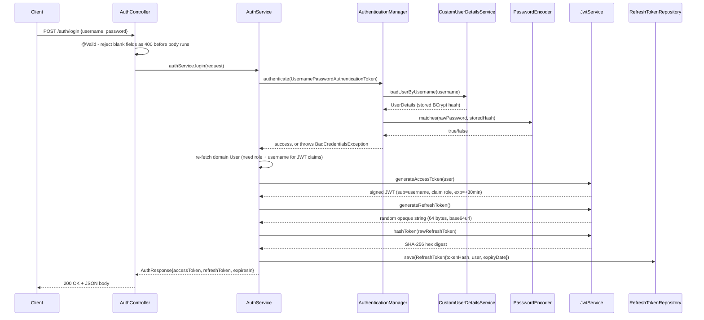

# Module 2 — Conceptual & Architectural Guide

> Purpose: architectural understanding, not a line-by-line walkthrough (for
> that, see [`logic/auth-deep-dive.md`](../logic/auth-deep-dive.md)). Design
> rationale lives in [`plan/authentication.md`](../plan/authentication.md);
> current as-built status lives in [`claude.md`](../claude.md). This doc is
> meant to be a jumping-off point — ask follow-ups on any function/decision
> below.

---

## 1. End-to-end trace: one request, start to finish

The most architecturally representative request in this module is
**`POST /auth/login`** — it's the one endpoint that touches every major
component this module owns: Spring Security's own authentication pipeline,
`JwtService`'s two token-issuance paths, and the refresh-token persistence
layer. Tracing it once gives you the shape everything else in the module
follows from.

**Entry point:** the HTTP request, matched by Spring MVC's dispatcher to
`AuthController.login(LoginRequest)` via its `@PostMapping("/login")`.

**Components it passes through, in order:**
1. `SecurityConfig`'s filter chain — `/auth/login` is on the `permitAll()`
   list and in `JwtAuthenticationFilter.shouldNotFilter()`'s skip list, so
   this request reaches the controller with no token checks at all.
2. `AuthController` — validates shape only (`@Valid`), delegates immediately.
3. `AuthService.login()` — the actual orchestration.
4. Spring Security's own pipeline (`AuthenticationManager` →
   `DaoAuthenticationProvider` → `CustomUserDetailsService` →
   `PasswordEncoder`) — this module plugs into it rather than replacing it
   (see §4).
5. `JwtService` — mints both tokens and hashes the refresh token.
6. `RefreshTokenRepository` — persists only the hash, never the raw value.
7. Back up through `AuthResponse` construction, serialized to JSON by
   Spring's message converter.

**How the other three endpoints deviate from this shape:**
- **`/auth/register`** stops after step 2 — `AuthService.register()` never
  calls `AuthenticationManager` at all (there's no credential to *check*
  yet, only one to *create*), and issues no tokens.
- **A protected request** (anything other than the four `/auth/**` public
  endpoints) never reaches `AuthController` — instead
  `JwtAuthenticationFilter` runs *before* step 1 even applies, parses a
  Bearer token, and populates `SecurityContextHolder` directly from the
  JWT's own claims, with **no call to `CustomUserDetailsService` or the
  database at all**. This is the one place the module deliberately bypasses
  the pipeline used above.
- **`/auth/refresh`** replaces steps 4 with a `RefreshTokenRepository`
  lookup-by-hash instead of an `AuthenticationManager` call — the refresh
  token itself is the credential, so there's no username/password to check.
- **`/auth/logout`** is the only one of the four that *is* gated by
  `JwtAuthenticationFilter` like a normal protected route (a valid access
  token is required to call it), then does a single revoke-by-hash write.

---

## 2. Contracts: inputs, outputs, side effects, assumptions

Only non-trivial methods are listed — pure DTOs, Lombok-generated
getters/setters, and one-line delegations are skipped.

### Controller (`AuthController`)

| Method | In → Out | Side effects | Assumptions |
|---|---|---|---|
| `register` | `RegisterRequest` → `201`, no body | Delegates to `AuthService.register` | Caller must call `/auth/login` separately afterward — no auto-login |
| `login` | `LoginRequest` → `200` + `AuthResponse` | Delegates to `AuthService.login` | — |
| `refresh` | `RefreshRequest` → `200` + `AuthResponse` | Delegates to `AuthService.refresh` | No `Authorization` header required or checked here |
| `logout` | `RefreshRequest` → `204`, no body | Delegates to `AuthService.logout` | Caller already passed the filter-chain's `authenticated()` gate with a valid access token |

### Service (`AuthService`) — where the actual logic lives

| Method | In → Out | Side effects | Assumptions |
|---|---|---|---|
| `register` | `RegisterRequest` → `void` | 1 insert into `users` (password BCrypt-hashed, role forced to `ROLE_USER`) | The `existsBy...` pre-check is a fast path, **not** the authoritative guard — see §4 |
| `login` | `LoginRequest` → `AuthResponse` | 1 insert into `refresh_tokens` | Throws if `AuthenticationManager` rejects the credentials; assumes the just-authenticated user still exists in the DB (re-fetched, not reused from `UserDetails`) |
| `refresh` | raw refresh token string → `AuthResponse` | 1 update (revoke old token), 1 insert (new token row) | Presented token must hash to a row that is unrevoked and unexpired; rotates unconditionally on success |
| `logout` | raw refresh token string → `void` | 0 or 1 update (revoke), depending on whether the hash is found | Deliberately silent/idempotent if the token is unknown — never reveals whether it was "real" |
| `issueTokenPair` (private) | `User` → `AuthResponse` | 1 insert into `refresh_tokens` | Shared by `login` and `refresh`; the *only* place a token pair is minted |

### Security layer

| Class / method | In → Out | Side effects | Assumptions |
|---|---|---|---|
| `JwtService.generateAccessToken` | `User` → signed JWT string | None (pure computation) | Reads `jwt.secret`/`jwt.access-token-expiration-ms` from config |
| `JwtService.generateRefreshToken` | — → random opaque string | Consumes entropy from a shared `SecureRandom` | Caller is responsible for persisting the hash, not this method |
| `JwtService.hashToken` | raw string → SHA-256 hex digest | None | One-way; there is no `unhashToken` — lookups are always hash-to-hash |
| `JwtService.isAccessTokenValid` | JWT string → `boolean` | None; **never throws** | Callers (the filter) rely on this to always return, never propagate an exception |
| `JwtService.extractUsername` / `extractRole` | JWT string → claim value | None | Assumes the token was already validated by `isAccessTokenValid` — will throw if called on a malformed/expired token directly |
| `CustomUserDetailsService.loadUserByUsername` | username → `UserDetails` | None (read) | Only ever invoked by `AuthenticationManager` during `login()` — **not** on every request |
| `JwtAuthenticationFilter.doFilterInternal` | `HttpServletRequest`/`Response`/`FilterChain` → nothing (void) | Mutates `SecurityContextHolder` for the current thread, or leaves it untouched | Never rejects a request itself; always calls `filterChain.doFilter` |
| `RestAuthenticationEntryPoint.commence` | triggered by Spring Security on an unauthenticated access attempt | Writes a `401` JSON body directly to the response writer | Only fires when `SecurityContextHolder` is empty at the authorization check |
| `RestAccessDeniedHandler.handle` | triggered by Spring Security on an authenticated-but-wrong-role attempt | Writes a `403` JSON body directly to the response writer | Only fires when the context *is* populated but lacks the required authority |

### Exceptions & `GlobalExceptionHandler`

`InvalidRefreshTokenException` is a plain `RuntimeException` subtype with no
logic of its own — its only contract is *being thrown* from
`AuthService.refresh()` and *being caught* by exactly one
`@ExceptionHandler` in `GlobalExceptionHandler`, mapped to `401` with the
specific message preserved. `BadCredentialsException` and
`MethodArgumentNotValidException` are framework exceptions (Spring
Security's and Spring MVC's own) handled the same way, but map to a fixed,
non-specific message in the credentials case (see §4).

---

## 3. Annotations and what they actually trigger

| Annotation | Where | What it actually does at runtime |
|---|---|---|
| `@RestController` / `@RequestMapping("/auth")` | `AuthController` | Combines `@Controller` + `@ResponseBody`; establishes the shared `/auth` path prefix for every method below it. |
| `@PostMapping("/register"\|"/login"\|"/refresh"\|"/logout")` | Controller methods | Registers each method with Spring MVC's dispatcher for `POST` + that exact path — this is what makes the method reachable at all. |
| `@RequestBody` | Controller params | Deserializes the raw JSON body into the DTO via Jackson, **before** `@Valid` runs. |
| `@Valid` | Controller params | Triggers Bean Validation on the deserialized DTO before the method body executes. A failure throws `MethodArgumentNotValidException`, intercepted by `GlobalExceptionHandler` — the controller method body never runs. Real enforcement, not documentation. |
| `@NotBlank` / `@Size` / `@Email` | DTO fields (`LoginRequest`, `RegisterRequest`, `RefreshRequest`) | The actual Bean Validation rules `@Valid` executes — e.g. `@Size(min = 8)` on `RegisterRequest.password` is a genuine runtime length check, not a hint. |
| `@Service` | `AuthService`, `JwtService`, `CustomUserDetailsService` | Registers each as a Spring-managed singleton bean, discovered by component scanning, eligible for constructor injection elsewhere. |
| `@Component` | `RestAuthenticationEntryPoint`, `RestAccessDeniedHandler` | Same bean-registration mechanism as `@Service` — the different stereotype is purely documentation of role, not different runtime behavior. |
| `@Configuration` | `SecurityConfig` | Marks the class as a source of `@Bean` definitions, processed at application startup. |
| `@Bean` | Methods in `SecurityConfig` (`passwordEncoder`, `authenticationManager`, `securityFilterChain`, `jwtAuthenticationFilter`) | Each method's return value is registered in the Spring application context, available for injection anywhere else by type. |
| `@Value("${jwt.secret}")` etc. | `JwtService`, `AuthService` fields | Injects a value from `application.properties` (itself resolved from an environment variable with a fallback default) at bean-construction time. |
| `@Transactional` | `AuthService.register`/`login`/`refresh`/`logout` | Wraps the method in a Spring-managed database transaction — the existence checks + insert (or the revoke + insert pair, in `refresh`) commit or roll back together on any uncaught exception. |
| `@Entity` / `@Table` | `User`, `RefreshToken` | Marks the class as JPA-managed, mapped to the named table; Hibernate generates/validates DDL from this plus the field-level annotations below (given `ddl-auto=update`). |
| `@Id` / `@GeneratedValue(strategy = GenerationType.IDENTITY)` | `User.id`, `RefreshToken.id` | Marks the primary key and delegates its generation to the database's auto-increment column. |
| `@Column(nullable = false, unique = true)` | `User.username`, `RefreshToken.tokenHash` | Generates a real `NOT NULL UNIQUE` constraint at the DB level — this is what actually makes duplicate registrations and colliding token hashes fail, independent of any Java-side check (see §4). |
| `@ManyToOne` / `@JoinColumn(name = "user_id")` | `RefreshToken.user` | Establishes the foreign-key relationship; many refresh tokens can point at one user (multiple devices/sessions). |
| `@OneToMany(mappedBy = "user", cascade = CascadeType.ALL)` | `User.bookings` | Not exercised by Module 2 itself, but establishes the relationship other modules build on. |
| `@Repository` | `UserRepository`, `RefreshTokenRepository` | Registers the interface as a Spring Data JPA bean and translates raw JDBC/Hibernate exceptions into Spring's `DataAccessException` hierarchy. |
| `@Builder`, `@Data`, `@NoArgsConstructor`, `@AllArgsConstructor` (Lombok) | Entities & DTOs | Pure compile-time code generation (getters/setters/`equals`/`hashCode`/`toString`, a fluent builder, both constructor forms). Zero runtime behavior of their own. |
| `@Builder.Default` | `AuthResponse.tokenType`, `RefreshToken.revoked` | Tells Lombok's builder to keep the declared default (`"Bearer"`, `false`) when a field is left unset, instead of silently defaulting to `null`/`false` unconditionally. |
| `@ExceptionHandler(X.class)` on `@RestControllerAdvice` | `GlobalExceptionHandler` | Global interception: any instance of `X` thrown anywhere inside a controller-triggered call stack is caught here instead of becoming a raw `500`. |
| `extends OncePerRequestFilter` | `JwtAuthenticationFilter` | Not an annotation, but the mechanism that guarantees this filter's logic runs exactly once per request, even across internal servlet forwards/includes. |

**A note on `@PreAuthorize` and Module 2:** this module issues a `role` claim
and expects downstream `@PreAuthorize("hasRole('...')")` checks to consume
it, but Module 2 itself defines none. `claude.md` records that
`SecurityConfig` was actually missing `@EnableMethodSecurity` until Module 3
added it — meaning any `@PreAuthorize` written *during* Module 2 would have
silently done nothing. Not a bug in Module 2's own endpoints (it uses none),
but worth knowing if you're reading Module 2's code in isolation and wonder
why role-based authorization isn't demonstrated anywhere in this module.

---

## 4. Key design decisions and trade-offs

**Two token types (signed JWT + opaque DB-backed token) instead of one.**
The obvious simpler alternative is a single session token, either a JWT
alone or a DB-backed opaque token alone. A JWT-only design can't be revoked
before it expires — a stolen token is valid until it dies naturally, however
long that is. An opaque-token-only design requires a DB round-trip on
*every* request to check validity, which doesn't scale as well and adds
latency to every call. Splitting the two gives each its own job: the access
token is fast (self-contained signature check, zero I/O) and the refresh
token is revocable (DB row, can be flipped `revoked`). Trade-off accepted:
two token formats and two code paths to reason about, in exchange for
neither weakness.

**Access tokens carry the role claim; the filter never re-queries the DB.**
The alternative was to have `JwtAuthenticationFilter` look up the user (and
their current role) on every request, guaranteeing the role is always
fresh. Rejected because that reintroduces a DB round-trip per request — the
exact cost the JWT was meant to avoid. Trade-off: if an admin's role is
changed mid-session, their already-issued access token keeps the *old* role
until it naturally expires (bounded to 30 minutes by the short TTL) —
accepted as tolerable staleness in exchange for zero-I/O authorization.

**Refresh tokens are opaque random strings, not JWTs.**
A refresh token *could* have been a second JWT with a longer expiration.
Rejected because a refresh token's only job is to be looked up by hash in
the database — it never needs to be self-describing, and making it a JWT
would add signature-verification overhead for no benefit, plus create a
second signing key to manage. A high-entropy random string is simpler and
equally secure for this purpose.

**Refresh token rotation (single-use, replaced on every `/auth/refresh`
call) instead of a long-lived reusable refresh token.**
A reusable refresh token is simpler to implement but means a stolen token
grants an attacker indefinite renewed access, silently, alongside the
legitimate user. Rotation means every refresh mints a new token and
immediately kills the old one — a stolen-then-reused old token becomes a
detectable signal (`storedToken.isRevoked()` is `true` on reuse), even
though the current implementation only logs that signal rather than
auto-revoking the whole token family (see "not handled" below).

**Delegating credential checking to Spring Security's own pipeline
(`AuthenticationManager`/`DaoAuthenticationProvider`) instead of calling
`PasswordEncoder.matches()` directly in `AuthService`.**
Hand-rolling the comparison (`if (passwordEncoder.matches(raw,
user.getPassword()))`) would be a handful of lines shorter. Rejected because
password comparison is exactly the kind of security-critical logic worth
borrowing from a maintained, widely-audited framework rather than
duplicating — and it keeps `CustomUserDetailsService` reusable if a second
authentication entry point (e.g. an OAuth2 bridge) is ever added later.

**The JWT filter never rejects a request itself.**
`JwtAuthenticationFilter` could have written a `401` directly the moment it
sees an invalid/missing token. Instead it always calls
`filterChain.doFilter()` and leaves rejection to Spring Security's own
authorization check + `RestAuthenticationEntryPoint`/`RestAccessDeniedHandler`.
This keeps exactly one place in the codebase deciding "is this request
allowed" instead of two competing implementations of that decision — the
filter's only job is identity extraction, not authorization.

**Statelessness (`SessionCreationPolicy.STATELESS`, CSRF disabled) over
traditional session-cookie auth.**
Session cookies are simpler for a browser-only client but require
sticky sessions or a shared session store to scale across multiple app
instances. Pure bearer-token auth means any instance can handle any
request. CSRF protection is disabled as a direct consequence — CSRF exists
to stop a browser silently replaying a cookie cross-site, and there are no
cookies/`HttpSession` here to protect.

**Same DB-integrity-constraint pattern used for both username/email
uniqueness and refresh-token-hash uniqueness: a fast application-level
pre-check, backed by an authoritative DB `UNIQUE` constraint.**
A pre-check alone (`existsByUsername`) leaves a TOCTOU race open under
concurrent requests. A bare DB constraint alone works but always lets a
doomed request run further before failing. Combining both gives a fast,
friendly rejection in the common case, with the DB constraint as the real
authority — accepted repetition of the same pattern in two places rather
than inventing two different guards.

**Never storing a raw refresh token — only its SHA-256 hash.**
Mirrors password hashing exactly: if the `refresh_tokens` table were ever
leaked, an attacker would have hashes, not usable tokens. The trade-off is
symmetrical with passwords too: like a password, a raw refresh token can
only ever be checked, never recovered or displayed again after issuance.

**Uniform "Invalid username or password" message for login failures, but
specific messages for refresh-token failures.**
These look inconsistent at first glance but follow the same underlying
rule: don't leak information the caller doesn't already have. A login
caller doesn't know if a username exists — a specific message would let
them enumerate valid usernames. A refresh-token caller already possesses
the token in question, so distinguishing "not recognized" from "revoked"
from "expired" leaks nothing new.

---

## 5. Edge cases and failure modes

### Handled

- **Duplicate username/email at registration**, including the concurrent
  double-registration race — fast path via `existsBy...`, authoritative
  path via the DB `UNIQUE` constraint surfacing as a clean `409`.
- **Wrong username or password at login** — uniform `401`, no enumeration
  signal either way.
- **Unknown, revoked, or expired refresh token** presented to
  `/auth/refresh` or `/auth/logout` — each produces a clean `401` (refresh)
  or a silent no-op (logout), never a raw `500`.
- **Refresh-token reuse after rotation** — detected (`isRevoked()` is
  `true`) and logged as a `WARN`, distinguishing it from a merely-expired
  token.
- **Missing, malformed, or expired JWT on a protected route** — the filter
  never throws; `RestAuthenticationEntryPoint` produces a consistent `401`
  JSON body instead of Spring's default HTML error page.
- **Authenticated but wrong role** — `RestAccessDeniedHandler` produces a
  consistent `403`, distinct from the `401` case.
- **Validation failures** (blank username, short password, malformed email)
  — rejected at `400` before any service code runs, with per-field detail
  messages.
- **A client trying to smuggle a role into registration** — structurally
  impossible, since `RegisterRequest` has no `role` field for Jackson to
  populate; the server-side literal `"ROLE_USER"` is the only source of a
  new account's role.

### Not handled — worth knowing about

- **Access tokens cannot be revoked before they naturally expire.** Logout
  only revokes the refresh token; a stolen access token keeps working for
  up to 30 minutes regardless. This is a deliberate, documented trade-off
  of pure statelessness (no server-side token blacklist), bounded by
  keeping the TTL short — not a gap that was missed, but one you should
  know is real if you're reasoning about worst-case exposure windows.
- **Detected refresh-token reuse is only logged, not acted on.** A more
  robust response would revoke the *entire* token family (every refresh
  token descended from the same original login) the moment reuse is
  detected, since reuse is a real signal of possible theft. Today it's a
  `WARN` log line with no automated follow-up — flagged in
  `plan/authentication.md` as a future improvement, not yet built.
- **No brute-force protection on `/auth/login`.** No rate limiting, no
  account lockout after N failed attempts, no CAPTCHA — an attacker can
  attempt unlimited password guesses per username today.
- **No "log out of all devices" endpoint**, despite the data model
  supporting it — `RefreshTokenRepository.deleteAllByUser` and
  `findAllByUserAndRevokedFalse` exist but aren't wired to any controller
  method yet. A user compromised on one device can't self-service revoke
  every session from this module alone.
- **No password reset, email verification, or MFA flow of any kind.**
  Registration produces an immediately-usable account with no email
  confirmation step; there is no path to recover a forgotten password.
- **`@EnableMethodSecurity` was missing for the entirety of Module 2's
  original implementation** (only added in Module 3). Since Module 2 itself
  never uses `@PreAuthorize`, this didn't break anything *in this module*,
  but it means the `role` claim this module issues was, for a time,
  decorative everywhere else in the app too — worth knowing if you're
  auditing when role-based checks actually became enforceable.
- **No integration test against a live MySQL instance** — this sandbox has
  no running database; only unit tests (`AuthServiceTest`, `JwtServiceTest`)
  have actually been run. A real end-to-end exercise of these endpoints is
  still outstanding (see `claude.md`, Known Gaps).
