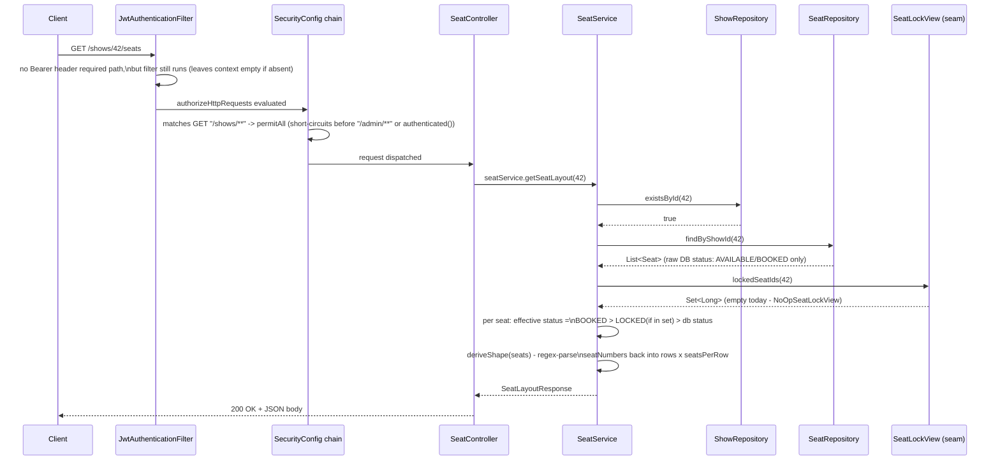

# Module 3 — Conceptual & Architectural Guide

> Purpose: architectural understanding, not a line-by-line walkthrough (for
> that, see [`logic/listing-deep-dive.md`](../logic/listing-deep-dive.md)).
> Design rationale lives in [`plan/crud.md`](../plan/crud.md); current
> as-built status lives in [`claude.md`](../claude.md). This doc is meant to
> be a jumping-off point — ask follow-ups on any function/decision below.

---

## 1. End-to-end trace: one request, start to finish

The most architecturally representative request in this module is
**`GET /shows/{showId}/seats`** — it's the one endpoint where every layer
(security, controller, service, two repositories, the Module 4 seam, DTO
mapping) is doing something non-trivial. Tracing it once gives you the shape
every other endpoint follows, with variations noted after.

**Entry point:** the HTTP request itself, matched by Spring MVC's dispatcher
to `SeatController.getSeatLayout(Long showId)` based on the `@GetMapping`
path pattern.

**Components it passes through, in order:**
1. `JwtAuthenticationFilter` — always runs (this path isn't in its
   `shouldNotFilter()` skip list), but since no `Authorization` header is
   required here, it simply leaves the security context empty if none is
   sent, and continues the chain regardless.
2. `SecurityConfig`'s `authorizeHttpRequests` rule chain — evaluated in
   declaration order; the `GET "/shows/**" → permitAll()` rule matches
   before the request ever reaches the `/admin/**` or `anyRequest()` rules.
3. `SeatController` — thin dispatch, no logic.
4. `SeatService.getSeatLayout()` — the actual orchestration: existence
   check, two repository reads, one seam call, per-seat status computation,
   shape derivation.
5. `ShowRepository` / `SeatRepository` — Spring Data JPA, translate to SQL.
6. `SeatLockView` (via `NoOpSeatLockView` today) — the Module 4 handoff
   point.
7. Back up through `SeatDto`/`SeatLayoutResponse` construction, serialized
   to JSON by Spring's message converter, returned as the HTTP response.

**How the other six endpoints deviate from this shape:** the three admin
writes (`createMovie`, `createShow`, `generateLayout`) insert two extra
components *before* step 3 — the `/admin/**` URL matcher (`hasRole`) and the
controller-method `@PreAuthorize` check (§3) — and add a `@Valid` request-body
validation pass between steps 3 and 4. The two other public reads
(`listMovies`, `listShowsForMovie`) skip the seam entirely (no lock concept
applies to a movie or a show, only to individual seats) but otherwise follow
the identical controller → service → repository → DTO shape.

---

## 2. Contracts: inputs, outputs, side effects, assumptions

Only non-trivial methods are listed — pure DTOs, Lombok-generated
getters/setters, and one-line delegations are skipped.

### Controllers (`MovieController`, `ShowController`, `SeatController`)

| Method | In → Out | Side effects | Assumptions |
|---|---|---|---|
| `MovieController.createMovie` | `MovieRequest` → `201` + `MovieResponse` | Inserts one `movies` row | Caller already passed the `/admin/**` + `@PreAuthorize` gate |
| `MovieController.updateMovie` | `movieId`, `MovieRequest` → `200` + `MovieResponse` | Updates one `movies` row | `movieId` may not exist (service throws `404`) |
| `MovieController.listMovies` | `search?`, `Pageable` → `200` + `Page<MovieResponse>` | None (read-only) | `Pageable` already resolved from query params by Spring |
| `ShowController.createShow` | `movieId`, `ShowRequest` → `201` + `ShowResponse` | Inserts one `shows` row | Parent movie may not exist; screen may already be booked in that window |
| `ShowController.listShowsForMovie` | `movieId`, `includePast` → `200` + `List<ShowResponse>` | None | — |
| `SeatController.generateSeatLayout` | `showId`, `SeatLayoutRequest` → `201` + `SeatLayoutResponse` | Bulk-inserts `rows × seatsPerRow` `seats` rows | Show must exist and have **no** existing seats — this is a one-time-only operation |
| `SeatController.getSeatLayout` | `showId` → `200` + `SeatLayoutResponse` | None | Show must exist; seats may or may not have been generated yet (empty list is valid) |

### Services (the actual logic)

| Method | In → Out | Side effects | Assumptions |
|---|---|---|---|
| `MovieService.createMovie` | `MovieRequest` → `MovieResponse` | 1 insert | Titles are **not** checked for uniqueness — duplicates are allowed by design |
| `MovieService.updateMovie` | `movieId`, `MovieRequest` → `MovieResponse` | 1 update, mutates a *managed* entity in place (relies on JPA dirty-checking) | Throws `MovieNotFoundException` if absent |
| `MovieService.getMovieOrThrow` (package-private) | `movieId` → `Movie` | None | Shared by `ShowService`; the single source of truth for "movie not found" |
| `ShowService.createShow` | `movieId`, `ShowRequest` → `ShowResponse` | 1 insert; **reads** an unbounded-but-windowed set of same-screen shows first | Assumes no two concurrent calls can slip past the overlap check at the same instant (see §5 — this is a real gap) |
| `ShowService.assertNoScreenConflict` (private) | screen name, new interval → throws or returns | None (read-only) | Assumes no real movie runs longer than the 24-hour lookback window |
| `ShowService.listShowsForMovie` | `movieId`, `includePast` → `List<ShowResponse>` | 2 extra reads *per show returned* (seat counts) | Accepts N+1-shaped query cost at small scale (§4) |
| `SeatService.generateLayout` | `showId`, `SeatLayoutRequest` → `SeatLayoutResponse` | Bulk insert (`saveAll`) | Assumes `existsByShowId` + the DB unique constraint together make double-generation impossible even under concurrency |
| `SeatService.getSeatLayout` | `showId` → `SeatLayoutResponse` | None | The "effective status" computed here is **not** what's stored in the DB — see §4's design-decision writeup |
| `SeatService.resolveRowLabels` (private) | requested labels or `null`, row count → `List<String>` | None | Throws `IllegalArgumentException` if caller-supplied labels don't match the row count |
| `SeatService.deriveShape` (private) | `List<Seat>` → `int[]{rows, seatsPerRow}` | None | Assumes every `seatNumber` matches the `letters+digits` pattern this same class generates — not resilient to hand-inserted seats with a different naming scheme |
| `NoOpSeatLockView.lockedSeatIds` | `showId` → empty `Set<Long>` | None | Always returns empty; exists purely to satisfy the `SeatLockView` contract until Module 4 |

### Exceptions & `GlobalExceptionHandler`

Each of `MovieNotFoundException`, `ShowNotFoundException`,
`ScreenTimeConflictException`, `SeatsAlreadyGeneratedException` is a plain
`RuntimeException` subtype with no logic of its own — its only "contract" is
*being thrown* from a specific service method and *being caught* by exactly
one `@ExceptionHandler` in `GlobalExceptionHandler`, which maps it to a fixed
HTTP status (`404`, `404`, `409`, `409` respectively) and the uniform
`ErrorResponse` JSON shape.

---

## 3. Annotations and what they actually trigger

| Annotation | Where | What it actually does at runtime |
|---|---|---|
| `@RestController` | Every controller | Combines `@Controller` + `@ResponseBody` — every method's return value is serialized straight to the HTTP response body (JSON, via Spring's configured message converter) instead of being resolved as a view name. |
| `@PostMapping` / `@GetMapping` / `@PutMapping` | Controller methods | Registers the method with Spring MVC's `DispatcherServlet` for a specific HTTP verb + path pattern; this is what makes the method reachable at all. |
| `@PathVariable` | Controller params | Binds a `{placeholder}` segment of the URL to the method parameter, with automatic type conversion (`String` → `Long` for `movieId`/`showId`). |
| `@RequestBody` | Controller params | Deserializes the raw JSON request body into the DTO type via Jackson, **before** `@Valid` runs. |
| `@RequestParam` | Controller params | Binds a query-string parameter (`?search=`, `?includePast=`); `defaultValue` supplies a value when the client omits it entirely. |
| `@Valid` | Controller params, next to `@RequestBody` | Triggers Bean Validation on the deserialized object *before* the method body executes. A failure throws `MethodArgumentNotValidException`, which never reaches the method — it's intercepted by `GlobalExceptionHandler.handleValidation()`. This is enforcement, not documentation. |
| `@NotBlank` / `@Positive` / `@Future` / `@DecimalMin` / `@Min` / `@Max` / `@NotNull` | DTO fields | The actual Bean Validation rules `@Valid` executes. Each one is a real runtime check (e.g. `@Future` compares against `LocalDateTime.now()` at validation time), not a compile-time hint. |
| `@PreAuthorize("hasRole('ADMIN')")` | Admin controller methods | Spring Security wraps the bean in an AOP proxy that intercepts the call **before** the real method runs, evaluating the SpEL expression against the current `Authentication`'s granted authorities. **Only takes effect because `SecurityConfig` now carries `@EnableMethodSecurity`** — without that, this annotation is silently inert (this was an actual Module 2 gap Module 3 fixed; see `claude.md`). |
| `@EnableMethodSecurity` | `SecurityConfig` | Registers the AOP infrastructure that makes `@PreAuthorize` (and `@PostAuthorize`/`@PreFilter`/`@PostFilter`, unused here) actually evaluate. Without it, those annotations compile fine and do nothing. |
| `@Transactional` | Write service methods | Wraps the method in a Spring-managed database transaction — all writes inside commit together or roll back together on any uncaught exception. |
| `@Transactional(readOnly = true)` | Read service methods | A hint to Hibernate to skip dirty-checking (change tracking) on entities loaded in this transaction, since nothing will be saved. **Not** an enforced DB-level read-only guarantee in MySQL — it's a performance optimization, not a safety mechanism; a stray `.save()` inside a `readOnly` method would still execute. |
| `@Service` / `@Component` | Service classes, `NoOpSeatLockView`, `RestAccessDeniedHandler` etc. | Registers the class as a Spring-managed singleton bean, discovered by classpath component scanning and eligible for constructor injection elsewhere. |
| `@Entity` / `@Table` | `Movie`, `Show`, `Seat` | Marks the class as a JPA-managed persistent type mapped to the named table; Hibernate generates/validates DDL from this + the field-level annotations below (given `ddl-auto=update`). |
| `@Table(uniqueConstraints = @UniqueConstraint(...))` | `Seat` | Generates an actual DB-level `UNIQUE` index on `(show_id, seat_number)`. This is a real, DB-enforced constraint — a violation throws `DataIntegrityViolationException` at flush/commit time, not a Java-side check. |
| `@ManyToOne` (default fetch = `EAGER`) | `Show.movie`, `Seat.show` | Every time a `Show` is loaded, its `Movie` is loaded alongside it in the same (or an immediately-following) query — this is *why* `candidate.getMovie().getDurationMinutes()` works inside `ShowService`'s overlap loop without a `LazyInitializationException`, and also why that loop has an implicit per-candidate query cost. |
| `@Column(nullable = false)`, `precision`/`scale` on `Show.price` | Entity fields | Generates `NOT NULL` / `DECIMAL(10,2)` column definitions — a DB-level constraint, independent of and in addition to the DTO-level `@NotNull`/`@DecimalMin` checks. |
| `@Builder`, `@Data`, `@NoArgsConstructor`, `@AllArgsConstructor` (Lombok) | Entities & DTOs | Pure compile-time code generation (getters/setters/`equals`/`hashCode`/`toString`, a fluent builder, both constructor forms). Zero runtime behavior of their own — by the time the class is loaded, this code looks hand-written. |
| `@PageableDefault(size = 20, sort = "title")` | `MovieController.listMovies` | Supplies default paging/sorting when the client's request omits `?page=`/`?size=`/`?sort=`; the actual parameter resolution (reading those query params into a `Pageable`) is done by Spring Data's web support, auto-configured because `spring-boot-starter-data-jpa` is present. |
| `@ExceptionHandler(X.class)` on `@RestControllerAdvice` | `GlobalExceptionHandler` | Global interception: any instance of `X` thrown anywhere inside a controller-triggered call stack is caught here instead of becoming a raw `500`, and the method's return value becomes the HTTP response. |
| `@Tag` / `@Operation` / `@SecurityRequirement` / `@SecurityScheme` / `@OpenAPIDefinition` | Controllers, `OpenApiConfig` | Pure metadata scanned by springdoc at startup to build the OpenAPI document served at `/v3/api-docs` and rendered at `/swagger-ui.html`. **No effect on request handling** — removing all of them would not change any endpoint's actual behavior. |

---

## 4. Key design decisions and trade-offs

**Hand-written DTO mapping instead of MapStruct.**
The alternative (and `claude.md`'s original plan) was to add MapStruct once
Module 3 needed real entity↔DTO mapping. Rejected because: these DTOs are
flat with no nested collections, so generated mapping code buys little; the
project's explicit goal is fully-commentable, readable code, and generated
mapper implementations are the opposite of that; and MapStruct's
annotation-processor ordering with Lombok is a known source of silent build
breakage. Trade-off accepted: a little more boilerplate (~10 lines per
`toResponse()`) in exchange for zero magic and zero extra build-tool risk.

**No persisted `Show.endTime`; overlap computed in Java per candidate.**
The alternative was adding an `endTime` column so the screen-conflict check
could be a single indexed database range query. Rejected to avoid a schema
change beyond what the module strictly needed. Trade-off: `assertNoScreenConflict`
does `O(candidates in a 24h window)` work in the application layer instead of
letting the database do a range comparison — acceptable because a single
screen has at most a handful of shows in any 24-hour window, but it does mean
this logic re-derives the same "show length" computation every time instead
of the database being able to index on it directly.

**The `SeatLockView` seam (interface + swappable implementation) over a
feature flag or an inline `if (redisAvailable)` check.**
The alternative was to hardcode "no locks exist" as a literal inside
`SeatService`, then edit that method directly when Module 4 lands. Rejected
because it would require touching (and re-testing) `SeatService` itself for
a change that's really about a *different* module's readiness — the
interface means Module 4 only ever adds a new class and flips which bean is
on the context. Trade-off: one extra abstraction layer (`SeatLockView`) for
a concept with exactly one caller today — worth it specifically because the
seam sits exactly on `claude.md`'s hardest architectural rule (never infer
lock state from the DB), so keeping it structurally impossible to violate by
accident was judged worth the extra indirection.

**Synchronous, blocking request handling throughout (no reactive/async).**
The module uses `spring-boot-starter-webmvc` (servlet-based, blocking I/O),
consistent with the rest of the app. No endpoint here does anything
inherently latency-heavy (no external API calls, no long-running
computation) that would benefit from `WebFlux`/reactive streams, and JPA
itself is blocking by default — going reactive would mean either fighting
JPA or adopting R2DBC, neither of which this project needs. This isn't a
Module 3-specific decision so much as an inherited one, but it does shape
every method signature in this module (plain return types, no `Mono`/`Flux`).

**Batch-build-then-`saveAll` for seat generation, not per-seat `save()`.**
An 8×12 grid is 96 rows; the chosen approach builds the full `List<Seat>` in
memory (bounded — validation caps this at 26×50 = 1,300 seats maximum) and
inserts it in one batch call, instead of one round-trip per seat. Trade-off:
a small, bounded memory allocation in exchange for avoiding up to 1,300
individual database round-trips — an easy call at this scale.

**Idempotency guard (`existsByShowId`) *and* a DB unique constraint, not
just one or the other.**
A single `existsByShowId` pre-check alone would leave a real TOCTOU race
window open (two concurrent `POST` calls for the same show could both pass
the check before either commits). A bare DB constraint alone would work
correctly but always let the wasteful path run once before failing.
Combining both gives a fast, friendly rejection in the common (non-racing)
case, with the DB constraint as the actual authority — same two-layer
pattern already used for `User.username`/`email` uniqueness in Module 2.

**Plain-`String` seat/user-role status fields, not enums — inherited, not
revisited.**
Module 1 already modeled `Seat.status` as a `String`. Module 3 could have
opportunistically converted it to an enum while touching this entity anyway
(the unique-constraint change). Deliberately left as-is: `claude.md` already
flags this as a known simplification to revisit later, and changing it
mid-module would touch every string-literal comparison across
`SeatService`/`SeatRepository` for a refactor orthogonal to what Module 3 was
asked to deliver.

**Exceptions as flat `RuntimeException` subtypes, individually handled — no
shared `ApiException` base class.**
`plan/crud.md`'s original sketch proposed a small `ApiException(status,
message)` base so `GlobalExceptionHandler` could map generically. The
as-built code instead follows Module 2's existing pattern exactly
(`InvalidRefreshTokenException` has no base class either) — one
`@ExceptionHandler` method per exception type. Trade-off: a little
repetition across handler methods, in exchange for staying consistent with
how the rest of the codebase already does this rather than introducing a
second convention.

---

## 5. Edge cases and failure modes

### Handled

- **Duplicate seat-layout generation** (same show, called twice) — rejected
  at the service level (fast path) and, under true concurrency, at the DB
  level via the unique constraint (authoritative path). Both paths surface
  as a clean `409`, never a raw `500` or silent double-insert.
- **Unknown `movieId`/`showId`** on any endpoint that takes one — consistent
  `404` via `MovieNotFoundException`/`ShowNotFoundException`, including on
  read paths (`listShowsForMovie`, `getSeatLayout`) where a naive
  implementation might have just returned an empty list instead.
- **Movie exists but has zero shows / show exists but has zero seats** —
  deliberately distinguished from "doesn't exist" by checking existence
  first, then querying; an empty array is a meaningful, valid response.
- **Malformed / out-of-range seat-layout requests** (`rows=0`, `rows=200`,
  negative price, past start time) — rejected at `400` via Bean Validation
  before any service code runs.
- **Mismatched explicit `rowLabels` size** — the one validation rule Bean
  Validation can't express (cross-field) is caught manually and mapped to
  `400` via a narrowly-scoped `IllegalArgumentException` handler.
- **Non-admin caller hitting an admin endpoint** — rejected twice over (URL
  matcher, then `@PreAuthorize`), so a gap in either layer alone doesn't
  expose the endpoint.
- **Seats requested before a layout was generated** — `getSeatLayout` on a
  show with no seats yet returns a valid `200` with an empty `seats` array
  and `rows`/`seatsPerRow` both `0`, not an error.

### Not handled — worth knowing about

- **Screen double-booking under true concurrency is *not* DB-enforced.**
  Unlike seat-layout generation, there is no unique constraint backing
  `assertNoScreenConflict` — it's a pure read-then-decide check. Two
  concurrent `POST /admin/movies/{id}/shows` calls for overlapping windows on
  the same screen could both pass the check before either commits, producing
  two genuinely overlapping shows. This is the one place in the module where
  the "check + DB constraint" belt-and-braces pattern used everywhere else
  (seats, usernames) was *not* applied, because there's no natural single
  column pair to put a `UNIQUE` constraint on for an interval-overlap rule.
  Flagged in `plan/crud.md` but not yet closed.
- **No update/delete for `Show` or the seat layout.** A show can be created
  but never rescheduled or cancelled; a seat layout can be generated but
  never resized or regenerated (the idempotency guard makes this
  *permanent*, not just default-protected). Fixing a mis-entered layout
  today requires a direct DB edit.
- **`ShowService.assertNoScreenConflict` and `listShowsForMovie`'s seat
  counts both carry an accepted N+1-shaped query cost** — one extra query
  per candidate show / per listed show respectively. Fine at expected
  scale (a handful of shows per screen per day, tens of shows per movie);
  would need a real aggregate/join query if either collection ever grew
  large.
- **No optimistic locking (`@Version`) on any entity.** Two admins editing
  the same movie concurrently get silent last-write-wins, not a conflict
  error.
- **Time zone ambiguity.** `startTime` is a bare `LocalDateTime` — no zone
  offset is stored or validated. `@Future` and the `includePast` filter both
  compare against the server's `LocalDateTime.now()`, so a client in a
  different time zone submitting "future" times close to midnight could see
  surprising accept/reject behavior.
- **`LOCKED` can never actually appear in a response yet.** This is
  intentional (§4's seam discussion), not a bug — but it means Module 3's
  seat-status feature is only two-thirds real until Module 4 ships a working
  `SeatLockView` implementation.
- **No rate limiting or request throttling anywhere** in the module — not
  in scope, but worth naming since seat-layout generation and the movie
  search endpoint are both realistic targets for abuse at production scale.
