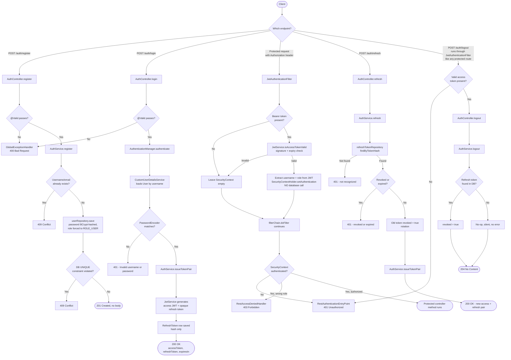

# Module 2 Deep Dive — Authentication

> Audience: a student who knows basic Java/Spring but hasn't built a token-based
> auth system before. Companion reading: [`plan/authentication.md`](../plan/authentication.md)
> (the design doc this module was built from) and [`jwt.md`](jwt.md) (a decisions
> log for the JWT filter specifically). This document is the "how it actually
> works, end to end" tour.

---

## 1. What problem is Module 2 solving?

A REST API has no memory between requests — HTTP is stateless by nature. But we
still need to answer "who is calling this endpoint, and are they allowed to?" on
every single request, without keeping a server-side session (sessions don't
scale horizontally: if you have 3 app instances behind a load balancer, a
session stored in instance A's memory is invisible to instance B).

Module 2 solves this with **token-based authentication**: the client proves who
they are once (username + password, at `/auth/login`), and in exchange gets a
piece of signed, tamper-proof data — a **JWT (JSON Web Token)** — that it
attaches to every future request. The server can verify that token
mathematically, with no database lookup and no memory of having issued it.

That's the entire mental model. Everything below is the machinery that makes
it secure, revocable, and production-grade.

---

## 2. Core concepts (read this section once; everything after refers back to it)

### 2.1 Statelessness
The server keeps zero session state about a logged-in user between requests.
Every request must carry its own proof of identity (the JWT). This is why
[`SecurityConfig`](../src/main/java/com/example/movieticket/security/SecurityConfig.java)
sets `SessionCreationPolicy.STATELESS` — Spring Security is explicitly told
"never create an `HttpSession`, never consult one."

### 2.2 Two tokens, two jobs
This module deliberately issues **two different kinds of token** with opposite
tradeoffs. Confusing them is the single most common mistake a beginner makes
here, so nail this down first:

| | **Access token** | **Refresh token** |
|---|---|---|
| What it *is* | A real, signed **JWT** | A random opaque string (not a JWT) |
| Lifespan | Short (30 minutes) | Long (7 days) |
| Where it's checked | In-memory, by verifying a cryptographic signature | In the database, by looking up its hash |
| Can it be revoked before it expires? | **No** — this is the tradeoff for being fast | **Yes** — it's a DB row, so it can be flipped to "revoked" |
| Sent on | Every protected API call, as `Authorization: Bearer <token>` | Only to `/auth/refresh` and `/auth/logout` |
| Carries data? | Yes — username + role are embedded inside it | No — it's just a lookup key, meaningless on its own |

The design reasoning: verifying a JWT signature is a pure CPU operation (no
database round-trip), so it's cheap to do on *every single request*. But that
speed comes at a cost — once issued, a JWT can't be un-issued. So we keep it
short-lived (30 min) to bound the damage, and we do the "can this be revoked"
work through a *different*, DB-backed token (the refresh token) that's only
consulted occasionally (when the access token expires).

### 2.3 Password hashing (BCrypt)
We never store or compare plaintext passwords. `SecurityConfig` registers a
`BCryptPasswordEncoder` bean. BCrypt is **adaptive** (its work factor can be
tuned up as hardware gets faster) and **self-salting** (it generates and
embeds a random salt automatically, so two users with the same password get
different hashes). `PasswordEncoder.encode()` is used at registration;
`.matches()` is used internally by Spring Security at login — you'll notice
`AuthService` never calls `.matches()` directly (see §2.5).

### 2.4 The Spring Security filter chain
Before any request reaches a `@RestController` method, it passes through a
chain of **servlet filters**. Think of this as an assembly line the request
walks through, where each station can inspect it, decorate it, or reject it
outright. Module 2 adds exactly one custom station to this line —
[`JwtAuthenticationFilter`](../src/main/java/com/example/movieticket/security/JwtAuthenticationFilter.java)
— positioned by `SecurityConfig` to run early, before Spring's own
authentication machinery. Its only job is to read the JWT (if present) and,
if valid, tell the rest of the chain "this request is authenticated, and
here's who as."

### 2.5 `AuthenticationManager` / `DaoAuthenticationProvider` / `UserDetailsService`
This is Spring Security's own login pipeline, and Module 2 plugs into it
rather than reinventing it:

```
AuthService.login()
  → AuthenticationManager.authenticate(usernamePasswordToken)
      → DaoAuthenticationProvider (auto-wired by Spring Boot)
          → CustomUserDetailsService.loadUserByUsername()   // fetches the User row
          → PasswordEncoder.matches(raw, storedHash)         // compares the hash
```

`AuthService` never touches the password comparison itself — it hands
Spring Security a username/password pair and Spring Security either throws
`BadCredentialsException` or returns successfully. This is intentional:
password-comparison code is exactly the kind of security-critical logic you
want to borrow from a battle-tested framework rather than hand-roll.

### 2.6 `SecurityContextHolder`
A thread-local (i.e., "one copy per request-handling thread") holder for the
current request's `Authentication` object. Once something puts an
`Authentication` into it, every downstream piece of code — `@PreAuthorize`
checks, a controller method asking for the current `Principal`, etc. — can ask
"who is this request from?" for the rest of that request's lifetime.
`JwtAuthenticationFilter` is what populates it for JWT-authenticated requests.

### 2.7 DTOs (Data Transfer Objects) + Bean Validation
Classes like `LoginRequest`, `RegisterRequest`, `AuthResponse` exist purely to
define the *shape* of JSON going in and out over HTTP — they are never JPA
entities and never touch the database directly. `@Valid` on a controller
parameter tells Spring "run Bean Validation annotations (`@NotBlank`,
`@Size`, `@Email`, etc.) on this object before the method body runs"; a
failure short-circuits straight to `GlobalExceptionHandler` and the
controller method body never executes.

### 2.8 Centralized exception → JSON error mapping
Three different layers can produce an error, and all three are made to look
identical to an API client (`ErrorResponse` — timestamp, status, error,
message, path):
- **Inside a controller/service** → `GlobalExceptionHandler` (`@RestControllerAdvice`)
- **No/invalid JWT on a protected route** (401) → `RestAuthenticationEntryPoint`
- **Valid JWT, but wrong role** (403) → `RestAccessDeniedHandler`

### 2.9 Lombok annotations you'll see everywhere
`@Data` (getters/setters/`toString`/`equals`/`hashCode`), `@NoArgsConstructor`
/`@AllArgsConstructor` (empty and full constructors), `@Builder` (fluent
`X.builder().field(v).build()` construction). These are compile-time code
generators — pure boilerplate removal, no runtime magic.

---

## 3. The cast of files

| File | Layer | Responsibility |
|---|---|---|
| [`AuthController`](../src/main/java/com/example/movieticket/controller/AuthController.java) | Web | Maps HTTP verbs/paths to service calls. No business logic. |
| [`AuthService`](../src/main/java/com/example/movieticket/service/AuthService.java) | Service | All business logic for register/login/refresh/logout. |
| [`JwtService`](../src/main/java/com/example/movieticket/security/JwtService.java) | Security | Builds/verifies JWTs; generates/hashes opaque refresh tokens. |
| [`JwtAuthenticationFilter`](../src/main/java/com/example/movieticket/security/JwtAuthenticationFilter.java) | Security | Per-request filter: JWT → populated `SecurityContext`. |
| [`CustomUserDetailsService`](../src/main/java/com/example/movieticket/security/CustomUserDetailsService.java) | Security | Bridges our `User` entity to Spring Security's login pipeline. |
| [`SecurityConfig`](../src/main/java/com/example/movieticket/security/SecurityConfig.java) | Security | Wires everything above into one `SecurityFilterChain`; defines public vs protected routes. |
| [`RestAuthenticationEntryPoint`](../src/main/java/com/example/movieticket/security/RestAuthenticationEntryPoint.java) | Security | Produces the JSON 401 body. |
| [`RestAccessDeniedHandler`](../src/main/java/com/example/movieticket/security/RestAccessDeniedHandler.java) | Security | Produces the JSON 403 body. |
| [`User`](../src/main/java/com/example/movieticket/model/User.java) | Persistence | JPA entity for the `users` table. |
| [`RefreshToken`](../src/main/java/com/example/movieticket/model/RefreshToken.java) | Persistence | JPA entity for the `refresh_tokens` table (stores only the *hash*). |
| [`UserRepository`](../src/main/java/com/example/movieticket/repository/UserRepository.java) / [`RefreshTokenRepository`](../src/main/java/com/example/movieticket/repository/RefreshTokenRepository.java) | Persistence | Spring Data JPA query interfaces. |
| `LoginRequest` / `RegisterRequest` / `RefreshRequest` / `AuthResponse` / `ErrorResponse` | DTO | Request/response JSON shapes. |
| [`GlobalExceptionHandler`](../src/main/java/com/example/movieticket/exception/GlobalExceptionHandler.java) / [`InvalidRefreshTokenException`](../src/main/java/com/example/movieticket/exception/InvalidRefreshTokenException.java) | Error handling | Converts thrown exceptions into `ErrorResponse` JSON. |

---

## 4. Lifecycle trace: five journeys through the code

### 4.1 Registration — `POST /auth/register`

1. **Request enters** — `SecurityConfig` line
   `.requestMatchers("/auth/register", "/auth/login", "/auth/refresh").permitAll()`
   means this path never requires an existing token. `JwtAuthenticationFilter
   .shouldNotFilter()` also explicitly skips it, so the filter doesn't even run.
2. **`AuthController.register()`** receives a `RegisterRequest` body. The
   `@Valid` annotation triggers Bean Validation first (`@NotBlank`, `@Size(min
   = 3, max = 50)` on username, `@Email` on email, `@Size(min = 8)` on
   password) — any failure throws `MethodArgumentNotValidException`, caught by
   `GlobalExceptionHandler.handleValidation()`, and the method body below never
   runs.
3. **`AuthService.register()`**:
   - Cheap pre-checks: `userRepository.existsByUsername(...)` /
     `existsByEmail(...)` — fast, friendly rejection for the common case of an
     obviously-taken username.
   - Builds a `User` via its Lombok-generated `.builder()`, hashing the
     password with `passwordEncoder.encode(...)` (§2.3) and **hardcoding**
     `role = "ROLE_USER"`. Note `RegisterRequest` has no `role` field at all —
     a client cannot smuggle `"role": "ROLE_ADMIN"` into the request, because
     Jackson has nothing to deserialize it into.
   - `userRepository.save(user)` — this is the *real* duplicate guard. Two
     concurrent registrations could both pass the `existsBy...` checks before
     either commits (a TOCTOU race); the database's `UNIQUE` constraint on
     `username`/`email` is what actually prevents the double-insert, by
     throwing `DataIntegrityViolationException`. `AuthService` doesn't catch
     it — it's left to propagate up to `GlobalExceptionHandler`, which turns
     it into a clean `409 Conflict`.
4. **Response**: `201 Created`, empty body. No tokens are issued here — the
   client must call `/auth/login` next. Splitting "create an account" from
   "log in" means a leaked registration response can never itself grant
   access to anything.

### 4.2 Login — `POST /auth/login`

1. Also `permitAll()` and filter-skipped, for the same reason as registration
   (you can't present a token to get a token).
2. **`AuthController.login()`** validates the `LoginRequest` shape
   (`@NotBlank` on both fields) and calls `authService.login(request)`.
3. **`AuthService.login()`**:
   - Builds a `UsernamePasswordAuthenticationToken` (an *unauthenticated*
     credential holder at this point) and hands it to
     `authenticationManager.authenticate(...)`. This is where §2.5's pipeline
     runs: `DaoAuthenticationProvider` calls
     `CustomUserDetailsService.loadUserByUsername()` to fetch the stored
     `User`, wraps its hashed password in Spring Security's own `UserDetails`
     type, and `PasswordEncoder.matches(raw, hash)` does the actual
     comparison. A mismatch (or unknown username) throws
     `BadCredentialsException` — caught by
     `GlobalExceptionHandler.handleBadCredentials()`, always returning the
     *same* message ("Invalid username or password") whether the username or
     the password was wrong, so a caller can't use the error to enumerate
     valid usernames.
   - If authentication succeeds, `AuthService` re-fetches its own domain
     `User` (not Spring Security's generic `UserDetails`) via
     `userRepository.findByUsername(...)`, because the next step needs the
     real entity's `role` and `username` fields.
   - Calls the shared private helper **`issueTokenPair(user)`**:
     - `jwtService.generateAccessToken(user)` — see §4.6 below for exactly
       what's inside this JWT.
     - `jwtService.generateRefreshToken()` — 64 random bytes from a shared
       `SecureRandom`, Base64url-encoded. Not a JWT; carries no claims.
     - Persists a new `RefreshToken` row: `tokenHash` = SHA-256 hex digest of
       the raw refresh token (via `jwtService.hashToken(...)`) — **the raw
       value is never written to the database**, mirroring how `User.password`
       stores a BCrypt hash rather than plaintext. `expiryDate` = now + 7
       days (from `jwt.refresh-token-expiration-ms`).
     - Returns an `AuthResponse`: the JWT access token, the *raw* refresh
       token (returned to the client exactly once, right here — after this,
       the server only ever sees its hash again), `tokenType = "Bearer"`, and
       `expiresIn` in seconds.
4. **Response**: `200 OK` with the `AuthResponse` JSON body. The client is
   expected to store both tokens (e.g. access token in memory, refresh token
   somewhere more durable) and start sending the access token as
   `Authorization: Bearer <accessToken>` on every subsequent call.

### 4.3 A protected request — e.g. `GET /some-protected-endpoint`

This is the heart of the module — the part that runs on *every* API call, not
just the four `/auth/**` endpoints.

1. The request arrives at the servlet container and walks the filter chain
   `SecurityConfig` assembled. `JwtAuthenticationFilter.shouldNotFilter()`
   checks the path — anything other than `/auth/register`, `/auth/login`, or
   `/auth/refresh` runs through the filter's full logic (this deliberately
   *includes* `/auth/logout` — see §4.5).
2. **`JwtAuthenticationFilter.doFilterInternal()`** (this class extends
   `OncePerRequestFilter`, which guarantees the logic runs exactly once per
   request even if the container internally forwards/includes it elsewhere):
   - Reads the `Authorization` header. If it's missing or doesn't start with
     `"Bearer "`, the filter does nothing and calls
     `filterChain.doFilter(request, response)` to pass the request along
     untouched — **this filter never itself rejects a request.**
   - Otherwise strips the `"Bearer "` prefix (7 characters) to get the raw
     JWT string, and calls `jwtService.isAccessTokenValid(jwt)`.
3. **`JwtService.isAccessTokenValid()`** calls the private `parseClaims()`,
   which does two things at once via the JJWT library:
   `Jwts.parser().verifyWith(signingKey()).build().parseSignedClaims(jwt)`
   — verifies the cryptographic signature (proving the token was issued by
   *this* server and hasn't been tampered with) **and** checks the `exp`
   (expiration) claim, throwing `ExpiredJwtException`/`SignatureException`/etc.
   (all subtypes of `JwtException`) if either check fails. `isAccessTokenValid`
   catches all of those and returns a plain `boolean` — it **never throws** —
   specifically so the filter can rely on it and always fall through safely.
4. **If valid**: the filter extracts `username` (the JWT's standard `sub`
   claim) and `role` (a custom claim this app added) directly from the
   token's payload — **no database call happens here**. This is the entire
   payoff of embedding the role in the JWT at issuance time: authorizing a
   request costs zero I/O. It builds a
   `UsernamePasswordAuthenticationToken(username, null, [role authority])`
   and stores it in `SecurityContextHolder.getContext().setAuthentication(...)`
   (§2.6). **If invalid**: nothing is stored; the context is left empty.
5. Either way, `filterChain.doFilter(request, response)` is called at the end
   — the filter always continues the chain. Rejection is deliberately *not*
   this filter's job.
6. The request reaches Spring Security's authorization check
   (`.anyRequest().authenticated()` in `SecurityConfig`). If step 4 populated
   the context, this passes and the request reaches the controller. If the
   context is empty (no header, or an invalid/expired token),
   **`RestAuthenticationEntryPoint.commence()`** fires: it builds an
   `ErrorResponse` with `401` and writes it directly to the response's writer
   (bypassing normal Spring MVC serialization, because this code runs at the
   filter-chain level, before a controller would ever be reached).
7. If the context *is* populated but the endpoint requires a role the user
   doesn't have (e.g. a future `@PreAuthorize("hasRole('ADMIN')")` endpoint
   hit by a `ROLE_USER` token), **`RestAccessDeniedHandler.handle()`** fires
   instead, producing the same `ErrorResponse` shape with `403`.

### 4.4 Refresh — `POST /auth/refresh`

1. `permitAll()` and filter-skipped — deliberately so, since **the refresh
   token itself is the credential** here; there's no access token to present
   (it may well have already expired, which is the whole reason the client is
   calling this endpoint).
2. `AuthController.refresh()` validates a `RefreshRequest` (`@NotBlank` on
   `refreshToken`) and calls `authService.refresh(request.getRefreshToken())`.
3. **`AuthService.refresh()`**:
   - Hashes the presented raw token (`jwtService.hashToken(...)`) and looks it
     up via `refreshTokenRepository.findByTokenHash(tokenHash)` — note the
     server *never* stores or searches by the raw value, only the hash.
   - Unknown hash → `InvalidRefreshTokenException("Refresh token not
     recognized")`.
   - `storedToken.isRevoked()` → throws the same exception type with a
     different message, and additionally logs a `WARN` — reusing an
     already-rotated-away token is a signal that's either a client retry
     race or a stolen-token replay attack; the code can't distinguish which
     from here, so it's flagged for a human/monitoring system rather than
     acted on automatically.
   - `storedToken.getExpiryDate().isBefore(now)` → expired, same exception
     family again.
   - **Rotation**: if the token passes all three checks, it's immediately
     flipped `revoked = true` and saved — so it can never be exchanged again,
     whether or not the client ever uses the new pair it's about to receive.
   - Calls the same `issueTokenPair(storedToken.getUser())` helper from
     §4.2 to mint a brand-new access + refresh token pair.
4. All three `InvalidRefreshTokenException` cases are mapped by
   `GlobalExceptionHandler.handleInvalidRefreshToken()` to the same `401`
   status with the specific message preserved — unlike login's deliberately
   uniform message, here the caller already possesses the token in question,
   so there's no enumeration risk in being specific.

### 4.5 Logout — `POST /auth/logout`

1. **Not** in `SecurityConfig`'s `permitAll()` list, so it falls through to
   `.anyRequest().authenticated()` — a valid, unexpired `Authorization: Bearer
   <accessToken>` header is required to call this endpoint at all. It *does*
   run through `JwtAuthenticationFilter` (step 4.3 applies in full) — this is
   a deliberate deviation from an earlier draft of the plan that would have
   skipped it (see `jwt.md`'s "Decisions" section for the full history of
   that fix).
2. `AuthController.logout()` validates a `RefreshRequest` and calls
   `authService.logout(request.getRefreshToken())`.
3. **`AuthService.logout()`**: hashes the token, and if a matching row exists,
   flips `revoked = true`. If no matching row is found, it does **nothing** —
   silently. This is deliberate: by the time a caller reaches this code, they
   already had a valid access token, so there's no security value in telling
   them whether the refresh token they submitted was "real"; the response is
   the same either way.
4. **Response**: `204 No Content`.
5. **Important caveat, documented deliberately in code**: this only revokes
   the *refresh* token. The *access* token used to authenticate this very
   call keeps working, unmodified, until it naturally expires — because
   access-token validity is a pure signature/expiry check with no database
   involved (§4.3), there is nothing to "flip" for it. This is the accepted
   cost of statelessness, bounded by keeping access tokens short-lived (30
   minutes by default).

### 4.6 What's actually inside an access token

`JwtService.generateAccessToken(user)` builds:

```
Jwts.builder()
    .subject(user.getUsername())      // "sub" — standard claim
    .claim("role", user.getRole())     // "role" — custom claim, e.g. "ROLE_USER"
    .issuedAt(now)                     // "iat" — standard claim
    .expiration(expiry)                // "exp" — standard claim, checked automatically on parse
    .signWith(signingKey())            // HMAC-SHA256, key from jwt.secret (application.properties)
    .compact();                        // serializes to "header.payload.signature"
```

The signing key comes from `Decoders.BASE64.decode(jwtSecret)` wrapped by
`Keys.hmacShaKeyFor(...)` — a Base64-encoded 256-bit secret, read from the
`jwt.secret` property (itself sourced from the `JWT_SECRET` environment
variable in real deployments, never hardcoded). Rotating this secret
instantly invalidates every previously-issued access token (their signatures
no longer verify) but has **no effect** on refresh tokens, since those are
opaque, unsigned, and checked against the database instead.

---

## 5. Request/response lifecycle — visual



---

## 6. Why the pieces are split this way (design intent recap)

- **Controller vs Service**: `AuthController` only validates shape and
  delegates — every decision (hashing, token issuance, rotation, revocation
  semantics) lives in `AuthService`. This means the business rules are
  testable without spinning up HTTP at all (see `AuthServiceTest`).
- **JwtService as the only class that touches raw token bytes**: signing,
  parsing, hashing, and random generation are all centralized in one class,
  so if the signing algorithm or hashing scheme ever needs to change, there's
  exactly one place to look.
- **The filter never rejects**: `JwtAuthenticationFilter` only ever adds an
  `Authentication` or leaves the context empty, then always continues the
  chain. All actual 401/403 decisions are made in one consistent place
  (Spring Security's authorization check + the two handler beans), so there's
  never a second, competing source of truth for "is this request allowed?"
- **Access vs refresh token split**: this is the load-bearing design decision
  of the whole module (§2.2). Every other choice — where DB lookups happen,
  what can be revoked, how long each token lives — follows from it.

For the historical reasoning behind specific edge-case decisions (e.g. why
`/auth/logout` is *not* skipped by the filter, or the TOCTOU race in
registration), see [`jwt.md`](jwt.md) and
[`plan/authentication.md`](../plan/authentication.md) — this document explains
*how the shipped code works*; those explain *why it ended up this way*.
