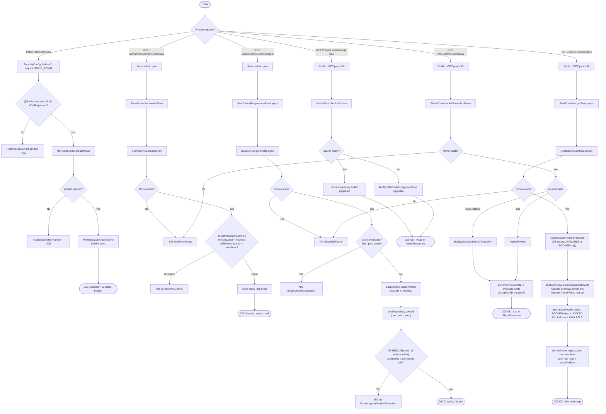

# Module 3 Deep Dive — Movie & Show Listing (CRUD)

> Audience: a student who knows basic Java/Spring and has read
> [`auth-deep-dive.md`](auth-deep-dive.md) (or at least knows what a JWT and a
> `@RestController` are) but hasn't built a multi-entity CRUD + read API before.
> Companion reading: [`plan/crud.md`](../plan/crud.md) (the design doc this
> module was built from) and [`claude.md`](../claude.md) (project-wide
> conventions and the Module 3 status entry). This document is the "how it
> actually works, end to end" tour — same format as the auth deep dive, applied
> to a different module.

---

## 1. What problem is Module 3 solving?

A ticketing system needs a **catalog** (what movies exist, what showings are
scheduled) and an **inventory** (which physical seats exist for a showing, and
whether each one is free). Module 3 builds both:

- **Admins** curate the catalog: create/update a `Movie`, schedule a `Show` for
  it on a screen at a time, and generate that show's seat grid.
- **The public** reads the catalog: browse movies, see a movie's showtimes, and
  check a show's live seat map before deciding to book.

The tricky part isn't the CRUD itself — creating/reading rows is the easy 80%.
The interesting 20% is:
1. A screen can only show one movie at a time, so scheduling has to check for
   conflicts (§4.2, §2.9).
2. A seat's status (`AVAILABLE`/`LOCKED`/`BOOKED`) doesn't all live in the same
   place — `LOCKED` is a *future* module's problem (Redis, Module 4), and this
   module has to be designed so that future module slots in without a rewrite
   (§2.6, §4.6).

Everything below is the machinery for those two things, plus the ordinary CRUD
around them.

---

## 2. Core concepts (read this section once; everything after refers back to it)

### 2.1 REST resource nesting and admin/public namespacing
A `Show` cannot exist without a parent `Movie` — `Show.movie` is a `NOT NULL`
foreign key. The URLs say so directly: `POST /admin/movies/{movieId}/shows`
reads as "create a show *under* this movie," not "create a show and separately
tell it which movie." The same logic nests seats under a show:
`POST /admin/shows/{showId}/seats`. Public reads mirror the same nesting
(`GET /movies/{movieId}/shows`) so a client's mental model of "who owns what"
matches the URL shape.

Separately, every admin **write** endpoint lives under an `/admin/**` prefix
(`POST /admin/movies`, `POST /admin/movies/{id}/shows`,
`POST /admin/shows/{id}/seats`), while every public **read** lives at the bare
resource path (`GET /movies`, `GET /movies/{id}/shows`,
`GET /shows/{id}/seats`). This isn't just tidiness — it's what makes the
security rule in §2.6 a single coarse pattern instead of one rule per endpoint.

### 2.2 DTOs, and why an entity is never returned directly
Same principle as the auth module's `LoginRequest`/`AuthResponse`, applied
here to `MovieRequest`/`MovieResponse`, `ShowRequest`/`ShowResponse`,
`SeatLayoutRequest`/`SeatLayoutResponse`/`SeatDto`. The reason it matters *more*
here than in auth: `Movie`, `Show`, and `Seat` are linked by **bidirectional**
JPA relationships (`Movie.shows` ↔ `Show.movie`, `Show.seats` ↔ `Seat.show`).
If you handed Jackson a `Movie` entity directly, it would try to serialize
`movie.shows`, and each of *those* `Show` objects would try to serialize
`show.movie` — right back to the movie it came from — recursing forever (or
crashing with a stack overflow). DTOs sidestep this entirely: `MovieResponse`
simply has no `shows` field, so there's nothing to recurse into. A client that
wants a movie's shows calls the dedicated endpoint (§4.5) instead.

### 2.3 Bean Validation as a boundary check
Every `*Request` DTO is annotated with constraints from
`jakarta.validation.constraints` — `@NotBlank`, `@Positive`, `@Future`,
`@DecimalMin`, `@Min`/`@Max`. Paired with `@Valid` on the controller method
parameter, this is Spring's Bean Validation running *before* the method body
executes: if `MovieRequest.title` is blank, or `ShowRequest.startTime` is in
the past, the request never reaches `MovieService`/`ShowService` at all — it's
short-circuited straight to `GlobalExceptionHandler.handleValidation()`
(already built in Module 2) as a `400 Bad Request`. This is the same
"validate at the boundary" principle as the auth module's `RegisterRequest`,
just with different constraint types for different data shapes (dates, prices,
integer ranges instead of usernames and emails).

### 2.4 `@Transactional` and the `readOnly` optimization
Every service method that writes (`createMovie`, `updateMovie`, `createShow`,
`generateLayout`) is annotated `@Transactional` — same meaning as in
`AuthService`: the method's database operations are wrapped in one atomic
unit, all-or-nothing. Module 3 adds a refinement not used in Module 2:
`@Transactional(readOnly = true)` on pure-read methods (`listMovies`,
`listShowsForMovie`, `getSeatLayout`). This tells Hibernate "don't bother
tracking whether entities loaded in this transaction get modified" — a small
but real optimization for a method that, by construction, never calls
`.save()`.

### 2.5 Managed-entity mutation vs. reconstruction
`MovieService.updateMovie()` doesn't do `Movie updated = new Movie(request)`.
It fetches the *existing, managed* entity (`movieRepository.findById(...)`)
and calls its setters directly (`movie.setTitle(...)`). This matters because
of JPA's **dirty checking**: inside a `@Transactional` method, Hibernate
tracks every field of an entity it fetched, and at commit time it compares
"what changed?" and writes only the necessary `UPDATE` statement. Constructing
a *new* `Movie` object with the same ID and saving it would work too, but
risks accidentally detaching the entity from collections/relationships that
aren't in the DTO (here, `Movie.shows`) — mutating the managed instance in
place avoids that risk entirely.

### 2.6 Defense in depth: two layers of authorization
Every admin-only endpoint is protected **twice**, deliberately redundantly:
1. **URL-level**, in `SecurityConfig`: `.requestMatchers("/admin/**").hasRole("ADMIN")`.
2. **Method-level**, on the controller method itself:
   `@PreAuthorize("hasRole('ADMIN')")`.

Either one alone would reject a non-admin caller. Having both means a mistake
in one layer (e.g. someone adds a new admin endpoint outside `/admin/**` and
forgets the URL rule) doesn't leave the endpoint completely open — the other
layer still catches it. This is called **defense in depth**: security that
doesn't rely on a single check being perfect.

There's a real story behind why this section exists at all: `@PreAuthorize` is
only *evaluated* if the security configuration class is annotated
`@EnableMethodSecurity`. Module 2's `SecurityConfig` never had that annotation
— meaning every `@PreAuthorize` check anywhere in the app was silently a
no-op, even though the Module 2 design doc assumed it worked. Module 3 is the
first module with anything to actually protect, so it's the module that
caught and fixed this (see `SecurityConfig`'s own comment, and
`plan/crud.md` §8). **The lesson**: an authorization annotation with no
supporting configuration doesn't fail loudly — it just quietly does nothing,
which is a dangerous kind of bug to have sitting in a codebase unnoticed.

### 2.7 The seam pattern: designing for a module that doesn't exist yet
`SeatLockView` is a one-method Java **interface**:

```java
public interface SeatLockView {
    Set<Long> lockedSeatIds(Long showId);
}
```

`SeatService` depends on this interface, not on any concrete implementation.
Today, exactly one class implements it — `NoOpSeatLockView`, which always
returns an empty set (`Collections.emptySet()`). When Module 4 builds real
Redis-backed locking, it will add a *second* implementation (something like
`RedisSeatLockView`) that actually queries Redis, and that becomes the one
Spring wires in. **`SeatService`'s code does not change at all** when that
happens — only which class gets constructed and handed to it. This is called
programming against an **abstraction** (the interface) instead of a
**concrete implementation**, and the interface itself — the boundary between
"what Module 3 needs" and "how Module 4 provides it" — is often called a
**seam**: a deliberate point where a codebase can be cut apart and one side
swapped out without disturbing the other.

> **Amended by Module 4's design (`plan/redis.md` §8).** "`SeatService`'s code
> does not change at all" turned out to be one line too strong. The interface
> became `lockedSeatIds(Long showId, Collection<Long> candidateSeatIds)`, and
> `getSeatLayout` now hands over the seat ids it has already loaded, because
> the single-argument form leaves a Redis implementation no option but a
> `SCAN` over the whole keyspace on the app's most-polled endpoint. One line
> of `SeatService` changed; the DTO, the controller, and the effective-status
> logic did not — which is the part the seam existed to protect. Also note
> `NoOpSeatLockView` gets **deleted** in Module 4, not left alongside: two
> unqualified beans of one interface won't autowire.

### 2.8 Batch inserts
`SeatService.generateLayout()` builds an entire `List<Seat>` in memory first
(a nested loop over rows and columns), then calls
`seatRepository.saveAll(seats)` exactly once. Compare this to calling
`.save()` inside the loop, which would issue one `INSERT` per seat — for an
8×12 grid, that's 96 individual round-trips to the database instead of one
batched operation. `saveAll` is Spring Data JPA's built-in support for this;
it's a small detail, but it's the difference between a snappy admin action and
a slow one as grids get larger.

### 2.9 TOCTOU races and the DB constraint as the authoritative guard
This is the same pattern already used for `User.username`/`email` uniqueness
in Module 2, reused here for a new case. **TOCTOU** stands for "time of check
to time of use" — the gap between *checking* a condition and *acting* on it,
during which another request can slip in. `SeatService.generateLayout()`
checks `seatRepository.existsByShowId(showId)` before inserting — but between
that check returning `false` and the `saveAll()` actually committing, a
*second* concurrent request for the same show could pass the exact same check.
Without something stronger, both requests would generate a full seat layout,
doubling the inventory. The real fix isn't in application code at all: `Seat`
now carries a database-level `UNIQUE(show_id, seat_number)` constraint
(`@Table(uniqueConstraints = ...)` in `Seat.java`). If two concurrent requests
both try to insert seat `"A1"` for the same show, the *second* `INSERT` fails
with `DataIntegrityViolationException` — which `GlobalExceptionHandler`
already catches and turns into a clean `409 Conflict` (§4.3). The
`existsByShowId` check is a nice fast-path for the common case (a single
admin, not racing themselves); the constraint is what's actually
**authoritative**.

### 2.10 Interval overlap — the screen double-booking check
A show occupies a time window: `[startTime, startTime + movie.durationMinutes)`
(a half-open interval — it includes the start instant but not the end
instant). Two intervals overlap if and only if:

```
existingStart < newEnd   AND   existingEnd > newStart
```

This is a classic, reusable piece of interval-arithmetic logic — it says "each
interval starts before the other one ends." `ShowService` doesn't persist an
`endTime` column on `Show` at all; a show's end is always *derived* on demand
from its movie's `durationMinutes` (`newStart.plusMinutes(movie.getDurationMinutes())`).
So the check has two parts: fetch every show already on the same screen within
a generous time window (§4.2 explains the window sizing), then run this exact
boolean test against each one in plain Java.

### 2.11 Effective status vs. persisted status
This is the single most important concept in the module, and it only fully
makes sense combined with §2.7. A seat's `status` column in the database is
never actually `"LOCKED"` — it's only ever `"AVAILABLE"` or `"BOOKED"`
(persisted, durable facts). But the API's public seat-layout endpoint *does*
need to report `LOCKED` once Redis locking exists. The resolution: every seat
DTO returned to a client carries an **effective status**, computed fresh on
every request as:

```
BOOKED (if the DB says so)
  > LOCKED (if SeatLockView says this seat id is currently held)
    > AVAILABLE (otherwise)
```

`BOOKED` always wins because it's durable and final. `LOCKED` is checked next,
using the seam from §2.7. Only if neither applies does the DTO fall back to
whatever the DB literally says (`AVAILABLE` in practice). The DB row itself
never changes because of a lock — only what gets *reported* about it does.

### 2.12 Pagination (`Pageable` / `Page<T>`)
`GET /movies` can return a lot of rows over time, so it's paginated rather
than returning every movie in one response. Spring Data's `Pageable`
(carrying page number, page size, and sort order) is resolved automatically
from query parameters (`?page=0&size=20&sort=title,asc`) when it appears as a
controller method parameter — no manual parsing required, because
`spring-boot-starter-data-jpa` auto-configures the resolver that does this.
The repository method returns a `Page<Movie>`, which bundles the actual
content *with* metadata (`totalElements`, `totalPages`) — `Page.map(...)` is
then used to transform `Page<Movie>` into `Page<MovieResponse>` while
preserving that metadata, so `MovieService` never has to reconstruct a page
object by hand.

### 2.13 OpenAPI/Swagger annotations
`@Tag`, `@Operation`, and `@SecurityRequirement` (from `io.swagger.v3.oas.annotations`,
provided by the `springdoc-openapi-starter-webmvc-ui` dependency added in this
module) don't affect runtime behavior at all — they're metadata that springdoc
reads at startup to generate a live, interactive API description at
`/swagger-ui.html`. `@Operation(summary = "...")` labels an endpoint in that
UI; `security = @SecurityRequirement(name = "bearerAuth")` tells it "this
endpoint needs a Bearer token" and adds the padlock icon, referencing the
`bearerAuth` scheme defined once, globally, in `OpenApiConfig`.

---

## 3. The cast of files

| File | Layer | Responsibility |
|---|---|---|
| [`MovieController`](../src/main/java/com/example/movieticket/controller/MovieController.java) | Web | Create/update movie (admin), list/search movies (public). |
| [`ShowController`](../src/main/java/com/example/movieticket/controller/ShowController.java) | Web | Create a show under a movie (admin), list a movie's shows (public). |
| [`SeatController`](../src/main/java/com/example/movieticket/controller/SeatController.java) | Web | Generate a show's seat layout (admin), get the live seat map (public). |
| [`MovieService`](../src/main/java/com/example/movieticket/service/MovieService.java) | Service | Movie CRUD logic; also the shared `getMovieOrThrow()` lookup `ShowService` reuses. |
| [`ShowService`](../src/main/java/com/example/movieticket/service/ShowService.java) | Service | Show creation + screen-overlap check (§2.10); listing a movie's shows. |
| [`SeatService`](../src/main/java/com/example/movieticket/service/SeatService.java) | Service | Seat-layout generation (§2.8, §2.9) and effective-status computation (§2.11). |
| [`SeatLockView`](../src/main/java/com/example/movieticket/service/SeatLockView.java) | Service | The Module 3 → Module 4 seam interface (§2.7). |
| [`NoOpSeatLockView`](../src/main/java/com/example/movieticket/service/NoOpSeatLockView.java) | Service | Module 3's implementation of the seam — reports nothing locked. |
| [`Movie`](../src/main/java/com/example/movieticket/model/Movie.java) | Persistence | JPA entity for the `movies` table (unchanged in Module 3). |
| [`Show`](../src/main/java/com/example/movieticket/model/Show.java) | Persistence | JPA entity for the `shows` table — **Module 3 added `price`**. |
| [`Seat`](../src/main/java/com/example/movieticket/model/Seat.java) | Persistence | JPA entity for the `seats` table — **Module 3 added a `UNIQUE(show_id, seat_number)` constraint** (§2.9). |
| [`MovieRepository`](../src/main/java/com/example/movieticket/repository/MovieRepository.java) / [`ShowRepository`](../src/main/java/com/example/movieticket/repository/ShowRepository.java) / [`SeatRepository`](../src/main/java/com/example/movieticket/repository/SeatRepository.java) | Persistence | Spring Data JPA query interfaces — Module 3 added paged search, screen-overlap window fetch, future-only fetch, and an `existsByShowId` guard. |
| `MovieRequest`/`MovieResponse`, `ShowRequest`/`ShowResponse`, `SeatLayoutRequest`/`SeatDto`/`SeatLayoutResponse` | DTO | Request/response JSON shapes (§2.2, §2.3). |
| [`MovieNotFoundException`](../src/main/java/com/example/movieticket/exception/MovieNotFoundException.java) / [`ShowNotFoundException`](../src/main/java/com/example/movieticket/exception/ShowNotFoundException.java) / [`ScreenTimeConflictException`](../src/main/java/com/example/movieticket/exception/ScreenTimeConflictException.java) / [`SeatsAlreadyGeneratedException`](../src/main/java/com/example/movieticket/exception/SeatsAlreadyGeneratedException.java) | Error handling | New exception types, each mapped to a specific HTTP status. |
| [`GlobalExceptionHandler`](../src/main/java/com/example/movieticket/exception/GlobalExceptionHandler.java) | Error handling | Extended (not forked) with handlers for the four exceptions above, plus a generalized `DataIntegrityViolationException` message (§2.9) and a narrow `IllegalArgumentException` handler for the one cross-field validation case Bean Validation can't express (mismatched `rowLabels` size). |
| [`SecurityConfig`](../src/main/java/com/example/movieticket/security/SecurityConfig.java) | Security | Extended with `@EnableMethodSecurity` (§2.6) and the `/admin/**` / public-`GET` URL rules. |
| [`OpenApiConfig`](../src/main/java/com/example/movieticket/config/OpenApiConfig.java) | Config | Defines the `bearerAuth` scheme (§2.13); no `@Bean` methods, annotation-only. |

---

## 4. Lifecycle trace: seven journeys through the code

### 4.1 Create a movie — `POST /admin/movies`

1. **Request enters** — `SecurityConfig`'s `.requestMatchers("/admin/**").hasRole("ADMIN")`
   rule means this path requires a valid access token whose embedded `role`
   claim is `"ROLE_ADMIN"` (§2.6). `JwtAuthenticationFilter` runs first (same
   mechanics as the auth module's protected-request journey) and populates
   `SecurityContextHolder` if the token is valid.
2. **`MovieController.createMovie()`** is only reached if both the URL rule
   *and* its own `@PreAuthorize("hasRole('ADMIN')")` pass. The `@Valid`
   keyword on the `@RequestBody MovieRequest request` parameter triggers Bean
   Validation (§2.3) — a blank `title` or non-positive `durationMinutes` stops
   here with a `400`.
3. **`MovieService.createMovie()`**: builds a `Movie` via its Lombok
   `.builder()` (same generated-code pattern as the auth module's `User`),
   `save()`s it, logs at `INFO`, and maps the saved entity to a
   `MovieResponse` via the private `toResponse()` helper (§2.2's DTO
   boundary — hand-written, not MapStruct; see §6).
4. **Response**: `201 Created`, with a `Location: /movies/{id}` header
   pointing at the new resource (REST convention for a successful creating
   `POST`) and the `MovieResponse` body.

### 4.2 Create a show — `POST /admin/movies/{movieId}/shows`

This is the journey with the most business logic in the module.

1. Same admin-gate journey as §4.1, on a nested URL
   (`/admin/movies/{movieId}/shows`).
2. **`ShowController.createShow()`** validates the `ShowRequest` body
   (`@Future` on `startTime` rejects scheduling something in the past;
   `@DecimalMin(value = "0.0", inclusive = false)` on `price` rejects zero or
   negative prices) and calls `showService.createShow(movieId, request)`.
3. **`ShowService.createShow()`**:
   - Calls `movieService.getMovieOrThrow(movieId)` — a package-private method
     shared with `MovieController`'s own lookups, so "movie not found" always
     produces the identical `MovieNotFoundException`/`404` regardless of
     which controller triggered it.
   - Computes `newEnd = newStart.plusMinutes(movie.getDurationMinutes())` —
     the derived-end-time idea from §2.10.
   - Calls the private `assertNoScreenConflict(screenName, newStart, newEnd)`:
     - Fetches candidate shows via
       `showRepository.findByScreenNameAndStartTimeBetween(screenName,
       newStart.minusHours(24), newEnd)` — the 24-hour lookback
       (`MAX_CANDIDATE_LOOKBACK_HOURS`) is a generous margin, not a business
       rule; it just needs to be wider than any realistic movie's runtime so
       an earlier, still-running show on the same screen isn't missed.
     - For each candidate, computes *its* end time the same way (reading
       `candidate.getMovie().getDurationMinutes()` — this works without an
       extra explicit fetch because `@ManyToOne` relationships default to
       `FetchType.EAGER` in JPA, meaning `Show.movie` is loaded automatically
       alongside the `Show` itself) and runs the overlap test from §2.10.
     - Any overlap throws `ScreenTimeConflictException`, logged at `WARN`
       first with the exact conflicting window for debuggability.
   - If no conflict, builds and saves a new `Show` (including `price`), logs
     at `INFO`, and returns a `ShowResponse` with `totalSeats`/`availableSeats`
     left `null` — there are no seats yet; that's a separate call (§4.3).
4. **Response**: `201 Created` (or `409 Conflict` if `ScreenTimeConflictException`
   was thrown, mapped by `GlobalExceptionHandler.handleScreenTimeConflict()`).

### 4.3 Generate a seat layout — `POST /admin/shows/{showId}/seats`

1. Admin-gated, same as above, on `/admin/shows/{showId}/seats`.
2. **`SeatController.generateSeatLayout()`** validates `SeatLayoutRequest`
   (`@Min(1)`/`@Max(26)` on `rows`, `@Min(1)`/`@Max(50)` on `seatsPerRow` —
   the 26-row cap exists specifically so row labels never have to roll past
   `'Z'` into double letters) and delegates to `SeatService.generateLayout()`.
3. **`SeatService.generateLayout()`**:
   - `showRepository.findById(showId).orElseThrow(...)` → `404` if the show
     doesn't exist.
   - `seatRepository.existsByShowId(showId)` → if `true`, throws
     `SeatsAlreadyGeneratedException` immediately (`409`) — the fast-path half
     of the TOCTOU-safe idempotency guard from §2.9.
   - `resolveRowLabels(...)`: if the request supplied explicit `rowLabels`,
     validates its size matches `rows` (throwing a plain `IllegalArgumentException`
     if not — caught by the narrow handler mentioned in §3); otherwise
     generates `"A", "B", "C", ...` by converting a row index to a character
     with `(char) ('A' + r)`.
   - Nested loop builds a `List<Seat>` in memory: outer loop over rows, inner
     loop `1..seatsPerRow`, each `Seat` built via its `.builder()` with
     `seatNumber = rowLabel + columnNumber` (e.g. `"A1"`), `status =
     "AVAILABLE"`, and `show` set to the managed `Show` fetched above.
   - `seatRepository.saveAll(seats)` — the batch insert from §2.8.
   - Maps each saved `Seat` to a `SeatDto` via `toSeatDto(seat, Set.of())` —
     passing an empty locked-id set directly, since a seat that was just
     created this millisecond cannot possibly already be locked or booked; no
     need to consult `SeatLockView` at all on this path.
4. **Response**: `201 Created` with the full generated grid. If this endpoint
   is called a second time for the same show, either the fast-path check
   (step 3) or, in a true race, the DB `UNIQUE` constraint (§2.9) turns the
   second call into a `409` — the endpoint is safe to retry without ever
   silently doubling a show's inventory.

### 4.4 List / search movies — `GET /movies`

1. No auth required (`.requestMatchers(HttpMethod.GET, "/movies", ...).permitAll()`
   in `SecurityConfig`).
2. **`MovieController.listMovies()`** takes `search` (optional query param) and
   a `Pageable` (§2.12, auto-resolved from `?page=&size=&sort=`, defaulting to
   20 results sorted by `title` via `@PageableDefault`).
3. **`MovieService.listMovies()`**: `StringUtils.hasText(search)` checks
   whether a real (non-blank) search term was supplied. If yes, calls the
   paged `findByTitleContainingIgnoreCase(search, pageable)`; if no, calls
   the inherited `findAll(pageable)` — both return a `Page<Movie>`, mapped to
   `Page<MovieResponse>` via `Page.map(this::toResponse)` (§2.12).
4. **Response**: `200 OK` with a JSON page envelope — `content` (the actual
   movies), `totalElements`, `totalPages`, `number` (current page index), etc.

### 4.5 List a movie's shows — `GET /movies/{movieId}/shows`

1. Public, `GET`-only permitted.
2. **`ShowController.listShowsForMovie()`** takes `movieId` from the path and
   an `includePast` query param (`@RequestParam(defaultValue = "false")`).
3. **`ShowService.listShowsForMovie()`**:
   - Calls `movieService.getMovieOrThrow(movieId)` *purely to trigger the
     404* — its return value is discarded. This exists so that an empty
     result list unambiguously means "this movie exists, nothing is
     scheduled," rather than being indistinguishable from "no such movie."
   - Chooses `findByMovieId` (everything) or `findByMovieIdAndStartTimeAfter`
     (future only, the default) based on `includePast`.
   - Maps each `Show` via `toResponseWithSeatCounts()`, which additionally
     queries `seatRepository.findByShowId(...).size()` and
     `seatRepository.findByShowIdAndStatus(..., "AVAILABLE").size()` per show,
     populating `totalSeats`/`availableSeats` this time (unlike the
     create-show response in §4.2, seats may well exist by now). This is
     two extra queries *per show in the list* — a deliberate, documented
     tradeoff (see the code comment on `toResponseWithSeatCounts()`) accepted
     because a single movie's show list is expected to be tens of rows, not
     thousands.
4. **Response**: `200 OK` with a plain `List<ShowResponse>` (not paginated —
   §2.12's pagination is reserved for the movie catalog, which can grow
   unbounded; one movie's show list is naturally small).

### 4.6 Get the live seat layout — `GET /shows/{showId}/seats`

**This is the endpoint the whole module's architecture was designed around.**
Read §2.7 and §2.11 again before this section if anything is unclear.

1. Public, `GET`-only permitted.
2. **`SeatController.getSeatLayout()`** takes only `showId` from the path —
   no body, no query params.
3. **`SeatService.getSeatLayout()`**:
   - `showRepository.existsById(showId)` → `404` if false (a cheaper check
     than `findById` when you only need a yes/no answer, not the entity).
   - `seatRepository.findByShowId(showId)` — every seat row for this show,
     straight from the DB, carrying whatever `status` is actually persisted
     (`"AVAILABLE"` or `"BOOKED"` only — see §2.11).
   - `seatLockView.lockedSeatIds(showId)` — **one call**, for the whole show,
     not one call per seat. Today this always returns an empty `Set<Long>`
     (`NoOpSeatLockView`); after Module 4, it will be a real (still
     single-call, batched) Redis lookup.
   - Maps each seat via `toSeatDto(seat, lockedSeatIds)`, which runs the
     effective-status logic from §2.11 seat by seat.
   - Calls the private `deriveShape(seats)`: since the original `{rows,
     seatsPerRow}` spec used at generation time isn't stored anywhere as its
     own record (only the flat `Seat` rows persist), the grid's shape for
     display purposes is *reconstructed* from the seat numbers themselves,
     using a compiled regular expression
     (`Pattern.compile("^([A-Za-z]+)(\\d+)$")`) to split `"A12"` back into
     its row-label part (`"A"`) and column-number part (`12`). `rows` becomes
     the count of distinct row labels seen; `seatsPerRow` becomes the highest
     column number seen across all seats.
4. **Response**: `200 OK` with the full `SeatLayoutResponse` — every seat
   carrying its true, current, effective status. This is the one response in
   the whole module whose correctness depends on a module (Module 4) that
   doesn't exist yet — and it's correct *today* precisely because §2.7's seam
   makes "nothing is locked" a real, honest answer rather than a placeholder
   that has to be remembered and removed later.

### 4.7 An admin write, traced through the security chain specifically

This journey zooms into just the authorization mechanics shared by §4.1–4.3,
since it's worth seeing on its own.

1. Request arrives at, say, `POST /admin/movies` with header
   `Authorization: Bearer <token>`.
2. `JwtAuthenticationFilter` (built in Module 2, unchanged here) verifies the
   token's signature and expiry, extracts `username` and `role` from its
   claims with **no database call**, and — if valid — populates
   `SecurityContextHolder` with an `Authentication` carrying that role as a
   `SimpleGrantedAuthority` (e.g. `"ROLE_ADMIN"`).
3. Spring Security's `authorizeHttpRequests` chain evaluates its rules **in
   the order they were declared** and stops at the first URL match. For
   `/admin/movies`, that's `.requestMatchers("/admin/**").hasRole("ADMIN")`.
   `hasRole("ADMIN")` is sugar for "does this request's authorities contain
   `ROLE_ADMIN`?" — Spring Security adds the `ROLE_` prefix internally when
   checking, matching how the role is already stored with that prefix baked
   in (see `CustomUserDetailsService`'s comment on this from Module 2). If
   the caller's role isn't `ROLE_ADMIN`, `RestAccessDeniedHandler` fires
   immediately here — the request never even reaches `MovieController`.
4. If the URL check passes, the request reaches
   `MovieController.createMovie()`, but Spring Security's AOP proxy
   intercepts the call *before* the method body runs, because of
   `@PreAuthorize("hasRole('ADMIN')")` — the second layer from §2.6. This
   only happens at all because `SecurityConfig` carries `@EnableMethodSecurity`;
   without it, this annotation would be silently skipped (§2.6's bug story).
5. Only if *both* checks pass does `MovieService.createMovie()` actually run.

---

## 5. Request/response lifecycle — visual



---

## 6. Why the pieces are split this way (design intent recap)

- **Controller vs. Service, once more**: every controller in this module is a
  thin translator — validate shape, call one service method, wrap the result
  in a `ResponseEntity`. Every actual decision (screen-conflict math,
  idempotency, effective-status computation) lives in a `*Service` class,
  exactly matching the split already established by `AuthController`/
  `AuthService` in Module 2. This is what makes each rule independently
  testable and independently explainable — you never have to read a
  controller to understand a business rule.
- **The `SeatLockView` seam is the module's most important design decision.**
  Without it, Module 3 would have two bad options: hardcode "nothing is ever
  locked" directly into `SeatService` (working today, but requiring a rewrite
  of that class in Module 4), or block on Module 4 entirely before Module 3
  could ship at all. The interface lets both modules exist and ship on their
  own timeline.
- **No `Show.endTime` column, by choice.** Adding one would make the
  screen-overlap query simpler (a direct database-level range comparison
  instead of Java-side arithmetic per candidate). It was left out to avoid a
  schema change beyond what this module strictly needed — see `plan/crud.md`
  §4.2 and §11-B for the tradeoff being made explicitly, in writing, rather
  than silently.
- **Hand-written DTO mapping, not MapStruct.** `claude.md` originally
  earmarked Module 3 as "the moment to add MapStruct" for entity↔DTO mapping.
  The actual decision went the other way: these DTOs are flat with no nested
  collections, so a hand-written `toResponse()` method is exactly as
  correct and considerably easier to read (and to explain, line by line) than
  a generated implementation from an annotation processor. See `claude.md`'s
  Tech Stack section for the full reasoning.
- **`price` lives on `Show`, not `Movie` or `Seat`.** The original spec had no
  price field anywhere. It was added to `Show` specifically — one flat price
  per showing — rather than per-seat tiers, because that's the simplest model
  that still unblocks Module 5's `Booking.totalPrice` calculation. See
  `claude.md`'s Data Model section, "Pricing (Module 3)".

For the historical reasoning behind specific decisions (why MapStruct was
skipped, why the `@EnableMethodSecurity` gap existed, why the DB-vs-Redis
seat-status split is a hard architectural rule and not a suggestion), see
[`plan/crud.md`](../plan/crud.md) and [`claude.md`](../claude.md) — this
document explains *how the shipped code works*; those explain *why it ended
up this way*.
