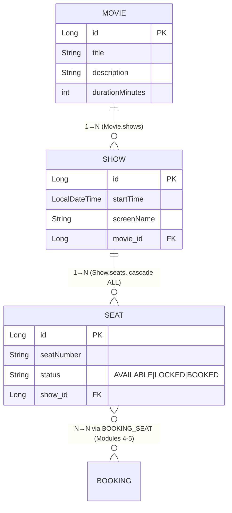
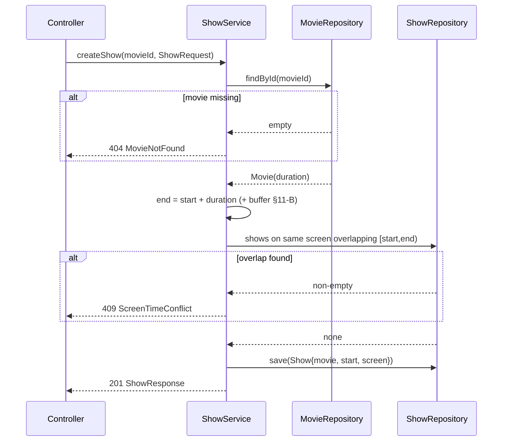
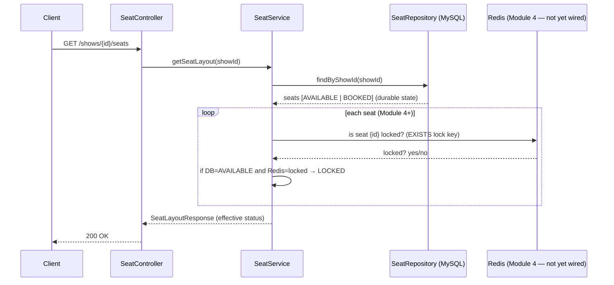

# Module 3 — Movie & Show Listing (CRUD)

Status: **planned (not yet implemented).** This document is the design of record.
It builds directly on the Module 1 entities/repositories and the Module 2 security
chain. Where it needs something the current codebase doesn't yet provide, that's
called out explicitly in §11 (Open Decisions) rather than assumed away.

---

## 1. Goal & Scope

Give the system its **catalog and inventory surface**: admins curate movies, schedule
shows onto screens, and materialize a show's physical seat grid; the public browses
movies, drills into a movie's shows, and views a show's live seat map.

This module is deliberately **CRUD-and-read-only with respect to seats** — it *creates*
the seat inventory and *reports* seat status, but it never mutates a seat's booked/locked
state. All seat-state transitions (`AVAILABLE → LOCKED → BOOKED`) belong to Modules 4–5
(Redis lock + transactional booking). Keeping that boundary clean is the single most
important design constraint here (see §6).

**Functional requirements**

- **Admin** (requires `ROLE_ADMIN`):
  - Create / update a `Movie`.
  - Create a `Show` linked to a `Movie`, with a start time and a screen.
  - Generate the `Seat` layout for a `Show` (bulk seat creation).
- **Public** (no auth required):
  - List `Movie`s (with search + pagination).
  - List `Show`s for a given `Movie`.
  - Get the `Seat` layout for a `Show`, each seat carrying a status of
    `AVAILABLE` / `LOCKED` / `BOOKED`.

**Non-functional requirements** (carried from `claude.md` "Project Constraints")

- Every endpoint documented via OpenAPI/Swagger (blocked on the springdoc dependency —
  see §11-D).
- Every service method logs at INFO/WARN via SLF4J.
- Controllers stay thin; all rules live in the service layer (principle #4).
- Never infer real-time lock state from the DB (principle #1) — this is what forces the
  Redis overlay seam in §6.

**Explicitly out of scope for Module 3:** deleting movies/shows (soft-delete policy is a
later decision — see §11-E), seat *locking/booking* (Modules 4–5), pricing engine
(§11-A raises the gap), and any write path on seats other than initial generation.

---

## 2. Endpoint Catalog

| # | Method & Path | Auth | Purpose | Success | Primary failure(s) |
|---|---|---|---|---|---|
| 1 | `POST /admin/movies` | `ROLE_ADMIN` | Create a movie | `201 Created` + `MovieResponse` | `400` validation, `409` duplicate title (see §11-C) |
| 2 | `PUT /admin/movies/{movieId}` | `ROLE_ADMIN` | Update a movie | `200 OK` + `MovieResponse` | `400`, `404` unknown movie |
| 3 | `POST /admin/movies/{movieId}/shows` | `ROLE_ADMIN` | Create a show under a movie | `201 Created` + `ShowResponse` | `400`, `404` unknown movie, `409` screen/time clash (§4.2) |
| 4 | `POST /admin/shows/{showId}/seats` | `ROLE_ADMIN` | Generate seat layout for a show | `201 Created` + `SeatLayoutResponse` | `400` bad layout spec, `404` unknown show, `409` seats already exist |
| 5 | `GET /movies` | public | List/search movies (paged) | `200 OK` + `Page<MovieResponse>` | — |
| 6 | `GET /movies/{movieId}/shows` | public | List shows for a movie | `200 OK` + `List<ShowResponse>` | `404` unknown movie |
| 7 | `GET /shows/{showId}/seats` | public | Seat layout w/ live status | `200 OK` + `SeatLayoutResponse` | `404` unknown show |

**Path convention:** admin write operations are namespaced under `/admin/**` so the
security rule is a single coarse matcher (`/admin/** → hasRole('ADMIN')`) *in addition to*
method-level `@PreAuthorize` — defence in depth. Public reads live at the bare resource
paths. This mirrors how Module 2 grouped `/auth/**`.

> **Nested vs. flat routes:** shows are created *nested* under a movie (`/admin/movies/{id}/shows`)
> because a show cannot exist without a movie — the parent is a hard FK (`Show.movie NOT NULL`).
> Seats are nested under a show for the same reason. Public reads follow the same nesting so
> the URL expresses the ownership. Seat layout is fetched via `/shows/{id}/seats` (flat on show)
> rather than `/movies/{mId}/shows/{sId}/seats` — the movie id is redundant once you have the
> show id, and the deeper path buys nothing.

---

## 3. How this maps onto the existing data model

Module 1 already gives us everything structurally. **No new tables, no schema migration.**
Recap of what we're working with (from `claude.md` / the entity files):



Relevant existing repository methods (check here before adding new ones — `claude.md`
says several already exist):

| Repository | Method | Used by |
|---|---|---|
| `MovieRepository` | `findByTitle`, `findByTitleContainingIgnoreCase` | dup check (#1), search (#5) |
| `ShowRepository` | `findByMovieId`, `findByMovieIdAndStartTimeBetween`, `findByStartTimeAfter` | list shows (#6), overlap check (#3) |
| `SeatRepository` | `findByShowId`, `findByShowIdAndStatus` | seat layout (#7), "seats exist?" guard (#4) |

**Gaps to add in Module 3** (thin, derived-query additions):
- `MovieRepository.findAll(Pageable)` — inherited from `JpaRepository`, nothing to write.
- `SeatRepository.existsByShowId(Long showId)` — cheap idempotency guard for #4 instead of
  loading the whole list.
- `ShowRepository.existsByScreenNameAndStartTime(...)` *or* the range query already present
  (`findByMovieIdAndStartTimeBetween`) — see §4.2 for which and why.

---

## 4. Detailed process — Admin write paths

### 4.1 Create / Update Movie (endpoints #1, #2)

The simplest path — pure CRUD, no cross-entity rules beyond the optional title-uniqueness
decision (§11-C).

```mermaid
flowchart TD
    A[POST/PUT request + MovieRequest body] --> B{@Valid passes?}
    B -- no --> B1[400 + field errors] 
    B -- yes --> C{Update? has movieId}
    C -- update --> D{movie exists?}
    D -- no --> D1[404 MovieNotFound]
    D -- yes --> E[copy fields onto managed entity]
    C -- create --> F{title dup check<br/>see 11-C}
    F -- dup --> F1[409 DuplicateMovie]
    F -- ok --> G[new Movie]
    E --> H[movieRepository.save]
    G --> H
    H --> I[map → MovieResponse]
    I --> J[201 create / 200 update]
```

Steps in the service (`MovieService`):
1. Validate the DTO at the controller boundary with `@Valid` (Bean Validation — see §7).
2. **Create:** run the duplicate-title policy (§11-C), construct a `Movie` via the Lombok
   `@Builder`, `save`, return `201` with a `Location: /movies/{id}` header.
3. **Update:** `findById(movieId)` → `404` if absent; copy `title/description/durationMinutes`
   onto the *managed* entity (do **not** `new` one and set the id — that risks blowing away
   the `shows` collection); `save`; return `200`.
4. Log `INFO "movie {id} created/updated"`.

> **Why not PATCH?** `PUT` here is a full replace of the mutable movie fields. We're not
> supporting partial updates in this module; if that's wanted later it's a separate PATCH
> endpoint with a nullable DTO. Keeping `PUT = full replace` keeps the semantics honest.

### 4.2 Create Show (endpoint #3)

A show is a movie scheduled onto a screen at a time. Two real rules:

1. **Parent must exist:** `movieId` from the path must resolve → else `404`.
2. **No double-booking a screen:** the same `screenName` cannot host two overlapping shows.
   A show occupies `[startTime, startTime + movie.durationMinutes)` (plus, realistically, a
   cleanup buffer — see §11-B). Overlap check:



**Implementation note on the overlap query.** The current `ShowRepository` has
`findByMovieIdAndStartTimeBetween` — that's *movie*-scoped, but screen conflicts are
*screen*-scoped across all movies (Screen 1 can't show Movie A and Movie B at once). So we
add a screen-aware finder. The clean interval-overlap predicate — two intervals overlap iff
`existingStart < newEnd AND existingEnd > newStart` — can't be expressed on `startTime` alone
because we don't persist an `endTime`; end is derived from the movie's duration. Options,
in order of preference:

- **(preferred)** Persist show length by adding a derived/`@Transient`-computed end, or store
  `endTime` on `Show`. Cleanest but touches the entity → raise as §11-B.
- **(no-schema-change fallback)** Fetch candidate shows on that screen within a bounded window
  (`startTime BETWEEN start − MAX_MOVIE_LEN AND end`) and do the precise overlap test in Java
  using each show's `movie.durationMinutes`. Correct, slightly chattier. Viable for Module 3
  volumes.

Pick one in §11-B before coding. Until then the plan assumes the Java-side check.

### 4.3 Generate Seat Layout (endpoint #4)

This is the most interesting admin operation: bulk-materializing a show's physical seats.

**Input** — a compact layout spec rather than N individual seats:

```jsonc
// POST /admin/shows/{showId}/seats
{
  "rows": 8,            // A..H
  "seatsPerRow": 12,    // 1..12  → seatNumber "A1".."H12"
  "rowLabels": null     // optional explicit labels; default = A, B, C…
}
```

**Algorithm:**

```mermaid
flowchart TD
    A[POST layout spec] --> V{spec valid?<br/>rows,cols in bounds}
    V -- no --> V1[400 InvalidLayout]
    V -- yes --> S{show exists?}
    S -- no --> S1[404 ShowNotFound]
    S -- yes --> E{seatRepository.existsByShowId?}
    E -- yes --> E1[409 SeatsAlreadyGenerated]
    E -- no --> G[build List&lt;Seat&gt;]
    G --> L[for each row r, col c:<br/>Seat{seatNumber=label+c,<br/>status=AVAILABLE, show}]
    L --> B[seatRepository.saveAll batch]
    B --> R[map → SeatLayoutResponse]
    R --> O[201 Created]
```

Steps (`SeatService.generateLayout`):
1. **Validate spec** — `rows` and `seatsPerRow` within sane bounds (e.g. 1–26 rows so single-
   letter labels stay clean, 1–50 per row). Reject otherwise → `400`.
2. **Resolve show** → `404` if absent.
3. **Idempotency guard** — `existsByShowId(showId)`; if seats already exist, `409`
   `SeatsAlreadyGenerated`. This makes the operation safe to retry without duplicating
   inventory. (Regeneration = a separate destructive endpoint we're not building now.)
4. **Build the grid** — nested loop; every seat starts `status = "AVAILABLE"`, `show` set to
   the managed parent. Seat number = `rowLabel + columnIndex` (`"A1"`, `"A2"`, … `"H12"`).
5. **Batch insert** — `seatRepository.saveAll(list)` in one call (one flush, not N).
6. Log `INFO "generated {count} seats for show {id}"`.

**Seat number example (8×12 grid):**

```
        1   2   3   4   5   6   7   8   9  10  11  12
  A   [A1][A2][A3][A4][A5][A6][A7][A8][A9][A10][A11][A12]
  B   [B1][B2] ...
  …
  H   [H1] ...                                     [H12]
```

> **Uniqueness caveat.** `Seat` currently has no DB unique constraint on
> `(show_id, seat_number)`. The `existsByShowId` guard prevents the *bulk* path from running
> twice, but a belt-and-braces unique index is worth adding when we're comfortable touching
> the schema (§11-B). Without it, two concurrent generate-layout calls could both pass the
> guard and double-insert — unlikely for an admin-only op, but not impossible.

---

## 5. Detailed process — Public read paths

### 5.1 List / search Movies (endpoint #5)

- `GET /movies?search=&page=0&size=20&sort=title,asc`
- If `search` blank → `movieRepository.findAll(pageable)`.
- Else → `findByTitleContainingIgnoreCase(search, pageable)` (add the `Pageable` overload;
  the existing method returns a bare `List`).
- Return a Spring `Page<MovieResponse>` — the JSON envelope carries `content`, `totalElements`,
  `totalPages`, `number`, giving the frontend real pagination for free.

> **Why paginate movies but not shows/seats?** A catalog grows unbounded; a single movie's
> show list and a single show's seat list are naturally bounded (tens, low hundreds). Paging
> those would add ceremony for no benefit. Revisit if a movie ever has hundreds of shows.

### 5.2 List Shows for a Movie (endpoint #6)

1. Confirm the movie exists (`existsById`) → `404` if not, so an empty list unambiguously
   means "movie exists, no shows scheduled" rather than "no such movie".
2. `showRepository.findByMovieId(movieId)` (optionally filter to future shows via the existing
   `findByStartTimeAfter` — decide in §11-F whether past shows are hidden).
3. Map → `List<ShowResponse>`, each including a lightweight seat-availability summary
   (`availableCount / totalCount`) if cheap — see the N+1 note below.

### 5.3 Get Seat Layout with live status (endpoint #7) — the important one

This endpoint is where the whole architecture's principle #1 gets tested. **Read §6 before
implementing it.**



---

## 6. The three seat statuses — where each one actually lives ⚠️

This is the crux of the module and the easiest place to violate `claude.md` principle #1
("Never infer real-time lock state from the DB").

| Status | Source of truth | Meaning | When set |
|---|---|---|---|
| `AVAILABLE` | **DB** (`Seat.status`) | free, not held, not sold | at layout generation (§4.3) |
| `LOCKED` | **Redis** (Module 4), *not the DB* | a user has an ephemeral hold (300 s TTL) mid-checkout | transiently, by the lock service |
| `BOOKED` | **DB** (`Seat.status`) | durably sold, payment confirmed | by the `@Transactional` booking commit (Module 5) |

Consequences for Module 3:

1. **At rest, a seat in the DB is only ever `AVAILABLE` or `BOOKED`.** `LOCKED` is never
   written to `Seat.status`. If you ever see `LOCKED` in the `seats` table, something has
   violated the architecture.
2. The seat-layout endpoint's job is to return the **effective** status =
   `DB status overlaid with the Redis lock set`. Concretely: start from the DB row; if it's
   `AVAILABLE` **and** a Redis lock key exists for that seat, report `LOCKED`; `BOOKED` always
   wins and never needs Redis.
3. **Redis is not provisioned until Module 4.** So Module 3 ships the endpoint returning
   truthful `AVAILABLE`/`BOOKED` from the DB, with the overlay behind a small seam we design
   now and fill in Module 4:

```java
// SeatStatusResolver — the seam. Module 3 ships the no-op; Module 4 swaps the impl.
interface SeatLockView {
    /** seat ids currently locked in Redis for this show. Module 3: returns empty set. */
    Set<Long> lockedSeatIds(Long showId);
}
```

`SeatService` computes effective status as:

```
effective = (seat.status == "BOOKED") ? BOOKED
          : lockView.lockedSeatIds(showId).contains(seat.id) ? LOCKED
          : AVAILABLE
```

Designing this seam in Module 3 means the seat-layout DTO and controller **don't change at
all** when Module 4 lands — only the `SeatLockView` bean gets a real Redis-backed
implementation. This keeps the DB-vs-Redis boundary honest from day one instead of
retrofitting it.

> **Amended by Module 4 (`plan/redis.md` §8).** The sentence above originally also claimed
> `SeatService` itself wouldn't change. It changes by **one line**: the seam's method became
> `lockedSeatIds(Long showId, Collection<Long> candidateSeatIds)` and `getSeatLayout` passes
> the seat ids it has already loaded. Without them, a Redis implementation's only option is
> `SCAN MATCH seat_lock:{showId}:*` — O(the entire keyspace), on the most-polled endpoint in
> the app, against a single-threaded server. With them it's one exact `MGET`. The part of the
> promise that actually mattered — no DTO change, no controller change, and **no change to
> the effective-status expression above** — still holds exactly.

> **Do not** be tempted to "simplify" by writing `LOCKED` into `Seat.status` during Module 4.
> That couples ephemeral state to durable state, breaks on crash (a locked-then-abandoned seat
> stays `LOCKED` forever with no TTL), and contradicts principle #1. The TTL living in Redis
> is the entire point.

---

## 7. DTOs & mapping

**Never serialize entities directly.** `Movie ↔ Show ↔ Seat` are bidirectional; Jackson would
recurse infinitely (or, with `@JsonManagedReference`, leak the whole object graph and trigger
lazy-load `N+1`s during serialization). All I/O goes through DTOs.

| DTO | Fields | Notes |
|---|---|---|
| `MovieRequest` | `@NotBlank title`, `description`, `@Positive durationMinutes` | create + update |
| `MovieResponse` | `id, title, description, durationMinutes` | no nested `shows` |
| `ShowRequest` | `@NotNull @Future startTime`, `@NotBlank screenName` | `movieId` comes from the path, not the body |
| `ShowResponse` | `id, movieId, movieTitle, startTime, screenName`, opt. `availableSeats/totalSeats` | flattened |
| `SeatLayoutRequest` | `@Min(1) @Max(26) rows`, `@Min(1) @Max(50) seatsPerRow`, `rowLabels?` | §4.3 |
| `SeatDto` | `id, seatNumber, status` (effective, §6) | one grid cell |
| `SeatLayoutResponse` | `showId, rows, seatsPerRow, List<SeatDto> seats` | full grid |

**Mapping:** `claude.md` says MapStruct is **not yet in `pom.xml`** — "add it when DTO mapping
is actually needed." Module 3 is exactly that moment. Recommendation: **add MapStruct now**
(`org.mapstruct:mapstruct` + `mapstruct-processor`, and order it after Lombok in the annotation
processor path or use `lombok-mapstruct-binding` so the two coexist). If we'd rather not take
the dependency yet, hand-written `toResponse(...)` mappers in each service are fine for this
volume — but decide once and be consistent (§11-A).

---

## 8. Authorization wiring — and a gap Module 3 must close ⚠️

Module 2's `SecurityConfig` currently ends every rule with `.anyRequest().authenticated()`
and only permits `/auth/**` + swagger paths. Two changes are required here:

**(a) Open the public reads.** Add to the `authorizeHttpRequests` block, *before*
`anyRequest().authenticated()`:

```java
.requestMatchers(HttpMethod.GET, "/movies/**", "/shows/**").permitAll()
.requestMatchers("/admin/**").hasRole("ADMIN")   // coarse gate; belt-and-braces with @PreAuthorize
```

Order matters — the specific `/admin/**` matcher and the `GET /movies|/shows` matchers must
precede the catch-all. Note the `GET`-only qualifier so we don't accidentally permit some
future `POST /shows`.

**(b) Method security is NOT currently enabled.** `SecurityConfig` has **no**
`@EnableMethodSecurity` annotation. That means `@PreAuthorize("hasRole('ADMIN')")` — which the
Module 2 plan explicitly assumed "works downstream" — **is silently ignored today.** Module 3
is the first module to rely on it, so Module 3 must add:

```java
@Configuration
@EnableMethodSecurity   // ← add this; without it every @PreAuthorize is a no-op
public class SecurityConfig { ... }
```

Verify with a test: a `ROLE_USER` token hitting `POST /admin/movies` must get `403`, not
`201`. This is the single highest-risk correctness item in the module — an unguarded admin
write endpoint is a real vulnerability, not a style nit. The `/admin/**` URL rule in (a) is
the primary defence; `@PreAuthorize` is the second layer, and both should be tested.

Failures flow through Module 2's existing `RestAuthenticationEntryPoint` (401) and
`RestAccessDeniedHandler` (403), so the JSON error shape is already consistent — nothing new
to build there.

---

## 9. Validation & error handling

Reuse Module 2's `GlobalExceptionHandler` (extend it; don't fork it). New exception → status
mappings:

| Exception | HTTP | When |
|---|---|---|
| `MethodArgumentNotValidException` (already handled) | `400` | Bean Validation failures on any `@Valid` DTO |
| `MovieNotFoundException` | `404` | unknown `movieId` |
| `ShowNotFoundException` | `404` | unknown `showId` |
| `DuplicateMovieException` | `409` | title policy (§11-C) |
| `ScreenTimeConflictException` | `409` | overlapping show on a screen (§4.2) |
| `SeatsAlreadyGeneratedException` | `409` | layout already exists (§4.3) |
| `InvalidSeatLayoutException` | `400` | rows/cols out of bounds |

All extend a small `ApiException(status, message)` base so the handler can map generically and
each service just throws the semantic type. Every thrown exception is logged at WARN with the
offending id(s) — no PII involved here, so ids are safe to log.

---

## 10. File-by-file breakdown (proposed)

```
com.example.movieticket
├── controller
│   ├── MovieController.java     # #1,#2 (admin) + #5,#6 (public)
│   ├── ShowController.java      # #3 (admin)  + part of #6
│   └── SeatController.java      # #4 (admin)  + #7 (public)
├── service
│   ├── MovieService.java        # create/update/list/search
│   ├── ShowService.java         # create (+ overlap rule), list-by-movie
│   └── SeatService.java         # generateLayout, getSeatLayout (+ SeatLockView seam §6)
├── security
│   └── SeatLockView.java        # interface + Module-3 no-op impl (empty locked set)
├── dto
│   ├── MovieRequest / MovieResponse
│   ├── ShowRequest  / ShowResponse
│   └── SeatLayoutRequest / SeatDto / SeatLayoutResponse
├── mapper                        # only if MapStruct chosen (§7/§11-A)
│   ├── MovieMapper / ShowMapper / SeatMapper
├── exception
│   ├── ApiException (base) + the six typed exceptions in §9
│   └── (extend existing GlobalExceptionHandler)
└── repository                    # additive only
    ├── SeatRepository:  + existsByShowId
    ├── MovieRepository: + Page<Movie> findByTitleContainingIgnoreCase(String, Pageable)
    └── ShowRepository:  + screen-overlap finder (§4.2)
```

Nothing in `model/` changes unless §11-B (endTime / unique constraint) is approved.

**Suggested build order:** DTOs → repository additions → services (Movie → Show → Seat) →
controllers → `SecurityConfig` changes (§8) → exception mappings → tests.

---

## 11. Open Decisions (resolve before / during implementation)

These are the judgment calls I'd want your sign-off on as we start — each changes code, so
flagging now rather than silently picking:

- **A. Pricing gap (raise early).** There is **no price field anywhere** — `Movie`, `Show`,
  and `Seat` have none; only `Booking.totalPrice` exists. The seat-layout response arguably
  wants a price, and Module 5's booking *must* compute `totalPrice` from something. Options:
  (i) add `price` to `Show` (flat per-show pricing — simplest, most common), (ii) add `price`
  to `Seat` (per-seat tiers: premium/regular), or (iii) a fixed constant for now. My
  recommendation: **add a `price` to `Show`** now while we're already touching this area, so
  Module 5 isn't blocked. This touches the entity → couple it with decision B.
- **B. Schema touch-ups.** Do we (i) add `endTime`/duration handling to `Show` for a clean
  overlap query (§4.2), and (ii) add a `UNIQUE(show_id, seat_number)` index on `Seat` (§4.3)?
  Both are "touch the entity" changes; if yes, batch them with A in one migration pass. If no,
  we use the Java-side overlap check and the `existsByShowId` guard as designed.
- **C. Movie title uniqueness.** Enforce unique titles (→ `409` on dup) or allow duplicates
  (remakes, re-releases legitimately share titles)? Recommendation: **allow duplicates**;
  disambiguate by id/year, drop the `409` on endpoint #1. Cheap to change either way.
- **D. springdoc dependency.** `claude.md` requires every endpoint documented; the dependency
  still isn't in `pom.xml`. Module 3 adds the first non-auth controllers → add
  `springdoc-openapi-starter-webmvc-ui` now and annotate all seven endpoints. (Module 2 left
  `AuthController` un-annotated for the same reason — we can backfill it in the same pass.)
- **E. Delete/soft-delete.** Deliberately out of scope here. When it lands: hard-delete is
  dangerous once bookings reference a show. Likely a soft-delete/`active` flag. Note it,
  don't build it.
- **F. Hide past shows?** Should `GET /movies/{id}/shows` return only future shows
  (`findByStartTimeAfter`) or all of them? Recommendation: **future-only by default**, with an
  `?includePast=true` override for an admin view.
- **G. MapStruct vs. hand mapping** (§7) — pick one and apply consistently.

---

## 12. Test plan (integration-first, per `claude.md`)

`-webmvc-test` and `-jpa-test` starters are already present, so real MVC + DB slices are
expected, not mock-only.

| Test | Asserts |
|---|---|
| `ROLE_USER` → `POST /admin/movies` | `403` (proves §8-b `@EnableMethodSecurity` + URL rule work) |
| no token → `POST /admin/movies` | `401` |
| `ROLE_ADMIN` → create movie → create show → generate seats | full happy path, `201`×3 |
| generate seats twice | second call `409 SeatsAlreadyGenerated` |
| create overlapping show on same screen | `409 ScreenTimeConflict` |
| `GET /shows/{id}/seats` after a booking (Module 5) | booked seats report `BOOKED`, rest `AVAILABLE` |
| `GET /shows/{id}/seats` with a Redis lock (Module 4) | locked seat reports `LOCKED`, DB row still `AVAILABLE` |
| `GET /movies?search=` paging | correct `Page` envelope, `totalElements` |
| invalid layout (`rows=0`) | `400 InvalidSeatLayout` |

The last two seat-status rows can only be fully exercised once Modules 4/5 land, but the
`SeatLockView` seam (§6) lets us unit-test the effective-status resolver *now* by stubbing the
locked-id set.

---

### Summary of the three things I'd flag loudest
1. **`@EnableMethodSecurity` is missing** — admin endpoints are unguarded at the method layer
   until Module 3 adds it (§8-b). Highest-risk item.
2. **`LOCKED` never touches the DB** — it's a Redis overlay; build the `SeatLockView` seam now
   so Module 4 drops in without changing this module (§6).
3. **No price field exists anywhere** — decide pricing (§11-A) before Module 5 needs it; ideal
   time to add it is this module's schema pass.
