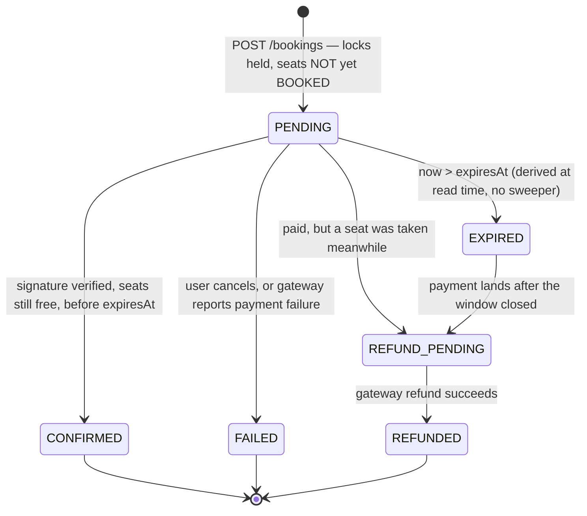

# Module 5 — Payment + Transactional Booking (design of record)

> Status: **implemented.** Written before implementation, per the `plan/` vs
> `logic/` convention. The as-built writeup, including the deviations from this
> document, is at `logic/payment.md`.
>
> Cross-refs used below: `plan/crud.md` (Module 3), `plan/redis.md` (Module 4
> design), `logic/redis-locking.md` (Module 4 as-built),
> `plan/authentication.md` (Module 2), `claude.md` (project guide).

---

## 1. What this module is actually for

Modules 1–4 built everything up to the moment of sale and then stop. A user can
browse movies, list shows, read a live seat map, and take an all-or-nothing
300-second Redis hold on up to 10 seats. After that: nothing. There is no
`BookingService`, no `BookingController`, no code path that writes a `Booking`
row, and **no code anywhere that sets `Seat.status = "BOOKED"`** — the constant
`STATUS_BOOKED` exists in two classes and is only ever *read*.

Module 4 deliberately left two hooks with zero callers, waiting for this module:

```java
// SeatLockService
public void assertHoldsAll(Long showId, Collection<Long> seatIds, Long userId)
public void releaseAfterCommit(Long showId, Collection<Long> seatIds, Long userId)
```

Module 5 is what turns an ephemeral Redis hold into a durable, paid-for sale
without ever letting two users end up with the same seat.

### 1.1 The scope change: "mocked payment" → a real gateway behind a seam

The original spec said *mocked payment*. Research done during this module's design
pass established that a **genuinely real** gateway integration costs nothing:

| | Real HTTP, real order objects, real HMAC signatures, real webhooks | Real money moves |
|---|---|---|
| Cost | ₹0, forever | 2% per txn (₹0 setup, ₹0 AMC) |
| KYC | none | PAN + bank account + address proof (RBI-mandated) |
| Code difference | — | **the key prefix**: `rzp_test_…` → `rzp_live_…` |

Razorpay test mode is not a simulator you write throwaway code against. It is the
same API surface, the same signature algorithm, the same webhook contract, the same
everything. What live mode adds is merchant registration — which a portfolio
project collecting money for films that do not exist should decline regardless.

So this module ships **both**, behind an interface, using the pattern this project
already used once: `SeatLockView` → `NoOpSeatLockView` (Module 3) →
`RedisSeatLockView` (Module 4).

> **Rejected: Stripe.** Best documentation of the three candidates, but Indian
> account creation is invite-only, which kills the "flip to live keys someday"
> property that makes the whole exercise meaningful.
>
> **Rejected: PayPal sandbox.** Genuinely free, no KYC, globally portable, good
> Orders v2 + webhook story. But no UPI, and a weaker fit for an Indian cinema
> domain. Kept as the fallback if Razorpay onboarding ever becomes a problem — the
> `PaymentGateway` seam in §6 is exactly what makes that a one-class swap.
>
> **Rejected: UPI deep links / a static UPI QR.** Truly free and needs no gateway
> at all, but there is no server-side confirmation callback whatsoever. Booking
> state would depend on the user *claiming* they paid. Unusable.

### 1.2 The consequence that shapes every other decision

**A real gateway makes payment asynchronous.** The user leaves for a bank page or a
UPI app. They may take four minutes. They may abandon. The confirmation may arrive
*after* the 300-second lock expired and somebody else already bought the seat. It
may arrive twice. It may arrive out of order relative to the browser redirect.

A mocked payment is synchronous and can never surface any of this. `claude.md`
principle #2 currently describes exactly that synchronous shape:

> Booking confirmation (seat re-check → create `Booking`/`BookingSeat` rows → mark
> seat `BOOKED`) happens in one `@Transactional` service method.

That stays true of **confirmation** (§4), but it is no longer the whole flow —
creation and confirmation become two separate requests separated by an unbounded
amount of real-world time. This document amends principle #2 accordingly (§12).

The async state machine is designed into the **core** booking flow, and the mock
gateway simulates the async callback too. The mock is a test double of the real
contract, not a synchronous shortcut that hides the hard part.

---

## 2. Endpoints

| # | Method | Path | Auth | Purpose |
|---|---|---|---|---|
| 1 | POST | `/bookings` | authenticated | Create a `PENDING` booking + a payment intent. Returns a `checkoutUrl`. |
| 2 | POST | `/bookings/{bookingId}/confirm` | authenticated | Browser-callback confirmation path (signature-verified). |
| 3 | POST | `/payments/webhook` | **public** | Gateway-callback confirmation path (signature-verified). |
| 4 | GET | `/bookings/{bookingId}` | authenticated, owner only | One booking with its seats and payment status. |
| 5 | GET | `/bookings` | authenticated | The caller's bookings. |
| 6 | POST | `/bookings/{bookingId}/cancel` | authenticated, owner only | Abandon a `PENDING` booking, release the locks now rather than waiting for TTL. |
| 7 | POST | `/mock-gateway/pay/{providerOrderId}` | public, **mock profile only** | Stands in for the customer completing payment at the gateway. |

Endpoint 3 is public **on purpose** and this is the single most dangerous line in
the module — see §8.2. Endpoint 7 exists only when `payment.gateway=mock`; it is
not on the context in Razorpay mode.

Every endpoint gets `@Operation` + `@SecurityRequirement(name = "bearerAuth")`
annotations, per `claude.md`'s "every public endpoint documented via
OpenAPI/Swagger" constraint, and SLF4J logging in the service layer.

---

## 3. The state machine



Three rules carry the entire design.

### 3.1 Seats become `BOOKED` only at `CONFIRMED` — never at `PENDING`

A pending booking is protected **solely by the Redis lock it already holds**. It
writes no durable claim on any seat.

This is what makes an abandoned checkout self-healing with zero cleanup code: the
lock TTLs out on its own, and the orphaned `PENDING` row holds nothing that anyone
else needs. It is also a direct application of `claude.md` principle #1 — the DB
holds durable committed state, Redis holds the ephemeral hold, and a booking that
has not been paid for is still ephemeral.

> **Rejected: marking seats `BOOKED` (or adding a `RESERVED` status) at `PENDING`
> time.** It duplicates the Redis lock in a second, slower store with no TTL, so
> every abandoned checkout leaves a seat permanently unsellable until a sweeper
> comes along. That sweeper is exactly the code `plan/redis.md` §2 congratulated
> itself on not needing.

### 3.2 `Booking.expiresAt = bookingTime + seatlock.ttl-seconds`

The payment window **cannot** outlive the seat lock, because `claude.md` forbids
extending the lock:

> Redis lock TTL is fixed at **300 seconds** … No lock-extension / heartbeat
> mechanism, ever.

So the deadline is derived from the same property, not hardcoded and not
independently configurable. If the two could drift apart, the gap would be a window
where a booking is still "payable" but its seats are already lockable by someone
else — which is precisely the paid-but-seat-gone case in §4.4, promoted from a rare
edge case to routine behaviour.

Storing `expiresAt` on the row (rather than recomputing `bookingTime + ttl` on every
read) means a later TTL change does not retroactively move the deadline of bookings
already in flight.

### 3.3 No sweeper, no `@Scheduled`, no cleanup job

`EXPIRED` is **derived at read time**: `status == PENDING && now > expiresAt`.

This mirrors two things the project already does. Redis TTL-as-reconciliation
(`plan/redis.md` §2: there is no cleanup code anywhere in Module 4), and
`SeatService.toSeatDto`'s effective-status precedence, where the *displayed* seat
status is computed from several sources rather than persisted.

`EXPIRED` therefore never gets written by a background job. It gets written only
when something actually touches the booking — a read, a confirm attempt, a cancel —
and even then only as a side effect of answering the real question. A booking nobody
ever looks at again simply sits there as a dead `PENDING` row, harming nothing.

> **Rejected: a `@Scheduled` reaper flipping `PENDING` → `EXPIRED`.** It adds a
> moving part, a second writer racing the confirm path for the same rows, and a
> new failure mode (reaper down = stale state) in exchange for tidier-looking
> data. The lazy derivation is correct without any of that. Revisit only if an
> admin reporting screen ever needs accurate expiry counts without a read.

---

## 4. Confirmation: two paths, one idempotent method

The browser callback (endpoint 2) and the webhook (endpoint 3) are **two
independent deliveries of the same fact**. Either can arrive first. Both can
arrive. Either can arrive twice — Razorpay retries webhooks for up to 24 hours.

They both funnel into exactly one method:

```java
// BookingService
@Transactional
public BookingResponse confirmPaid(String providerOrderId, String providerPaymentId)
```

### 4.1 The algorithm

```
1. payment = paymentRepository.findWithLockByProviderOrderId(providerOrderId)
                              .orElseThrow(BookingNotFoundException)   // PESSIMISTIC_WRITE
2. if booking.status == CONFIRMED            -> return existing booking     (idempotent no-op, 200)
3. if booking.status == FAILED
      or (status == PENDING && now > expiresAt)
                                             -> REFUND_PENDING, log.error, return   (§4.3)
4. seats = seatRepository.findByIdInAndShowIdForUpdate(sortedSeatIds, showId)
   if any seat.status == BOOKED              -> REFUND_PENDING, log.error, return   (§4.4)
5. seats.forEach(s -> s.setStatus("BOOKED"))
   booking.status = CONFIRMED
   payment.status = CAPTURED; payment.providerPaymentId = providerPaymentId
   seatLockService.releaseAfterCommit(showId, seatIds, userId)
6. commit  ->  afterCommit fires  ->  unlock_seats.lua releases the locks
```

### 4.2 Step 1 is the whole concurrency story

`findWithLockByProviderOrderId` takes a `PESSIMISTIC_WRITE` row lock on the
`payments` row. That single lock does three jobs at once:

- **Idempotency gate.** A retried webhook blocks until the first one commits, then
  reads `CONFIRMED` at step 2 and returns without doing anything.
- **Race gate between the two paths.** The browser callback and the webhook cannot
  both pass step 2.
- **Serialization point for the seat writes.** Everything after it runs
  single-threaded per booking.

`providerOrderId` is `UNIQUE NOT NULL` on `payments` — it *is* the idempotency key.
Not a separate `idempotency_key` column, because the gateway already mints exactly
one durable identifier per payment attempt and inventing a second one just creates
two things that can disagree.

> **Rejected: optimistic locking (`@Version`) on the payment row.** It turns a
> concurrent duplicate webhook into an `OptimisticLockingFailureException` that we
> would then have to catch and translate into "actually that's fine, it's a
> duplicate" — which is more code than just taking the pessimistic lock and reading
> the committed truth.

### 4.3 The paid-too-late case

The user paid, but the 300s window closed first. The money is real; the seats are
not ours to give. We **never** confirm — the seats may already belong to someone
else, and even if they do not, confirming would mean honouring a hold that expired,
which is exactly the lock-extension `claude.md` forbids.

The booking goes to `REFUND_PENDING` with a loud `log.error`. This is the most
operationally significant state in the module and it should be greppable.

### 4.4 The paid-but-seat-gone case

Same outcome, different cause: the lock expired, another user locked and confirmed
the seat, and *then* our payment landed. Step 4's `FOR UPDATE` read is what catches
it. The DB is the backstop here exactly as `claude.md` describes — the Redis lock
was the primary gate and it already lost.

### 4.5 Why `releaseAfterCommit` is called *inside* the transaction

It looks wrong and it is right. The method registers a
`TransactionSynchronization` whose `afterCommit` callback runs the unlock script, so
calling it before the commit is what causes the release to happen *after* the
commit. Calling it outside an active transaction throws `IllegalStateException`
from `registerSynchronization`. `SeatLockService`'s own javadoc says so; this is
the ordering `claude.md` fixes and Module 4 exists to hand us pre-solved.

If the transaction rolls back, the callback never fires and the locks stand until
TTL — correct, because the user may retry.

> **Rejected: confirming inside the `POST /bookings` request.** This is the
> synchronous design the mock would happily have allowed and a real gateway
> forbids. It cannot represent abandon, redirect, retry, or out-of-order delivery,
> which is the entire substance of this module.

---

## 5. `POST /bookings` is three steps, not one

| Step | Transactional? | Work |
|---|---|---|
| **A** | `@Transactional` | resolve the user from the principal; load the show (404); load + validate seats belong to the show (404); `FOR UPDATE` re-read and reject anything already `BOOKED` (409); `assertHoldsAll` (409); compute `totalPrice`; persist `Booking(PENDING)` + `BookingSeat` rows + `Payment(CREATED, providerOrderId = null)` |
| **B** | **no transaction** | `paymentGateway.createIntent(...)` — an outbound HTTPS call to a third party |
| **C** | `@Transactional` | persist `providerOrderId` + `checkoutUrl` onto the payment row |

### 5.1 Never hold a transaction across a network call

Step B is separated for one reason: holding a pooled JDBC connection **and**
`FOR UPDATE` row locks for the duration of a call to somebody else's server is how
a slow third party becomes a database outage. It is the same failure shape
`claude.md` already warns about for Lettuce's 60-second default timeout, one layer
out.

The gateway `RestClient` gets its own explicit connect/read timeouts for the same
reason.

If step B fails, the booking stays `PENDING` with a null `providerOrderId`, expires
on its own with no cleanup, the locks TTL out, and the caller gets `502`.

### 5.2 Ordering inside step A

`assertHoldsAll` runs **after** the `FOR UPDATE` seat re-read, not before. Both
checks are mandatory (`plan/redis.md` §11.1: "the lock is the primary gate; the DB
check is the backstop. Neither replaces the other"), but doing the DB read first
means we are holding the row locks that make the subsequent decision meaningful
before we ask Redis anything.

### 5.3 Price

```java
BigDecimal totalPrice = show.getPrice().multiply(BigDecimal.valueOf(seatIds.size()));
```

Per `claude.md`'s pricing note: `show.price * seatCount`, computed at booking time
and stored, so a later admin price change never retroactively alters a sold ticket.

---

## 6. The `PaymentGateway` seam

```java
public interface PaymentGateway {

    /** "mock" | "razorpay" — persisted on the payment row so a booking always
        records which implementation actually handled it. */
    String name();

    /** Creates the gateway-side order/link. Returns its id + a URL the customer pays at. */
    PaymentIntent createIntent(PaymentIntentCommand command);

    /** Browser-callback path. Throws PaymentVerificationException (400) on mismatch. */
    void verifyCallbackSignature(String providerOrderId, String providerPaymentId, String signature);

    /** Webhook path. Verifies over the RAW body, then parses. Throws on mismatch. */
    WebhookEvent verifyAndParseWebhook(String rawBody, String signatureHeader);

    /** Drives REFUND_PENDING -> REFUNDED. */
    void refund(String providerPaymentId, BigDecimal amount);
}
```

Supporting records: `PaymentIntentCommand(bookingReference, amount, currency,
customerEmail, callbackUrl)`, `PaymentIntent(providerOrderId, checkoutUrl)`,
`WebhookEvent(type, providerOrderId, providerPaymentId, status)`.

Bean selection is `@ConditionalOnProperty("payment.gateway", havingValue = …)`, so
**exactly one implementation is on the context** — `RedisSeatLockView` *replaced*
`NoOpSeatLockView` rather than coexisting with it (`claude.md` Module 4), and this
follows the same rule. No `@Primary`, no list injection, no runtime branch.

### 6.1 `MockPaymentGateway` — `havingValue = "mock"`, `matchIfMissing = true`

The default, so `./mvnw spring-boot:run` and every unit test work offline with no
credentials.

- Mints `mock_order_<uuid>`.
- Signs with the **same** `HMAC_SHA256(orderId + "|" + paymentId, secret)`
  construction as the real gateway, against a locally generated secret — so the
  real verification code path is genuinely exercised rather than stubbed to
  `return true`.
- Its `checkoutUrl` points at `POST /mock-gateway/pay/{providerOrderId}`
  (endpoint 7), which simulates the customer paying and then calls **the same
  webhook handler the real gateway would**.

That last point is the whole reason this design is worth having: **the mock walks
the async path, it does not bypass it.** The idempotency, the late-payment branch,
and the seat-gone branch are all reachable and testable with no network.

Labelled as mocked in three places, per `claude.md`'s constraint: the class javadoc,
`README.md`, and a `log.warn` emitted at startup when the bean is created.

### 6.2 `RazorpayPaymentGateway` — `havingValue = "razorpay"`

Fails fast in its constructor if any of the three secrets is blank — a
half-configured payment gateway should refuse to start, not fail on the first
customer.

```
POST https://api.razorpay.com/v1/payment_links
  Authorization: Basic base64(key_id:key_secret)
  { "amount": <paise, integer>, "currency": "INR",
    "reference_id": <bookingReference>,
    "callback_url": "<app>/bookings/{id}/confirm", "callback_method": "get" }

callback signature: HMAC_SHA256(razorpay_order_id + "|" + razorpay_payment_id, key_secret)      hex
webhook signature:  HMAC_SHA256(<raw request body>, webhook_secret)  ==  X-Razorpay-Signature   hex
```

**Payment Links, not Checkout.js.** Razorpay's standard Checkout is a browser JS
widget, and this project has no frontend until Module 8. A Payment Link is created
server-side and returns a URL that opens in any browser — which makes a real
end-to-end test possible *today*, from a backend-only codebase, with no HTML
written inside a backend module.

Amounts are **paise** (integer minor units):
`amount.movePointRight(2).longValueExact()`. Never `doubleValue()` —
`longValueExact()` throws rather than silently truncating a price that somehow
carries sub-paise precision.

### 6.3 No SDK, no new dependencies

`com.razorpay:razorpay-java:1.4.10` exists and would work. It is deliberately not
used.

- The entire server-side surface needed is three things: create a link, verify a
  callback signature, verify a webhook signature. That is roughly forty lines with
  `RestClient` (already present via `spring-boot-starter-webmvc`),
  `javax.crypto.Mac`, and `java.util.HexFormat` (both JDK).
- The SDK pulls okhttp3 and org.json onto a Spring Boot 4.1 / Jackson 3 classpath
  that has **already** produced one Jackson collision during Module 2
  (`claude.md` §JSON, `logic/jwt.md` §2.9).
- It is the same reasoning that rejected MapStruct in Module 3: this project wants
  every line explainable, and "the SDK does it" is the opposite of that.

**`pom.xml` is unchanged by this module.**

---

## 7. Schema changes

### 7.1 `Booking`

| Field | Change |
|---|---|
| `totalPrice` | `double` → `BigDecimal`, `@Column(nullable = false, precision = 10, scale = 2)` |
| `status` | **new** — `BookingStatus`, `@Enumerated(EnumType.STRING)`, `nullable = false, length = 20` |
| `expiresAt` | **new** — `LocalDateTime`, `nullable = false` (§3.2) |
| `bookingReference` | **new** — `String`, unique, not null, a UUID |

**`totalPrice` was `private double totalPrice;`** — in direct contradiction of
`claude.md`'s own pricing note ("not `double`/`float`, since money must never lose
cents to binary floating-point rounding") which was written about `Show.price`
while `Booking.totalPrice` sat there in binary floating point the whole time.
Module 5 is the first code that would ever write to it, so this is the moment to
fix it.

⚠️ **`spring.jpa.hibernate.ddl-auto=update` will not narrow or convert an existing
column type.** On any database where `bookings` already exists, this needs a manual
migration before first run:

```sql
ALTER TABLE bookings MODIFY total_price DECIMAL(10,2) NOT NULL;
```

Since no booking row has ever been written by any code, dropping the table is
equally valid locally. This must go in the README runbook — it is exactly the class
of thing that silently works on a fresh DB and fails on the reviewer's.

**`bookingReference`** is a UUID rather than the numeric id because Module 7 puts
this value in a QR code. A sequential integer in a QR is enumerable — anyone can
guess `bookingId + 1` and try to validate someone else's ticket. Adding it now
costs one column; retrofitting it after Module 7 ships means reissuing tickets.

### 7.2 `Payment` (new, table `payments`)

| Column | Notes |
|---|---|
| `id` | identity |
| `booking_id` | `@OneToOne`, unique, not null |
| `provider` | `"mock"` / `"razorpay"` — which implementation handled it |
| `provider_order_id` | **unique, not null.** The idempotency key (§4.2). |
| `provider_payment_id` | nullable until captured |
| `amount` | `BigDecimal(10,2)`, not null |
| `currency` | `String(3)`, not null |
| `status` | `PaymentStatus`, `@Enumerated(EnumType.STRING)` |
| `failure_reason` | nullable |
| `created_at` / `updated_at` | |

`@OneToOne` rather than `@OneToMany`: one payment attempt per booking. A user who
wants to retry after a failure creates a **new** booking, because their lock has to
be re-acquired anyway — a retry against a stale booking whose lock expired is
precisely the paid-too-late case we are trying to avoid manufacturing on purpose.

### 7.3 `BookingSeat` — and a correction to `claude.md`

`claude.md` currently claims:

> The Module 5 DB re-check + `uk_seat_show_seatnumber`-style constraints are the
> last-line backstop, not the primary gate.

There is no such constraint on `booking_seats` today, and **the obvious one cannot
be added.** A `UNIQUE(seat_id)` would be a true "this seat is sold at most once"
guarantee — except `BookingSeat` rows are created at `PENDING` time (§3.1), so a
seat legitimately appears in an earlier abandoned booking *and* in the later
successful one. `UNIQUE(seat_id)` would make every retry after an abandoned
checkout fail with a 409 forever. MySQL has no partial/filtered indexes, so there
is no "unique only among confirmed rows" option.

What gets added is `UNIQUE(booking_id, seat_id)` (`uk_booking_seat`), which
prevents a seat being duplicated *within* one booking.

The real serialization point is §4.1 step 4: `SELECT … FOR UPDATE` on the seat rows
plus the `BOOKED` status check. That is **stronger** than a unique index would be,
because it also catches the cross-booking case that a per-row constraint cannot see.
`claude.md`'s wording gets corrected rather than quietly left standing.

### 7.4 Enums

`BookingStatus { PENDING, CONFIRMED, FAILED, EXPIRED, REFUND_PENDING, REFUNDED }`
and `PaymentStatus { CREATED, CAPTURED, FAILED, REFUND_PENDING, REFUNDED }` are the
project's **first entity enums**. `Seat.status` and `User.role` are plain strings,
and `claude.md` explicitly flags that inconsistency as something to keep track of.

Justification for diverging: these are brand-new fields with no legacy rows and no
string literals scattered across existing services to hunt down — which is the
exact reason `Seat.status` is *not* being converted in the same breath. Doing both
would put a status-string refactor of Modules 3 and 4 inside a payments module.

The inconsistency gets recorded in `claude.md` rather than papered over.

### 7.5 Repositories

```java
// SeatRepository — new
@Lock(LockModeType.PESSIMISTIC_WRITE)
@Query("select s from Seat s where s.id in :ids and s.show.id = :showId order by s.id")
List<Seat> findByIdInAndShowIdForUpdate(@Param("ids") Collection<Long> ids,
                                        @Param("showId") Long showId);
```

⚠️ **`order by s.id` is not cosmetic.** Two concurrent bookings whose seat sets
overlap will deadlock in InnoDB if they acquire row locks in different orders. The
service sorts the id list before calling, and the query sorts again — belt and
braces, because the JPQL `in` clause does not otherwise guarantee acquisition
order.

```java
// PaymentRepository — new
Optional<Payment> findByProviderOrderId(String providerOrderId);

@Lock(LockModeType.PESSIMISTIC_WRITE)
Optional<Payment> findWithLockByProviderOrderId(String providerOrderId);

// BookingRepository — added to the existing findByUserId/findByShowId
Optional<Booking> findByIdAndUserId(Long id, Long userId);
Optional<Booking> findByBookingReference(String bookingReference);

@Query("select distinct b from Booking b "
     + "join fetch b.bookingSeats bs join fetch bs.seat "
     + "where b.user.id = :userId order by b.bookingTime desc")
List<Booking> findAllForUserWithSeats(@Param("userId") Long userId);
```

The fetch join exists because `GET /bookings` is the module's N+1 risk: `Booking`'s
`@ManyToOne` associations default to EAGER and `bookingSeats` is a lazy collection,
so a naive list of 20 bookings is 40+ queries.

---

## 8. Traps

Numbered so `logic/payment.md` can confirm each one was actually checked in the
shipped code, the way Module 4's two traps were.

### 8.1 The webhook body must be the raw string

```java
@PostMapping("/payments/webhook")
public ResponseEntity<Void> handle(@RequestBody String rawBody,
                                   @RequestHeader("X-Razorpay-Signature") String signature)
```

`@RequestBody String`, **never** a parsed DTO. The HMAC is computed over the exact
bytes the gateway sent; deserializing to an object and re-serializing changes
whitespace and key order, and the signature will never match again. Parse only
*after* verification — and with the Jackson **3** `ObjectMapper`
(`tools.jackson.databind.ObjectMapper`), not the Jackson 2 one that is also on the
classpath transitively via `jjwt-jackson` (`claude.md` §JSON).

### 8.2 `POST /payments/webhook` must be `permitAll`, declared before `anyRequest()`

Razorpay's servers carry no JWT. **The signature is the authentication.** The
matcher must be added to `SecurityConfig` ahead of `.anyRequest().authenticated()`,
since Spring Security evaluates rules in declaration order and stops at the first
match.

This is the same class of trap as Module 4's `locks/mine` matcher, with the
polarity reversed: there, a rule declared too late would have made a private
endpoint public; here, a rule declared too late makes a public endpoint
permanently 401 and every webhook silently fails. Both need the matcher order
verified by *reading* it, not by the endpoint appearing to work.

CSRF is already globally disabled (`SecurityConfig`, pure bearer-token auth), so
there is nothing extra to do there.

### 8.3 Constant-time signature comparison

`MessageDigest.isEqual(byte[], byte[])`, never `String.equals`. Both gateways share
one `PaymentSignatures` helper so there is a single place this can be got wrong.

### 8.4 Trust the stored `providerOrderId`, not the one the browser echoes

The callback path (endpoint 2) resolves the payment by the order id **we**
persisted in step C, keyed off the authenticated user's booking — not by the
`razorpay_order_id` in the request body. Otherwise a caller can present a signature
that is internally consistent for an order that is not theirs. This is the single
most commonly botched part of a Razorpay integration.

### 8.5 `GET /bookings/{id}` returns 404, not 403, for someone else's booking

Via `findByIdAndUserId`, so ownership is a *query predicate* rather than a
load-then-compare that a later refactor can drop. 404 rather than 403 so booking
ids are not enumerable.

### 8.6 Secrets get no inline default

`application.properties` uses `${VAR:localdefault}` everywhere. The three Razorpay
secrets deliberately break that pattern with an empty default — there is no safe
local placeholder for a credential, and `RazorpayPaymentGateway` refuses to
construct if any is blank (§6.2). Same spirit as `claude.md`'s standing warning
about the `JWT_SECRET` default.

### 8.7 `releaseAfterCommit` must be called inside an active transaction

Outside one, `TransactionSynchronizationManager.registerSynchronization` throws
`IllegalStateException` — which, with no `Exception` → 500 handler in
`GlobalExceptionHandler`, surfaces as a raw 500. Module 4 shipped this method
**untested**; Module 5 is where it finally gets a test (§10).

---

## 9. New properties and exceptions

```properties
payment.gateway=${PAYMENT_GATEWAY:mock}
payment.currency=${PAYMENT_CURRENCY:INR}
payment.callback-base-url=${PAYMENT_CALLBACK_BASE_URL:http://localhost:8080}
payment.razorpay.api-base-url=${RAZORPAY_API_BASE_URL:https://api.razorpay.com/v1}
payment.razorpay.key-id=${RAZORPAY_KEY_ID:}
payment.razorpay.key-secret=${RAZORPAY_KEY_SECRET:}
payment.razorpay.webhook-secret=${RAZORPAY_WEBHOOK_SECRET:}
```

New exception types, wired into `GlobalExceptionHandler` in the existing
commented-per-module style:

| Exception | Status | Thrown when |
|---|---|---|
| `BookingNotFoundException` | 404 | unknown booking id, or one that is not the caller's (§8.5) |
| `BookingStateException` | 409 | an operation illegal for the booking's current state (cancelling a `CONFIRMED` booking) |
| `PaymentVerificationException` | 400 | signature mismatch, on either path |
| `PaymentGatewayException` | **502** | the gateway is unreachable, times out, or returns a non-2xx |

502 rather than 503: 503 in this codebase already means "*we* are degraded, fail
closed" (Redis down). A third party being down is a distinct condition and should
read differently in logs and dashboards.

---

## 10. Testing

### 10.1 Unit — Mockito, no network, must pass in CI and in this sandbox

Following `SeatLockServiceTest`'s established shape (mocked repositories +
`StringRedisTemplate`, `ArgumentCaptor` for the interesting assertions):

**`BookingServiceTest` — creation**
1. Happy path leaves the booking `PENDING`, seats **not** `BOOKED`, and locks **not** released.
2. `assertHoldsAll` throwing → 409, nothing persisted, gateway never called.
3. A seat already `BOOKED` → 409 raised **before** any gateway call.
4. A seat belonging to another show → 404, no Redis call.
5. `totalPrice` equals `show.price.multiply(seatCount)` exactly, as `BigDecimal`.
6. The user is resolved from the principal, never from the request payload
   (`plan/authentication.md` §7).
7. Gateway failure in step B → 502, booking left `PENDING` with a null order id.

**`BookingServiceTest` — confirmation**
8. **`confirmPaid` called twice → exactly one `CONFIRMED` booking; seats set `BOOKED` once.**
9. `confirmPaid` after `expiresAt` → `REFUND_PENDING`, seats untouched, never `CONFIRMED`.
10. `confirmPaid` when a seat is `BOOKED` by another booking → `REFUND_PENDING`.
11. `releaseAfterCommit` is registered on the confirm path **only** — asserted with
    `TransactionSynchronizationManager.initSynchronization()`, which finally covers
    the Module 4 gap from §8.7.
12. `cancel` on a `PENDING` booking → `FAILED` + locks released; on a `CONFIRMED`
    booking → 409.

**`PaymentSignaturesTest`**
13. Known-vector HMAC: a fixed secret and fixed input produce a known hex digest.
14. A tampered body is rejected.
15. Verification uses `MessageDigest.isEqual` (§8.3).

**`PaymentWebhookControllerTest`**
16. A bad signature → 400 **and no state change whatsoever**.
17. A well-formed `payment.captured` event → `confirmPaid` invoked with the ids
    parsed from the raw body.

**`MockPaymentGatewayTest`**
18. A full async round trip: create → mock-pay → webhook → `CONFIRMED`, with no
    network and no Redis beyond the mocked template.

### 10.2 Manual end-to-end

Needs JDK 21 + Docker, neither of which exists in the sandbox this project is being
built in. Like Modules 1–4, this module ships **compiled and unit-tested but never
run**, and that is stated plainly in `claude.md`'s Known Gaps rather than implied.
Unlike Modules 1–4, part of its correctness depends on a third party's live
responses, so the gap is materially larger here.

Runbook (also goes in `README.md`):

1. `docker compose up -d`, then `./mvnw spring-boot:run` — defaults to
   `payment.gateway=mock`, no credentials needed.
2. Register → login → (as admin) create a movie, a show, and a seat layout →
   `POST /shows/{id}/seats/lock`.
3. `POST /bookings` → `201`, status `PENDING`, a `checkoutUrl`.
4. `POST` that mock checkout URL → the booking flips `CONFIRMED`, the seats go
   `BOOKED`, `GET /shows/{id}/seats` reflects it, and the locks are gone from Redis.
5. Repeat, but wait out the full 300s before paying → `REFUND_PENDING`, **not**
   `CONFIRMED`. This is the branch worth watching fail correctly.
6. **Real Razorpay:** create a free test-mode dashboard account (no KYC). Set
   `PAYMENT_GATEWAY=razorpay` plus the three secrets. Expose the app with
   `cloudflared tunnel --url http://localhost:8080` — free, unlimited bandwidth, no
   account, and preferable to ngrok, whose free tier was cut to 2-hour sessions and
   1 GB/month in early 2026. Register
   `https://<random>.trycloudflare.com/payments/webhook` in the dashboard against
   the `payment.captured` event. Repeat steps 2–4, paying the Payment Link with a
   test card or test UPI id in any browser.

---

## 11. Class inventory

**New**

```
model/       Payment, BookingStatus, PaymentStatus
repository/  PaymentRepository
service/     PaymentGateway (interface), MockPaymentGateway, RazorpayPaymentGateway,
             PaymentSignatures, BookingService,
             PaymentIntent / PaymentIntentCommand / WebhookEvent (records)
controller/  BookingController, PaymentWebhookController,
             MockGatewayController (mock profile only)
dto/         CreateBookingRequest, BookingResponse, BookingSeatDto, ConfirmPaymentRequest
exception/   BookingNotFoundException, BookingStateException,
             PaymentVerificationException, PaymentGatewayException
config/      PaymentProperties (@ConfigurationProperties), RestClient bean for the gateway
```

**Modified**

```
model/Booking, model/BookingSeat
repository/SeatRepository, repository/BookingRepository
security/SecurityConfig                    (§8.2)
exception/GlobalExceptionHandler           (§9)
resources/application.properties           (§9)
claude.md                                  (§12)
README.md                                  (new file — see §12)
```

`BookingService` resolves the caller via `UserRepository.findByUsername` of its own
accord: `SeatLockService.resolveUserId` is private, and `assertHoldsAll` takes a
`Long userId` rather than a username.

---

## 12. Documentation debt this module must clear

- **`README.md` does not exist.** `claude.md`'s standing constraint says mocked
  payment logic must be labelled as mocked "both in code comments **and the
  README**" — against a README that has never been written. Module 5 creates it,
  with the §10.2 runbook and an unmissable note about the mock.
- **`claude.md` principle #2** is amended: confirmation is still one
  `@Transactional` method, but creation and confirmation are now two requests
  separated by unbounded real time (§1.2).
- **`claude.md`'s `booking_seats` backstop claim** is corrected per §7.3.
- **The enum inconsistency** (§7.4) is recorded, not hidden.
- **The `totalPrice` migration** (§7.1) goes in Known Gaps — it is the one change
  here that works silently on a fresh database and breaks on an existing one.
- `logic/payment.md` gets written after implementation, per the docs convention.

---

## 13. Open decisions

**A. Should `refund()` actually be called automatically on `REFUND_PENDING`?**
The state machine has the transition, and Razorpay's refund API is a single POST.
*Recommendation:* **implement the method, do not auto-invoke it.** Automatically
returning money in response to a webhook — one whose delivery semantics we have
just spent the whole module treating as unreliable — is a bad first instinct.
`REFUND_PENDING` + `log.error` is the honest state; an admin endpoint to trigger
the refund can come in Module 9. Say so out loud in the README rather than letting
`REFUND_PENDING` look like an oversight.

**B. Should `POST /bookings` deduplicate against an existing `PENDING` booking for
the same user + seats?** As specified, a user who double-clicks gets two `PENDING`
bookings, both valid, both payable, for the same seats — and whichever is confirmed
first wins while the second becomes paid-but-seat-gone.
*Recommendation:* **yes, add the check.** In step A, if the user already holds a
non-expired `PENDING` booking for exactly these seats on this show, return that one
and its existing `checkoutUrl` instead of creating a second. Cheap, and it removes
a self-inflicted instance of the module's worst-case branch.

**C. Should the 502 in step B be retried?**
*Recommendation:* **no.** One attempt, fail fast, let the client retry the whole
booking. Retrying inside the request burns the user's 300-second window on a
gateway that is already unwell, and `claude.md` principle #3 is fail-fast.

**D. Testcontainers?** `plan/redis.md` §15-C recommended it for Module 4's
concurrency tests and it was never added. Module 5 makes the case stronger — test 8
(double confirmation) is only fully convincing against a real MySQL that actually
honours `SELECT … FOR UPDATE`, since a mocked repository just returns whatever it
is told.
*Recommendation:* **still defer**, but say so explicitly rather than leaving it
implied. The sandbox has no Docker, so adding the dependency here buys an untested
test. Flag it in Known Gaps alongside Module 4's identical gap so the two get fixed
together on real hardware.

**E. Does `GET /shows/{showId}/seats` need to change?** No. Seats become `BOOKED`
only at confirmation, and the effective-status precedence
(`BOOKED > LOCKED > DB status`) in `SeatService.toSeatDto` already covers it
without modification. Module 5 touches neither `SeatService` nor the seat DTOs.
This is the seam from `plan/crud.md` §6 paying off a second time.

---

## 14. Three things I'd flag loudest

**1. The webhook endpoint is public, and that is the correct design.** §8.2. It is
also the only unauthenticated write endpoint in the entire application. Its
security rests on one HMAC comparison over one raw string — so the raw-body rule
(§8.1) and the constant-time comparison (§8.3) are not style preferences, they are
the endpoint's entire threat model. If the matcher ordering in `SecurityConfig` is
wrong, either every webhook silently 401s (payments never confirm and nobody
notices until a customer complains) or the endpoint is fine and something else is
broken. Verify it by reading the matcher list, exactly as Module 4 did.

**2. `Booking.totalPrice` is a `double` today, and `ddl-auto=update` will not fix
it.** §7.1. Everything about this module will work perfectly on a freshly created
database and then behave differently on one where `bookings` already exists. This
is the highest-probability "works on my machine" defect in the module, and the fix
is one `ALTER TABLE` that has to be written down somewhere a person will read.

**3. The paid-but-not-seated branches are the module.** §4.3 and §4.4 are the two
states that only exist because payment is asynchronous, and they are the only
reason this module is more interesting than a CRUD write. They are also the two
easiest to leave untested, because reaching them requires deliberately expiring a
lock or racing two bookings. Tests 9 and 10 in §10.1 are the ones to insist on. A
Module 5 that confirms happily and has never once produced a `REFUND_PENDING` has
not actually been tested.
