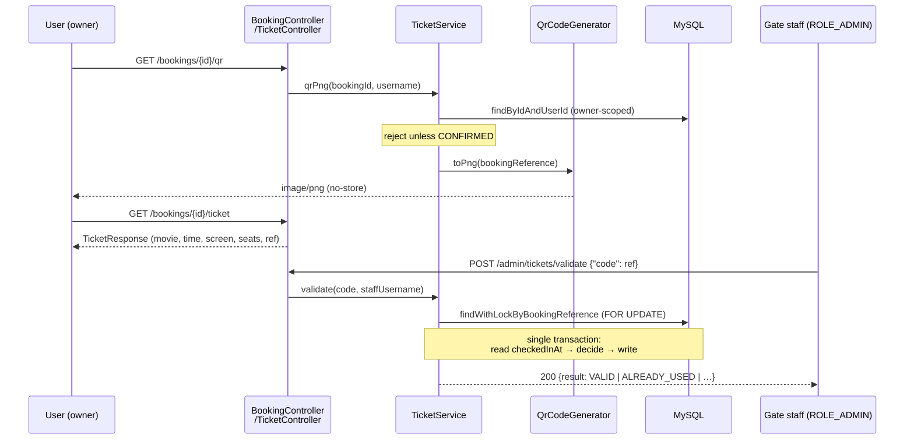

# Module 7 — QR Ticket (design of record)

> **Context / why this file exists.** Module 7 is the last backend module before
> the frontend. Modules 1–6 got a user from "browse shows" to a `CONFIRMED`
> booking row with seats marked `BOOKED`; nothing in the system turns that row
> into something a person carries to a door, and nothing reads it back. This is
> the design of record for closing that, written before any Java. Per this
> project's docs convention, the as-built writeup (`logic/qrtickets.md`) comes
> later and records deviations.
>
> **Deliverable:** this document is to be written verbatim to
> `movieticket/plan/qrtickets.md` (the file exists and is empty).

---

## 1. What this module is actually for

`claude.md`'s one-line pitch for the whole project ends "…get a confirmed
booking with a QR ticket." Six modules in, the second half of that sentence is
still unimplemented. Module 5 already did the one piece that had to be done
early — `Booking.bookingReference`, a UUID rather than the numeric id, added
*specifically* so Module 7 would have something non-enumerable to put in a
barcode (`plan/payment.md` §7.1, and the field's own javadoc says so). That
column has been sitting unused ever since.

Two things are missing:

1. **Nothing renders a ticket.** There is no endpoint that produces a QR image,
   and `BookingResponse` carries `showId` but no movie title, start time, or
   screen — so even a frontend that wanted to print a ticket has nothing to
   print beside the barcode.
2. **Nothing reads a ticket back.** More importantly: there is no notion of a
   ticket being *used*. A booking is `CONFIRMED` forever. Two people with the
   same screenshot both walk in.

(2) is the substance of this module. (1) is a QR library call.

### 1.1 The concurrency requirement, one last time

`claude.md`'s hard requirement is that two users never end up with the same
seat. Module 4 enforced it in Redis, Module 5 enforced it in the DB with
`SELECT … FOR UPDATE`. Module 7 is the same requirement pushed one step further
down the funnel: **two people must never both get through the gate on one
ticket.** The QR code itself is a bearer token — a screenshot forwards
perfectly, and no amount of cryptography changes that. The only defence that
actually works is making redemption a **single-use state transition guarded by
a row lock**, which is why §5 is longer than §4 despite §4 being the part with
"QR" in the name.

---

## 2. Architecture at a glance



Three endpoints, one new nullable column, one new property, no new
`SecurityConfig` matcher (§7.1 — that last one is deliberate and worth noting).

---

## 3. Decisions taken before writing this document

Signed off with the user on 2026-09-04, before any code. Recorded here so they
are not silently re-litigated during implementation:

1. **The QR encodes the bare `bookingReference` and nothing else** (§4.1).
2. **A processed scan always returns `200` with an explicit `result` enum**,
   including for rejections (§5.4) — a deliberate deviation from this project's
   exception-to-status-code convention, argued there.
3. **Scope is QR + validate + check-in window + the ticket-detail endpoint** —
   `GET /bookings/{id}/ticket`, since `BookingResponse` has no movie/show
   detail and Module 8 will need it.

---

## 4. The QR code

### 4.1 Payload: the bare `bookingReference`

The QR's text content is exactly the UUID string, e.g.
`9f2c1e4a-7b03-4d51-a0f2-6e8c5d1b93aa`. No prefix, no JSON, no signature, no
URL.

`Booking.bookingReference` is a random UUID — ~122 bits of entropy — and the
gate looks it up in our own database. That makes it a **nonce, not a claim**:
there is nothing in it for an attacker to tamper with and nothing for a
verifier to derive without the DB. Guessing is not a threat model at 2^122;
brute-forcing `/admin/tickets/validate` requires an admin token first.

> **Rejected: a signed payload (`{ref}.{HMAC}`).** Tempting because
> `PaymentSignatures` already exists (Module 5's shared constant-time HMAC
> helper) so it would cost ~15 lines. It buys tamper-evidence and lets a
> scanner reject garbage without a DB round-trip. But there is nothing to
> tamper with — a forged reference fails the DB lookup anyway — and the real
> threat is a *legitimately issued* ticket being forwarded as a screenshot,
> which a signature does not touch at all. Signing a random value we look up
> ourselves is ceremony. Revisit only if offline validation is ever needed (a
> gate device with no network), which is the one scenario where a signature
> earns its keep.

> **Rejected: a URL (`https://host/tickets/{ref}`).** A phone camera opens it
> directly, which demos beautifully. It also puts the ticket value into browser
> history, the clipboard, and whatever telemetry the scanning app sends home,
> and it hardcodes a deployed hostname into every issued ticket.

> **Rejected: the numeric `booking.id`.** Already rejected in Module 5 for this
> exact module's sake (`plan/payment.md` §7.1) — enumerable.

### 4.2 Rendering: ZXing, in-memory, never stored

New class `service/QrCodeGenerator.java` — a `@Component` with one public
method:

```java
byte[] toPng(String text, int sizePx)
```

Implementation is `QRCodeWriter.encode(text, BarcodeFormat.QR_CODE, size, size,
hints)` → `MatrixToImageWriter.writeToStream(matrix, "PNG", out)` over a
`ByteArrayOutputStream`. Hints: `ERROR_CORRECTION = M` (the default L is fine
for a clean screen, M survives a creased printout and a fingerprint on a phone
camera) and `MARGIN = 2` (ZXing's default quiet zone of 4 modules wastes
noticeable space at small sizes; 2 is still within spec).

**The PNG is never persisted.** It is a pure function of a value we already
store, ~1–2 KB, and takes well under a millisecond to produce.

> **Rejected: caching the bytes** (a `BLOB` column, a disk cache, or a Caffeine
> cache). Every one of those is a cache-invalidation and storage problem
> adopted in exchange for microseconds on an endpoint a user hits once per
> booking.

**Dependencies** (`pom.xml`, closing out `claude.md` line 61–62's "add ZXing
when Module 7 starts"):

```xml
<dependency>
  <groupId>com.google.zxing</groupId>
  <artifactId>core</artifactId>
  <version>${zxing.version}</version>
</dependency>
<dependency>
  <groupId>com.google.zxing</groupId>
  <artifactId>javase</artifactId>
  <version>${zxing.version}</version>
</dependency>
```

Both need an explicit `<version>` — ZXing is not in the Spring Boot parent BOM,
the same situation as springdoc in Module 3, so pin it in `<properties>` as
`<zxing.version>` and **verify the current release on Maven Central at
implementation time** (3.5.3 is the last one I can confirm from memory; this
sandbox is offline). Both artifacts must be the same version — ZXing does not
support mixing.

⚠️ **`javase` pulls in `java.awt`/ImageIO.** `MatrixToImageWriter` is
AWT-backed, which is why it lives in `javase` rather than `core`. This is safe
here because Spring Boot sets `java.awt.headless=true` by default, so it works
in a headless container — but it is the reason to be deliberate rather than
surprised. If that dependency ever becomes unwelcome, `core` alone plus ~20
lines writing the `BitMatrix` into a 1-bit `BufferedImage` replaces it; the
seam is that `QrCodeGenerator` is the only class in the project that imports
anything from `com.google.zxing`.

### 4.3 Endpoint: `GET /bookings/{bookingId}/qr`

- **Owner only**, resolved via the existing
  `BookingRepository.findByIdAndUserId` — ownership as a query predicate, not a
  load-then-compare (Module 5's rule, `plan/payment.md` §8.5). `404`, not
  `403`, for someone else's booking.
- **`CONFIRMED` only.** A `PENDING`/`EXPIRED`/`FAILED`/`REFUND_PENDING` booking
  gets `409` via the existing `BookingStateException` → already mapped in
  `GlobalExceptionHandler`. Status must come from `BookingService`'s
  read-time-derived `effectiveStatus` semantics, not the raw column — a stale
  `PENDING` row is `EXPIRED` and must not mint a ticket.
- **Produces `image/png`** with `Cache-Control: no-store`. A ticket is a bearer
  credential; it has no business in a shared proxy cache.
- Optional `?size=` query param, `@Min(128) @Max(1024)`, default 320. Bounded
  because an unbounded size is a trivially free CPU/memory amplifier.
- `@Operation` annotated per `claude.md`'s "every public endpoint documented"
  constraint.

### 4.4 Endpoint: `GET /bookings/{bookingId}/ticket`

New `TicketResponse` DTO — the printable face of a booking, which
`BookingResponse` cannot serve because it exposes only `showId`:

| Field | Source |
|---|---|
| `bookingReference` | `booking.bookingReference` |
| `movieTitle` | `booking.show.movie.title` |
| `startTime` | `booking.show.startTime` |
| `screenName` | `booking.show.screenName` |
| `seats` | `booking.bookingSeats[].seat.seatNumber`, sorted |
| `totalPrice` | `booking.totalPrice` |
| `qrUrl` | `"/bookings/{id}/qr"` — so a client never string-builds it |
| `checkedInAt` | nullable; non-null once redeemed (§5) |

Same owner-only, `CONFIRMED`-only rules as §4.3. Needs a fetch-joined query to
avoid N+1 across `show → movie` and `bookingSeats → seat`; model it on the
existing `BookingRepository.findAllForUserWithSeats` (which already
demonstrates the `distinct` + `join fetch` pattern this project uses) — add
`findByIdAndUserIdWithDetail`, extending the fetch to `b.show` and
`b.show.movie`.

`@JsonFormat(pattern = "yyyy-MM-dd'T'HH:mm:ss")` on the two `LocalDateTime`
fields, matching `BookingResponse`.

---

## 5. ⚠️ Redemption: the part that is actually hard

### 5.1 Single-use state, and where it lives

One new column on `Booking`:

```java
// Module 7 (plan/qrtickets.md section 5.1): null until the ticket is scanned
// at the gate; the instant of the FIRST successful scan thereafter. Deliberately
// NOT a new BookingStatus value - see that class's javadoc.
@Column(name = "checked_in_at")
private LocalDateTime checkedInAt;
```

> **Rejected: adding `USED` to `BookingStatus`.** `BookingStatus` is the
> *payment* lifecycle (`PENDING → CONFIRMED/FAILED/EXPIRED/REFUND_PENDING →
> REFUNDED`). Check-in is orthogonal to it — a redeemed booking is still
> `CONFIRMED`, and its money is still captured. Folding the two together would
> mean auditing `BookingService.effectiveStatus`, the `checkoutUrl` derivation
> in `toResponse`, `cancelBooking`'s guard, and Module 6's
> `BookingStatusChangedEvent` consumers for a state none of them were written
> to expect. A nullable timestamp is strictly more informative (it records
> *when*, which the operator needs on a duplicate scan) and touches nothing.

**Schema migration: none needed.** This is a *new nullable* column, which
`spring.jpa.hibernate.ddl-auto=update` adds cleanly — unlike Module 5's
`total_price` type change, which required a hand-written `ALTER TABLE`. Worth
stating explicitly in `README.md` so the next reader doesn't go looking for a
migration step that isn't there.

Also consider `checked_in_by` (the staff user's id). **Recommendation: include
it** as a plain `Long` column, not a `@ManyToOne` — it is an audit breadcrumb
answering "which turnstile let this person in", not a navigable relationship,
and a real FK would drag a `User` into every ticket load for no read path.

### 5.2 The double-scan race

Two turnstiles scan the same forwarded screenshot at the same instant. Both
read `checkedInAt IS NULL`, both decide `VALID`, both write. Two people walk in
on one ticket — the exact failure this project spent six modules preventing one
step upstream.

The fix is the one Module 5 already established:

```java
@Lock(LockModeType.PESSIMISTIC_WRITE)
@Query("select b from Booking b join fetch b.show s join fetch s.movie "
     + "where b.bookingReference = :ref")
Optional<Booking> findWithLockByBookingReference(@Param("ref") String ref);
```

A direct mirror of `PaymentRepository.findWithLockByProviderOrderId`, which
serialises exactly this shape of race for `confirmPaid`. Read, decide, and
write all happen inside **one** `@Transactional` method, so the second scanner
blocks on the row until the first commits and then observes a non-null
`checkedInAt`.

⚠️ Two implementation traps here:

- **`@Transactional(readOnly = true)` is wrong for this method**, however much
  a scan reads like a lookup. It is a write.
- **`join fetch` alongside `@Lock(PESSIMISTIC_WRITE)`** takes row locks on the
  joined `shows`/`movies` rows too on MySQL. That is harmless (they are
  read-mostly reference rows and nothing else locks them in a conflicting
  order), but it should be a conscious choice — the alternative is a second,
  unlocked query for the display fields. **Recommendation: keep the fetch
  join**; one query, and the lock scope is uncontended in practice.

No deadlock-ordering concern like `SeatRepository.findByIdInAndShowIdForUpdate`
had — this locks exactly one `bookings` row, not a set.

### 5.3 The check-in window

A ticket for next Friday must not open tonight's gate. Validation checks:

```
show.startTime.minusMinutes(ticket.checkin.opens-minutes-before)
    <= now <=
show.startTime.plusMinutes(show.movie.durationMinutes)
```

The closing bound reuses this project's established **derive-the-end-time-on-
the-fly** approach rather than introducing a persisted `Show.endTime` —
`ShowService.assertNoScreenConflict` already computes
`candidate.getStartTime().plusMinutes(candidate.getMovie().getDurationMinutes())`
for screen-conflict detection (`ShowService.java:123`, `plan/crud.md` §4.2's
"no-schema-change" option). Same expression, same reason: adding the column now
would mean backfilling it and keeping it in sync with `movie.durationMinutes`
forever.

New property, following the `seatlock.ttl-seconds` house pattern of an inline
default overridable by environment variable:

```properties
# --- QR tickets (Module 7, plan/qrtickets.md) ---
# How early before showtime the gate accepts a ticket. The window closes
# at startTime + movie.durationMinutes, derived not persisted (section 5.3).
ticket.checkin.opens-minutes-before=${TICKET_CHECKIN_OPENS_MINUTES_BEFORE:60}
```

Read with `@Value("${ticket.checkin.opens-minutes-before}")`, matching
`SeatLockService.java:68`'s style.

> Late arrivals are allowed for the full runtime of the film, deliberately.
> Closing the window at showtime would turn a five-minute-late customer into a
> support ticket, and the seat is theirs either way — it is already `BOOKED` in
> the DB and nobody else can be sold it.

### 5.4 Result semantics — 200 for every processed scan

`POST /admin/tickets/validate` returns **`200`** with a `result` enum for every
scan the server actually processed, including rejections:

| `result` | Meaning |
|---|---|
| `VALID` | First successful scan. `checkedInAt` was just written. Let them in. |
| `ALREADY_USED` | Redeemed earlier; response carries the original `checkedInAt`. |
| `NOT_CONFIRMED` | Booking exists but is `PENDING`/`EXPIRED`/`FAILED`/`REFUND_PENDING`. |
| `OUTSIDE_WINDOW` | Right ticket, wrong time (§5.3). Response carries `startTime`. |
| `NOT_FOUND` | No booking with that reference. |

**This is a deliberate deviation from the project's convention** of
exception-to-status-code via `GlobalExceptionHandler`, and it is the only
endpoint that gets it. The caller is a turnstile, not a browser. `404` and
`409` both collapse to "error" in a naive client, and the *reason* is the
entire operational value of the response: `ALREADY_USED` means find the
duplicate and call security, `NOT_CONFIRMED` means send them to the box office,
`OUTSIDE_WINDOW` means come back later. Forcing an operator to parse prose out
of an `ErrorResponse.message` to tell those apart is how gates get propped
open. The scan itself succeeded; what it found is the payload.

Genuine failures still throw and still map through `GlobalExceptionHandler`
normally: a missing/invalid JWT is `401`, a non-admin is `403`, a blank `code`
is `400` via Bean Validation, and a dead database is `503` via the existing
`DataAccessException` catch-all. **No new exception types are needed in this
module** — the first module in four for which that is true.

Response DTO `TicketValidationResponse`: `result`, `bookingReference`,
`movieTitle`, `startTime`, `screenName`, `seats`, `checkedInAt` (populated on
both `VALID` and `ALREADY_USED`). On `NOT_FOUND` everything but `result` is
null — do not echo the submitted code back, since it is attacker-controlled
text that will be rendered on an operator's screen.

Every branch gets SLF4J logging per `claude.md`'s constraint, with
`ALREADY_USED` at **`warn`** specifically — a duplicate scan is the one outcome
worth grepping for after the fact.

### 5.5 Who can validate

`ROLE_ADMIN`, via the path `/admin/tickets/validate`. This is what
`plan/authentication.md` §7 anticipated three modules ago ("`/validate/{...}`
is likely role-gated the same way as admin routes"), and it inherits the
existing `.requestMatchers("/admin/**").hasRole("ADMIN")` rule plus a
`@PreAuthorize("hasRole('ADMIN')")` on the method — the same two-layer gate
Module 3 established for `MovieController`/`ShowController`/`SeatController`.

> **Rejected (for now): a `ROLE_STAFF`.** A real gate operator is not an
> administrator, and giving every turnstile a key to `POST /admin/movies` is
> not a design anyone would defend at scale. But adding a third role means
> touching registration (which force-assigns `ROLE_USER`, `plan/authentication.md`),
> the `role` claim's documented value set, `SecurityConfig`, and a new
> admin-only role-assignment endpoint — a self-contained user-management
> feature masquerading as a line item inside a QR module. It belongs in Module
> 9. Logged in Known Gaps.

⚠️ **Note what this buys us:** placing the endpoint under `/admin/` means
Module 7 adds **no new `SecurityConfig` matcher at all**, and therefore cannot
step on the declaration-order trap that has now bitten three consecutive
modules (Module 4's `locks/mine`, Module 5's `/payments/webhook`, Module 6's
`/ws/**`). That is not an accident of the path name; it is a reason to prefer
it.

---

## 6. Class inventory

**New:**

| Class | Package | Role |
|---|---|---|
| `QrCodeGenerator` | `service` | The only class importing `com.google.zxing`. `toPng(text, size)`. |
| `TicketService` | `service` | `qrPng`, `getTicket`, `validate`. All three business rules live here (principle #4). |
| `TicketController` | `controller` | `POST /admin/tickets/validate`. |
| `TicketResponse` | `dto` | §4.4. |
| `TicketValidationRequest` | `dto` | `@NotBlank String code`. |
| `TicketValidationResponse` | `dto` | §5.4. |
| `TicketValidationResult` | `model` | Enum, §5.4. Sits with `BookingStatus`/`PaymentStatus`. |

**Modified:**

| File | Change |
|---|---|
| `model/Booking.java` | `+ checkedInAt`, `+ checkedInBy` (§5.1). |
| `repository/BookingRepository.java` | `+ findWithLockByBookingReference`, `+ findByIdAndUserIdWithDetail` (§5.2, §4.4). |
| `controller/BookingController.java` | `+ GET /bookings/{id}/qr`, `+ GET /bookings/{id}/ticket`. |
| `pom.xml` | `+ zxing core & javase`, `+ <zxing.version>` (§4.2). |
| `application.properties` | `+ ticket.checkin.opens-minutes-before` (§5.3). |
| `claude.md`, `README.md` | §9. |

`SecurityConfig` is **not** in this table — see §5.5. Neither is
`GlobalExceptionHandler` — see §5.4.

> **On where the two `/bookings/**` endpoints live:** they go on
> `BookingController` (delegating to `TicketService`), not on `TicketController`.
> They are owner-scoped views of a booking and belong beside `GET /bookings/{id}`;
> `TicketController` is the staff-facing gate surface. Splitting by *audience*
> rather than by noun keeps the admin gate endpoint in one small, auditable file.

---

## 7. Security notes

### 7.1 No new matcher — see §5.5

`GET /bookings/**` already falls through to `.anyRequest().authenticated()`,
and `/admin/**` already requires `ROLE_ADMIN`. Verify by reading the matcher
list, not by observing the endpoints work.

### 7.2 The QR is a bearer credential

- `Cache-Control: no-store` on the PNG response (§4.3).
- Never log a `bookingReference` at `info` in a code path reachable without
  authentication. The `validate` path logs it, which is fine — that path is
  admin-only.
- Do not echo an unknown submitted `code` back in the `NOT_FOUND` response
  (§5.4).

### 7.3 What this module explicitly does not defend against

A user screenshotting their own ticket and sending it to a friend. Single-use
redemption means the *second* person through is stopped, but not necessarily
the *right* one — whoever scans first wins. Binding a ticket to an identity
document is a product decision far outside this codebase. State it in the
README rather than let a reader assume the QR is unforwardable.

---

## 8. Test plan

Unit (mocked repositories, in the established `*ServiceTest` style):

1. `QrCodeGeneratorTest` — **round-trip**: generate a PNG for a known string,
   read it back with ZXing's own `MultiFormatReader` over a
   `BufferedImageLuminanceSource`, assert the decoded text equals the input.
   This is the rare test with no mock and no ambiguity; it catches a
   misconfigured hint or an encoding bug that eyeballing a black-and-white
   square never would.
2. `TicketServiceTest.validate_firstScan_returnsValidAndStampsCheckedInAt`
3. `…validate_secondScan_returnsAlreadyUsed_withOriginalTimestamp` — and
   asserts `checkedInAt` was **not** overwritten.
4. `…validate_pendingBooking_returnsNotConfirmed`
5. `…validate_beforeWindowOpens_returnsOutsideWindow` (and one after close).
6. `…validate_unknownReference_returnsNotFound_andEchoesNothing`
7. `…qrPng_nonConfirmedBooking_throwsBookingStateException`
8. `…qrPng_someoneElsesBooking_throwsBookingNotFoundException` — asserts the
   owner-scoped repository method was the one called (404, not 403).

Deferred, needing Testcontainers:

9. **The two-turnstile race** — N threads validating one reference
   concurrently, exactly one `VALID` and N−1 `ALREADY_USED`. This is the
   headline test of the module and it is **worthless against a mocked
   repository**, which will happily return `checkedInAt == null` to every
   caller. It needs a real MySQL that actually honours `SELECT … FOR UPDATE`.
   Fourth module in a row to want Testcontainers (§10-C).

---

## 9. Documentation debt this module must clear

Following `plan/payment.md` §12 and `plan/websockets.md` §12's precedent of
listing this rather than leaving it to whoever notices:

- ⚠️ **`claude.md`'s Module Status is now two modules stale.** It says "Modules
  6–9: **PENDING**" while Module 6 is fully on disk (`WebSocketConfig`,
  `WebSocketSchedulerConfig`, `StompAuthChannelInterceptor`,
  `WebSocketSessionRegistry`, `SeatBroadcaster`, `BookingBroadcaster`,
  `SeatLockExpiryListener`, `SeatLockChangedEvent`, `BookingStatusChangedEvent`,
  `SeatStatusUpdate`, plus `spring-boot-starter-websocket` in `pom.xml` and
  three new properties). **Module 7 must not stack a status entry on a section
  that is already a module behind** — write Module 6's entry first, from the
  code as it actually shipped.
- **`logic/websockets.md` does not exist**, though `plan/websockets.md:4`
  promises it. Module 6's as-built writeup is missing; Module 7's
  (`logic/qrtickets.md`) should not be the second one skipped.
- **`claude.md` lines 61–62** — "ZXing is **not yet** in `pom.xml` — add
  `com.google.zxing:core` and `:javase` when Module 7 starts" — becomes false
  the moment this lands. Same for line 63's websocket note (already false).
- **Data Model** needs `Booking.checkedInAt`/`checkedInBy`, plus a line saying
  **no manual migration is required** (nullable add, unlike `total_price`).
- **Project Constraints** should gain the `ticket.checkin.opens-minutes-before`
  property alongside the fixed 300s lock TTL.
- **Known Gaps** needs §5.5's `ROLE_STAFF` deferral and §8's test 9.
- **`README.md`** needs a gate-scan step appended to the manual walkthrough
  (scan → `VALID`, scan again → `ALREADY_USED`) and §7.3's honest note about
  forwarded screenshots.

---

## 10. Open decisions

**A. Should `checkedInBy` be recorded at all?** *Recommendation:* **yes**, as a
plain `Long` staff user id, not a `@ManyToOne` (§5.1). It is an audit
breadcrumb with no read path that would justify a navigable association. Say no
and the only cost is losing "which turnstile" on a disputed entry.

**B. Should a check-in publish a WebSocket event?** *Recommendation:* **no.** A
redemption changes no seat state — the seat has been `BOOKED` since payment —
so `/topic/shows/{id}/seats` has nothing to say, and pushing to
`/user/queue/bookings` would tell a user something they learned by standing at
the door. Module 6's channels stay exactly as they are.

**C. Testcontainers.** *Recommendation:* **defer again, and say so out loud.**
Fourth consecutive module to want it (Modules 4, 5, 6, and now §8's test 9),
and this sandbox still has no Docker, so adding the dependency buys an untested
test. It should be fixed once on real hardware, for all four at the same time.

**D. Should `GET /bookings/{id}/qr` also serve SVG?** *Recommendation:* **no.**
PNG covers phone screens and printers; an SVG variant means a second code path
and a content-negotiation branch for an aesthetic difference nobody has asked
for. Trivially added later if Module 8's print stylesheet wants it.

**E. Should the check-in window be enforced at all in a portfolio project?**
*Recommendation:* **yes, keep it.** It is ~6 lines, it reuses `ShowService`'s
existing end-time derivation rather than inventing anything, and `OUTSIDE_WINDOW`
is the result that makes the enum look like a real gate API rather than a
boolean with extra steps. It is also the only part of this module that
demonstrates domain reasoning rather than plumbing.

---

## 11. Verification

Order matters — steps 1–3 are all that can be done in this sandbox.

1. **Compile.** `./mvnw -Dmaven.compiler.release=17 compile` (the standing
   workaround for this machine's Temurin 17 default — `claude.md`'s build-
   environment note; the project's real target stays Java 21 and none of this
   module's code needs newer syntax). First run will need network access to
   fetch the two new ZXing artifacts.
2. **Unit tests.** `./mvnw -Dmaven.compiler.release=17 test` — tests 1–8 from
   §8 must pass alongside the existing suite (49 tests as of Module 5, plus
   whatever Module 6 added: `SeatBroadcasterTest`, `BookingBroadcasterTest`,
   `SeatLockKeysTest`). Report the real total, including
   `MovieticketApplicationTests.contextLoads`' known environment-only failure.
3. **Round-trip check** (§8 test 1) is the one that proves the QR is real. Do
   not substitute "the endpoint returned some bytes".
4. **End-to-end, on hardware with Docker** — `docker compose up -d`, then
   `./mvnw spring-boot:run`:
   - Run `README.md`'s existing mock-mode walkthrough to a `CONFIRMED` booking.
   - `GET /bookings/{id}/qr` with the owner's JWT → open the PNG, scan it with
     any phone QR app, confirm the decoded text is the `bookingReference` from
     `GET /bookings/{id}`.
   - `GET /bookings/{id}/ticket` → movie title, start time, screen, seats all
     populated.
   - As an **admin**, `POST /admin/tickets/validate` with that code → `200`,
     `result: VALID`, `checkedInAt` set.
   - Immediately repeat → `200`, `result: ALREADY_USED`, **same** `checkedInAt`.
   - As a **non-admin**, same call → `403` (proves both layers of §5.5).
   - Garbage code → `200`, `result: NOT_FOUND`, no echo of the input.
   - A `PENDING` booking's reference → `NOT_CONFIRMED`; its `/qr` → `409`.
   - Temporarily set `TICKET_CHECKIN_OPENS_MINUTES_BEFORE=0` against a show
     starting tomorrow → `OUTSIDE_WINDOW`.
   - Confirm Swagger UI renders all three new endpoints under their tags.
5. **Deferred** — §8 test 9, the concurrent-scan race. Blocked on
   Testcontainers (§10-C). Say so in the completion report rather than letting
   its absence pass as coverage.

---

## 12. Three things I'd flag loudest

**1. The QR code is the easy half, and the half everyone will look at.** §5 is
the module. A barcode endpoint is a library call with a content type; making
redemption single-use under concurrent scans is where the project's own
standard applies. If `validate` is written as a read followed by a write
without `findWithLockByBookingReference` and a real `@Transactional`, it will
pass every unit test in §8, work flawlessly in manual testing, and let two
people through the door on one screenshot in exactly the conditions nobody
reproduces. It is the same `SELECT … FOR UPDATE` lesson as
`BookingService.confirmPaid`, one step downstream — and test 9, the one test
that would catch it, is the one this sandbox cannot run.

**2. `200 OK` on a rejected scan is a deliberate deviation, and it will look
like a mistake to anyone who has read the other six modules.** §5.4. Every
other endpoint in this project reports failure through
`GlobalExceptionHandler`. This one does not, because its caller is a turnstile
that must distinguish "already used" from "wrong show" from "not paid" in order
to do three different things — and an `ErrorResponse.message` string is not an
API. Document the reasoning at the endpoint itself, in the javadoc, or a future
reviewer will "fix" it into `409`s and quietly destroy the distinction.

**3. `claude.md` is a module behind, and this module makes it two.** §9. Module
6 shipped ten classes, a pom dependency, and three properties without a status
entry, and its `logic/` writeup was never written. Module 7 stacking on top of
that is how a source-of-truth document stops being one — and `claude.md` is
load-bearing here in a way it usually isn't, because it is the file that
records *why* things like `bookingReference` exist. That column was added two
modules early purely so this module could use it; that is the doc working. Keep
it working.
