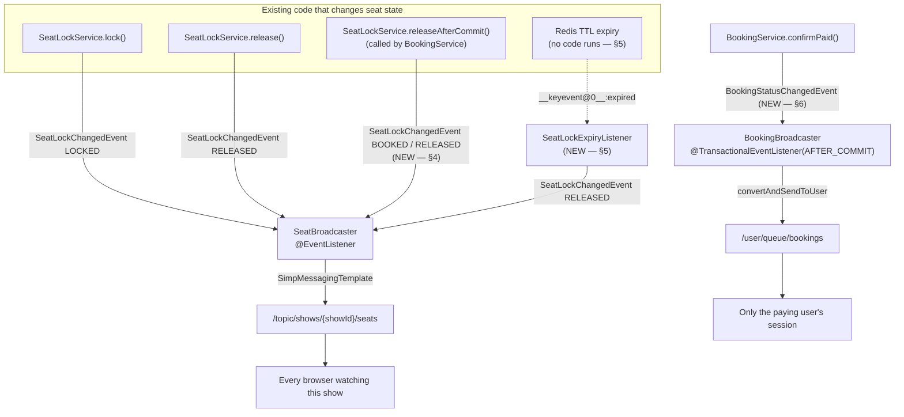

# Module 6 — WebSockets (design of record)

> **Status: implemented.** Per `claude.md`'s docs-layout convention, this document
> remains the design of record; see `logic/websockets.md` for the as-built
> writeup, including the places implementation needed more machinery than this
> doc's estimates (Open Decision A's session cap, notably) or where the plan
> itself turned out to need one field it hadn't anticipated (`SeatLockChangedEvent
> .expiresAt`). `plan/redis.md` and `plan/payment.md` are the two documents this
> one leans on hardest — §11.2 of the former is literally the handoff note that
> created this module.

---

## 1. What this module is actually for

Today, the only way a user learns that a seat they were about to pick is gone is:

1. they click it, `POST /shows/{showId}/seats/lock` returns **409**, or
2. they manually refresh and `GET /shows/{showId}/seats` reports it `LOCKED`/`BOOKED`.

Both are the system telling the user *no* after the fact. Everything Modules 3–5
built is already correct — the seat map is honest, the lock is atomic, the booking
is transactional — it is just **pull-only**. Module 6 adds the push.

The scope is deliberately narrow:

**In scope**
- A STOMP-over-WebSocket transport with a simple in-memory broker.
- `/topic/shows/{showId}/seats` — every viewer of a show sees seat status changes
  (`LOCKED`, `AVAILABLE`, `BOOKED`) within milliseconds.
- `/user/queue/bookings` — the person who just paid sees their booking flip
  `PENDING → CONFIRMED` when the webhook lands, instead of polling
  `GET /bookings/{bookingId}`.
- Closing **two holes in the existing event stream** that mean the most important
  transitions currently fire nothing at all (§4, §5).
- JWT authentication on the STOMP `CONNECT` frame (`plan/authentication.md` §7
  reserved this work for Module 6 three modules ago).

**Explicitly out of scope**
- Any client→server messaging. The socket is **push-only** (§3.3).
- Multi-instance fan-out. The simple broker is single-instance; this is a
  documented limitation with a named fix, not an oversight (§9).
- Chat, presence, "3 other people are viewing this show", seat-selection previews.
- Replacing `GET /shows/{showId}/seats`. The REST map stays the source of truth and
  the reconciliation point (§3.2).

### 1.1 The seam Module 4 already built

`plan/redis.md` §11.2 planted this on purpose:

```java
// service/SeatLockChangedEvent.java  — exists today, nothing listens
public record SeatLockChangedEvent(Long showId, List<Long> seatIds, Type type) {
    public enum Type { LOCKED, RELEASED }
}
```

`SeatLockService.lock()` publishes `LOCKED`; `SeatLockService.release()` publishes
`RELEASED`. `ApplicationEventPublisher` is core Spring, so it cost no dependency
and no coupling. **Module 6 is the listener.** That part of the handoff worked
exactly as designed.

The part that did *not* survive contact with Module 5 is §4 and §5 below.

---

## 2. Architecture at a glance



One new dependency, `spring-boot-starter-websocket` — `claude.md` line 63 already
reserves it ("add it when Module 6 starts"). No `<version>`; Spring Boot 4.1's
parent BOM manages it.

---

## 3. Transport decisions

### 3.1 STOMP + simple broker, endpoint `/ws`

```java
@Configuration
@EnableWebSocketMessageBroker
public class WebSocketConfig implements WebSocketMessageBrokerConfigurer {
    // registerStompEndpoints:  "/ws", setAllowedOriginPatterns(configured origins)
    // configureMessageBroker:  enableSimpleBroker("/topic", "/queue")
    //                          setUserDestinationPrefix("/user")
    // configureClientInboundChannel: interceptors(stompAuthChannelInterceptor)  // §8.2
}
```

| Destination | Who can subscribe | Payload |
|---|---|---|
| `/topic/shows/{showId}/seats` | anyone, incl. anonymous (§8.1) | `SeatStatusUpdate` (§3.2) |
| `/user/queue/bookings` | authenticated principal only, own queue | `BookingResponse` (existing DTO) |

> **Rejected: `.withSockJS()`.** SockJS exists to paper over browsers and proxies
> with no WebSocket support. Every browser this project targets has had native
> WebSocket for a decade, and enabling SockJS adds an XHR-streaming/polling
> fallback surface, extra endpoints under `/ws/**`, and a client library Module 8
> would then be obliged to ship. If a hostile corporate proxy ever turns up in
> testing, this is a one-line addition then.

> **Rejected: raw `WebSocketHandler` (no STOMP).** It would mean hand-rolling
> subscription bookkeeping — "which sessions care about show 12" — plus a framing
> format and a user-destination mechanism. STOMP's broker already does all three,
> and `convertAndSendToUser` (§6) is otherwise a nontrivial amount of code.

> **Rejected: Server-Sent Events.** Genuinely tempting: unidirectional push is
> exactly what §3.3 says we want, and SSE rides plain HTTP so
> `JwtAuthenticationFilter` would authenticate it with **zero** new code (all of §8
> disappears). It loses on the per-user channel — SSE gives no equivalent of
> `/user/queue/**`, so §6 would need a hand-rolled `Map<username, SseEmitter>`
> registry with its own lifecycle bugs — and the project spec names WebSockets.
> Worth recording that the security section below is the price of that choice.

### 3.2 Payload = delta, not snapshot

```jsonc
// SeatStatusUpdate — published to /topic/shows/{showId}/seats
{
  "showId": 12,
  "seatIds": [101, 102],
  "status": "LOCKED",              // "AVAILABLE" | "LOCKED" | "BOOKED"
  "expiresAt": "2026-09-04T18:32:11",  // non-null only for LOCKED (§5)
  "at": "2026-09-04T18:27:11"
}
```

`status` uses **the same three string literals** `SeatDto.status` already carries,
computed by the same precedence rule (`BOOKED > LOCKED > DB status`) that
`SeatService.toSeatDto` enforces. This is not cosmetic: it means a client applies a
delta by overwriting `status` on the matching seat in its existing
`SeatLayoutResponse`, with no translation table between "what the REST endpoint
says" and "what the socket says". Two vocabularies for one concept is exactly how
the two drift.

**The client's contract, which the doc must state and Module 8 must honour:**

1. On connect **and on every reconnect**, `GET /shows/{showId}/seats` to establish
   a baseline. The delta stream is an optimization over that endpoint, never a
   replacement for it.
2. Then apply deltas.
3. On a `LOCKED` delta, start a countdown to `expiresAt`; at zero, re-fetch the
   baseline (§5 explains why this is the correctness floor rather than belt-and-
   braces).

> **Rejected: broadcasting the full `SeatLayoutResponse` on every change.** It is
> self-healing — a client that missed a frame is corrected by the next one — and
> that is a real advantage. It costs a `findByShowId` plus a Redis `MGET` **per
> lock event**, on the busiest path in the application, and ships a payload
> proportional to the whole auditorium to every viewer whenever anybody clicks one
> seat. Locking a seat is the single most frequent write in this system. Rule 1
> above buys back the self-healing for the price of one HTTP call per connection.

### 3.3 Push-only: no `@MessageMapping` anywhere

Locking a seat stays `POST /shows/{showId}/seats/lock`. It is not moving onto the
socket, and no inbound STOMP destination is defined.

Reasons, in order of weight:

1. **The REST endpoint has semantics STOMP cannot express.** Locking returns
   `409 Conflict` with a per-seat conflict list, `503` when Redis is unreachable
   (`claude.md`'s fail-closed rule), `404` for an unknown show. STOMP has no
   response frame for a `SEND`; you would invent an error queue and a correlation
   id and reimplement HTTP status codes badly.
2. **`GlobalExceptionHandler` and Bean Validation are wired to the servlet stack.**
   `@Valid @Size(max = 10) List<Long> seatIds` on `SeatLockRequest` — the one place
   `claude.md`'s ten-seat cap is enforced — would need a parallel implementation.
3. **One write path is auditable; two are a divergence waiting to happen.**

So the socket carries facts about state that has already changed, and nothing else.
This is a deliberate boundary, not an unfinished edge.

---

## 4. ⚠️ Hole #1: a confirmed booking currently fires no event at all

This is the most important paragraph in the document.

`BookingService.confirmPaid()` flips the seats to `BOOKED`, commits, and releases
the Redis locks by calling `SeatLockService.releaseAfterCommit(...)`. That method
executes `unlock_seats.lua` **directly**:

```java
// SeatLockService.releaseAfterCommit — as it exists today
TransactionSynchronizationManager.registerSynchronization(new TransactionSynchronization() {
    @Override public void afterCommit() {
        try {
            redisTemplate.execute(unlockSeatsScript, keys, String.valueOf(userId));
            ...
        } catch (DataAccessException ex) { /* logged, swallowed */ }
    }
});
```

It never routes through `release()`, so **no `SeatLockChangedEvent` is published**.
The moment a seat is genuinely *sold* — the single most valuable thing this module
could push — is silent. `SeatLockChangedEvent`'s javadoc warned Module 6 about TTL
expiry (§5) and did not notice this one; Module 5 was written after it.

`BookingService.cancelBooking()` has the same hole with the opposite sign: it uses
`releaseAfterCommit` too, so seats that were genuinely freed by a cancellation tell
nobody either.

### 4.1 Why the obvious fix is wrong

"Make `releaseAfterCommit` publish `RELEASED`, like `release()` does."

That would broadcast `AVAILABLE` for seats that just became `BOOKED`, because
`confirmPaid` and `cancelBooking` share the method and mean opposite things by it.
Every viewer would briefly see a sold seat as free and race to lock it — the exact
burst of surprise 409s that `plan/redis.md` §9-A's fail-closed rule was written to
avoid. `SeatService.toSeatDto` ranks `BOOKED` above `LOCKED` precisely so this
transition is invisible; a wrong broadcast reintroduces it at the transport layer.

### 4.2 The fix: one publisher, one event, no race

1. **Add `BOOKED` to the event's `Type` enum.** It is already the vocabulary of §3.2.

   ```java
   public record SeatLockChangedEvent(Long showId, List<Long> seatIds, Type type) {
       public enum Type { LOCKED, RELEASED, BOOKED }
   }
   ```

2. **Give `releaseAfterCommit` a resulting-status parameter**, and publish from
   inside its existing `afterCommit` callback:

   ```java
   public void releaseAfterCommit(Long showId, Collection<Long> seatIds, Long userId,
                                  SeatLockChangedEvent.Type resultingStatus)
   ```

   `BookingService.confirmPaid` passes `BOOKED`; `BookingService.cancelBooking`
   passes `RELEASED`. Two call sites, both already in the right place to know the
   answer, neither able to get it wrong by omission — the parameter is required.

3. **Do not also publish from `confirmPaid`.** Two publishers for one transition is
   two frames in an undefined order, and the wrong winner shows a sold seat as free.
   One `afterCommit` callback, one event.

> This knowingly amends an API `plan/redis.md` §11.1 described as fixed, in the same
> spirit as §8 of that document trading its "zero changes to `SeatService`" promise
> for one line. The alternative — a second, parallel event type published from
> `BookingService` — leaves two publishers racing over the same seats and pushes the
> ordering rule into Module 5, where §11.1 was explicitly trying not to put it.

### 4.3 The ordering subtlety inside the callback

The two statuses are **not** published under the same condition:

| Outcome | Publish? | Why |
|---|---|---|
| `BOOKED`, unlock succeeded | yes | seats are sold |
| `BOOKED`, unlock threw `DataAccessException` | **yes** | the booking committed. The seats are `BOOKED` in MySQL regardless of whether Redis heard about it; the stale lock just outlives the sale until TTL, which self-corrects (`plan/redis.md` §2) |
| `RELEASED`, unlock succeeded | yes | seats are genuinely free |
| `RELEASED`, unlock threw | **no** | the lock still stands until TTL. Broadcasting `AVAILABLE` would be a lie, and §5's expiry listener will announce it truthfully when the key actually dies |

So: publish `BOOKED` unconditionally, outside the `try`; publish `RELEASED` only on
the success path. Never let a publish failure escape the callback — the same reason
the existing code swallows the Redis failure there: the transaction has already
committed and throwing cannot undo it.

---

## 5. ⚠️ Hole #2: TTL expiry runs no code

`SeatLockChangedEvent`'s own javadoc flagged this, so at least it is not a surprise:

> a lock that ends by TTL expiry produces NO event, because no code runs when that
> happens — that's the whole point of the "TTL as reconciliation" design.

This is the common case, not an edge case. Most locks die by timeout: a user picks
three seats, gets distracted, closes the tab. Five minutes later the seats are free
and every other viewer's screen still shows them grey.

`plan/redis.md` §11.2 offered two answers and leaned toward the simpler one. **This
module does both**, because they solve different halves:

### 5.1 Redis keyspace notifications — the server-side answer

- `docker-compose.yml`'s Redis service gains
  `command: redis-server --notify-keyspace-events Kx` (`K` = keyspace events,
  `x` = expired). Note this sits alongside the existing deliberate absence of any
  persistence config — see `plan/redis.md` §9-F for why that stays.
- `SeatLockExpiryListener`: a `RedisMessageListenerContainer` subscribed to
  `__keyevent@0__:expired`, filtering for the `seat_lock:` prefix, publishing a
  `SeatLockChangedEvent(showId, [seatId], RELEASED)` per expired key.
- Key parsing reuses **`SeatLockKeys`**, which already exists as the declared single
  source of truth for the format and already has `seatIdFromKey`. Add a matching
  `showIdFromKey` there rather than parsing inline anywhere in the listener.
- Gated by `websocket.expiry-notifications.enabled` (default `true`), because the
  feature depends on Redis **server** configuration the application cannot assert at
  startup. A deployment against a managed Redis with notifications off should be
  able to turn the subscriber off rather than run a listener that silently never
  fires.

> **The honest caveat, stated here rather than discovered later.** Redis emits
> `expired` when the key is *actively* expired — either touched by a client or swept
> by the background expiry cycle — so the notification can lag the nominal TTL by a
> beat. And keyspace notifications are fire-and-forget pub/sub: no delivery
> guarantee, nothing buffered for a subscriber that was reconnecting. This is a
> **best-effort optimization, not a source of truth**, and any design that treats it
> as authoritative is wrong.

### 5.2 The client countdown — the correctness floor

Which is exactly why §3.2's payload carries `expiresAt` on every `LOCKED` delta, and
why the client contract requires a re-fetch when the countdown hits zero. If §5.1
never fires — notifications disabled, a message dropped, the app restarting through
the expiry window — the seat still goes green on schedule. §5.1 makes it *prompt*;
§5.2 makes it *correct*.

> **Rejected: a `@Scheduled` sweeper that polls Redis for vanished keys.** Three
> modules have now refused to add a background reconciliation job — `plan/redis.md`
> §2 (TTL as reconciliation), `plan/payment.md` §3.3 (no `EXPIRED` sweeper),
> `BookingService.effectiveStatus` (derived at read time). Adding one here, for
> cosmetics, would break the most consistent design commitment in the project.

---

## 6. The per-user booking push

The payer sits on the payment page. Razorpay's webhook hits
`POST /payments/webhook`, `confirmPaid` runs server-side, and the browser — which
was never part of that conversation — knows nothing. Today the only fix is polling
`GET /bookings/{bookingId}`.

- **New event:** `BookingStatusChangedEvent(bookingId, username, status)`, published
  from `BookingService.confirmPaid` on **all three** terminal branches — the
  `CONFIRMED` path and both `REFUND_PENDING` paths (`plan/payment.md` §4.3
  paid-too-late, §4.4 paid-but-seat-gone). Those two are precisely the outcomes a
  user must not have to discover by refreshing: their money moved and their seats
  did not.
- **Delivery:** `@TransactionalEventListener(phase = AFTER_COMMIT)` on
  `BookingBroadcaster`, which calls
  `SimpMessagingTemplate.convertAndSendToUser(username, "/queue/bookings", response)`.
- **Payload:** the existing `BookingResponse`. No new DTO — the client is going to
  render the same fields it already renders after a `GET /bookings/{id}`, and
  `toResponse` already derives the display status correctly.

**`AFTER_COMMIT` is not negotiable.** A plain `@EventListener` runs synchronously
inside the publishing transaction: if `confirmPaid` then rolls back, the user has
already been told their booking is confirmed and no `Booking` row says so. This is
the same rule, for the same reason, as `releaseAfterCommit`'s existing
`registerSynchronization` (`plan/payment.md` §4.5) — never let the outside world
learn a fact the database has not committed.

Note the asymmetry with §4, which uses a plain `@EventListener`: the seat events are
already published *from inside* an `afterCommit` callback, so they are post-commit by
construction and a second transactional wrapper would be redundant. The booking event
is published mid-transaction and needs the phase annotation to do the waiting.

---

## 7. Class inventory

```
src/main/java/com/example/movieticket/
├── config/
│   └── WebSocketConfig.java              # NEW  @EnableWebSocketMessageBroker, /ws, broker, interceptor (§3.1)
├── dto/
│   └── SeatStatusUpdate.java             # NEW  the broadcast delta (§3.2)
├── security/
│   └── StompAuthChannelInterceptor.java  # NEW  JWT on CONNECT, /user/** guard (§8.2, §8.3)
├── service/
│   ├── SeatBroadcaster.java              # NEW  @EventListener(SeatLockChangedEvent) -> /topic (§3.2)
│   ├── BookingBroadcaster.java           # NEW  @TransactionalEventListener -> /user/queue (§6)
│   ├── SeatLockExpiryListener.java       # NEW  Redis __keyevent@0__:expired subscriber (§5.1)
│   ├── BookingStatusChangedEvent.java    # NEW  record (§6)
│   ├── SeatLockChangedEvent.java         # EDIT + Type.BOOKED (§4.2)
│   ├── SeatLockService.java              # EDIT releaseAfterCommit gains resultingStatus, publishes (§4.2)
│   ├── SeatLockKeys.java                 # EDIT + showIdFromKey (§5.1)
│   └── BookingService.java               # EDIT 2 releaseAfterCommit call sites; publish booking event (§4.2, §6)
├── config/RedisConfig.java               # EDIT RedisMessageListenerContainer bean (§5.1)
└── security/SecurityConfig.java          # EDIT /ws/** permitAll, ordered (§8.1)

docker-compose.yml                        # EDIT redis: --notify-keyspace-events Kx (§5.1)
pom.xml                                   # EDIT spring-boot-starter-websocket
```

Nine new files, seven edits, one new dependency. `SeatService`, `SeatDto`,
`SeatController`, and every Module 3 DTO are untouched — the third module in a row
where `plan/crud.md` §6's seam pays off.

---

## 8. Security wiring ⚠️

This section is where the project's recurring traps live. Read it before writing
`SecurityConfig`.

### 8.1 `/ws/**` must be `permitAll`, declared before `anyRequest()`

The STOMP handshake is an ordinary HTTP `GET` with `Upgrade: websocket`, so it goes
through the servlet filter chain like anything else. It carries no `Authorization`
header (§8.2 explains why it cannot), so it must be permitted at the HTTP layer and
authenticated at the STOMP layer.

This is the **third** instance of this project's matcher-ordering trap, and each has
had a different failure mode:

| Module | Matcher | Failure if declared too late |
|---|---|---|
| 4 | `GET /shows/*/seats/locks/mine` | endpoint ships **public** — leaks one user's seat selections |
| 5 | `POST /payments/webhook` | endpoint 401s — **no payment ever confirms**, silently |
| 6 | `/ws/**` | handshake 401s — **no client ever connects**, loudly |

Module 6's version is the most forgiving of the three: it fails at the first
connection attempt, in front of whoever is testing. Verify it the way Modules 4 and
5 did — by reading the matcher list top to bottom, not by observing that it works.

Place it with the other public routes, above `.anyRequest().authenticated()`.

### 8.2 The JWT rides the STOMP `CONNECT` frame, not the handshake

A browser's `WebSocket` constructor **cannot set request headers**. There is no
`Authorization: Bearer ...` on the handshake, so `JwtAuthenticationFilter` will
never authenticate a WebSocket client, no matter where the matcher sits.

The token therefore travels as a **STOMP native header on the `CONNECT` frame**,
which is application data the client fully controls. `StompAuthChannelInterceptor`
reads it in `preSend`:

```java
StompHeaderAccessor accessor = MessageHeaderAccessor.getAccessor(message, StompHeaderAccessor.class);
if (StompCommand.CONNECT.equals(accessor.getCommand())) {
    String bearer = accessor.getFirstNativeHeader("Authorization");
    // absent            -> anonymous, allowed (§8.3)
    // present + valid   -> accessor.setUser(new UsernamePasswordAuthenticationToken(...))
    // present + invalid -> throw; the CONNECT is refused
}
```

It reuses `JwtService.isAccessTokenValid` and `JwtService.extractUsername` — the
same two methods `JwtAuthenticationFilter` calls, no parallel validation logic. This
is exactly the work `plan/authentication.md` §7 wrote down for Module 6 ("needs a
`ChannelInterceptor` that reuses `JwtService.isAccessTokenValid`/`extractUsername`
to authenticate the handshake. Flagged now so it's not a surprise in Module 6"). It
was not a surprise.

> **Rejected: the token as a `?token=` query parameter on the handshake URL.** It
> works and it is common. It also writes an access token into the server access log,
> the browser history, and any proxy log in between. The `CONNECT` frame is a
> message body; the query string is a URL.

### 8.3 Anonymous is allowed on `/topic`, required to be authenticated on `/user`

`GET /shows/**` is `permitAll` today, so the seat map is public and the broadcast
payload is byte-for-byte the same public information. Requiring a login to *watch*
data anyone can already *poll* would be security theatre with a real cost: an
anonymous browser could poll the map but not receive live updates of it.

So: anonymous `CONNECT` succeeds. But a token that **is** presented must be valid —
a rejected token is a bug or an attack, never a reason to silently downgrade to
anonymous.

The per-user queue is the other half. `/user/queue/bookings` carries a real user's
booking, price, and seats, so the same interceptor rejects a `SUBSCRIBE` whose
destination starts with `/user/` when `accessor.getUser() == null`. Spring's
user-destination resolution would already scope the message to the session's
principal, but "there is no principal, so the subscription resolves to nothing" is
an accident that happens to be safe rather than a check — make it a check.

### 8.4 Do not add `@EnableWebSocketSecurity`

It looks like the obvious thing to reach for. It brings Spring Security's message-
level authorization DSL — and, with it, **CSRF protection on STOMP `CONNECT`**,
which requires the client to supply a CSRF token on a connection this app has no
way to hand it, since `SecurityConfig` disables CSRF entirely (correctly: pure
bearer-token auth, no cookies, nothing for a cross-site request to replay). The
result is a `CONNECT` that fails for a reason with no obvious connection to the
symptom. The interceptor in §8.2/§8.3 does the authorization this module actually
needs in about thirty lines.

### 8.5 CORS on the handshake

`registerStompEndpoints(...).setAllowedOriginPatterns(...)` from a new
`websocket.allowed-origins` property (default `http://localhost:*` for local dev).
Module 8's frontend is the consumer; `plan/authentication.md` §7 already noted CORS
as a Module 8 concern, and this is the first piece of it that lands early.

Use `setAllowedOriginPatterns`, **not** `setAllowedOrigins("*")` — the latter is
rejected outright when credentials are in play, and the failure message points at
CORS rather than at the wildcard.

---

## 9. Failure modes

**A. The broker is in-memory, so this is single-instance only.** A lock acquired on
instance A publishes a Spring `ApplicationEvent` that exists only inside A's JVM.
A viewer connected to instance B never hears it — and, worse, has no way to know
they missed it. The seat map they hold quietly goes stale until they refresh.

Two real fixes, neither built here (settled with the user; see §11-A):
- **Relay through Redis pub/sub.** Redis is already a dependency and already has a
  `RedisMessageListenerContainer` after §5.1. Publish each `SeatStatusUpdate` to a
  Redis channel; every instance subscribes and re-fans-out to its own simple broker.
  Roughly fifty lines, plus the multi-instance test nothing in this project has yet.
- **Swap the simple broker for a real one** (`enableStompBrokerRelay` against
  RabbitMQ or ActiveMQ). Correct, standard, and adds a broker to the deployment.

This belongs in `claude.md`'s Known Gaps, phrased as a constraint on deployment
topology rather than a TODO: **the app is correct on one instance and lossy on
several.** Nothing in the design here forecloses either fix.

**B. A client misses a frame.** Covered structurally by §3.2's baseline-then-deltas
contract. This is the reason that contract exists rather than being an optimization.

**C. Redis keyspace notifications are off or a message is dropped.** §5.2. Seats go
green late (at the client's countdown) instead of promptly. Degraded, not wrong.

**D. A broadcast throws.** Every listener in §7 must swallow and log. A failed push
must never propagate into the publisher: for §4 the transaction has already
committed, and for §6 the money has already moved. A lost frame costs a stale
screen until the next re-fetch; a thrown exception out of an `afterCommit` callback
costs confusion at a call site that succeeded.

**E. Redis dies.** `RedisSeatLockView` already fails closed with `503`
(`plan/redis.md` §9-A), so the REST seat map correctly refuses to answer. The socket
stays open and simply goes quiet — no locks are being acquired, so there is nothing
to broadcast. Acceptable: the client's next baseline fetch gets the honest `503`.

**F. Token expiry on a long-lived socket.** See §11-A — this one is an open
decision, not a settled failure mode.

---

## 10. Test plan

**Unit (Mockito, no network — must pass in this sandbox).** Follow
`SeatLockServiceTest`'s existing style; introduce no new testing idiom.

1. `SeatBroadcaster` publishes to `/topic/shows/12/seats` with `status=LOCKED` for a
   `LOCKED` event — assert destination **and** payload, via a mocked
   `SimpMessagingTemplate`.
2. Same for `RELEASED` → `AVAILABLE` and `BOOKED` → `BOOKED`. The mapping table is
   the whole logic of the class; test all three rows.
3. `SeatLockService.releaseAfterCommit(..., BOOKED)` publishes `BOOKED` **even when
   the unlock script throws** `DataAccessException` (§4.3).
4. `releaseAfterCommit(..., RELEASED)` publishes **nothing** when the unlock script
   throws (§4.3). Tests 3 and 4 are the pair; neither is meaningful alone.
5. `StompAuthChannelInterceptor`: valid token sets the principal; invalid token
   refuses the `CONNECT`; absent token connects anonymously.
6. Interceptor rejects `SUBSCRIBE /user/queue/bookings` with no principal, and
   permits `SUBSCRIBE /topic/shows/12/seats` with none.
7. `SeatLockKeys.showIdFromKey("seat_lock:12:101") == 12L`, and the expiry listener
   ignores a non-`seat_lock:` key.
8. `BookingBroadcaster` sends to the booking owner's username, not to the show or to
   a topic.

**Integration (needs the full context, therefore MySQL).**

9. `WebSocketStompClient` against `@SpringBootTest(webEnvironment = RANDOM_PORT)`:
   connect, subscribe to a show topic, `POST` a lock over REST, assert the frame
   arrives with the right seats.
10. Same client, authenticated, subscribed to `/user/queue/bookings`: drive a
    confirmation and assert the `CONFIRMED` payload lands on that session and not on
    the topic.

Tests 9 and 10 carry the **same sandbox gap as Modules 2–5**: no JDK 21, no MySQL,
no Docker here, so they can be written but not run in this environment. Say so in
`claude.md`'s Known Gaps rather than letting them look like passing tests.

Test 3 is the one to insist on. It is the only test that would have caught the hole
in §4, and it is the easiest to skip because reaching it requires deliberately
breaking Redis mid-commit.

---

## 11. Open decisions

**A. Should a WebSocket session outlive its access token?** A session authenticated
at `CONNECT` stays authenticated for as long as the socket is open — hours, days —
while the access token that authorised it expires in thirty minutes. That is de
facto stateful auth, in tension with `claude.md` principle #5, and it stopped being
academic the moment §6 put a user's own booking data on `/user/queue/bookings`. A
token stolen and used at minute 29 buys an indefinite feed of that user's bookings.
*Recommendation:* **cap the session.** Read `exp` at `CONNECT` and schedule a
force-close at that instant via the broker's `TaskScheduler`. It needs one new
public accessor on `JwtService` (which today exposes `extractUsername`/`extractRole`
/`isAccessTokenValid` but nothing for expiry) and roughly fifteen lines. The client
reconnects with a fresh token, which it already has refresh machinery for. The
alternative — document the exposure and move on — is defensible only while the
socket carries nothing private, and §6 ended that.

**B. Should `SeatLockChangedEvent` move out of `service/` into an `event/` package?**
Three classes will publish it after §4 and §5. *Recommendation:* **leave it.** It is
a nine-line record next to the service that owns the concept, and this project has
consistently preferred a flat, obvious layout over premature packaging.

**C. Should `LOCKED` deltas carry the locking user's id?** It would let a client grey
out other people's seats and highlight its own without calling
`GET /shows/{showId}/seats/locks/mine`. *Recommendation:* **no.** It broadcasts who
is buying what to every anonymous viewer of the show, and `locks/mine` exists
precisely so that answer is served only to the person entitled to it — Module 4 made
that endpoint `authenticated()` on purpose (`plan/redis.md` §10). The convenience is
not worth undoing that.

**D. Testcontainers.** Third module in a row to want it and the third to defer.
Tests 9 and 10 need a real MySQL and a real Redis. *Recommendation:* **still defer**,
and say so out loud rather than by omission — this sandbox has no Docker, so adding
the dependency buys an untested test. It now blocks integration tests in Modules 4,
5, and 6; it should be fixed once, on real hardware, for all three.

**E. `websocket.expiry-notifications.enabled` default.** `true` assumes the
compose-file Redis; `false` is safe everywhere and silently useless locally.
*Recommendation:* **`true`**, matching the `docker-compose.yml` this repo ships,
with the property documented in `application.properties` next to the existing
`seatlock.ttl-seconds` comment block.

---

## 12. Documentation debt this module must clear

Following `plan/payment.md` §12's precedent of listing this explicitly rather than
leaving it to whoever notices:

- **`claude.md`'s Module Status is stale.** It says "Modules 5–9: PENDING" while
  Module 5 is fully on disk (`BookingService`, `Payment`, `PaymentGateway`,
  `RazorpayPaymentGateway`, `PaymentWebhookController`, `MockGatewayController`,
  and six new exception types). Module 6 should not add a status entry on top of a
  section that is already a module behind.
- **`logic/payment.md` does not exist**, but `BookingService.effectiveStatus`'s
  javadoc says "See logic/payment.md". A live cross-reference to a missing file.
- **`claude.md` line 63** — "`spring-boot-starter-websocket` is **not yet** in
  `pom.xml` — add it when Module 6 starts" — becomes false the moment this lands.
- **`claude.md`'s "Redis locking standards" block** needs the `releaseAfterCommit`
  signature change from §4.2, since that block currently states the Module 5 hooks
  as fixed API.
- **Known Gaps** needs §9-A's single-instance constraint and §10's untestable
  integration tests.

---

## 13. Three things I'd flag loudest

**1. A sold seat currently broadcasts nothing, and the intuitive fix broadcasts a
lie.** §4. `releaseAfterCommit` bypasses `release()`, so `confirmPaid` — the one
transition every viewer most needs to see — publishes no event at all. Wiring the
obvious `RELEASED` into it would tell every viewer that a just-sold seat is
`AVAILABLE`, which is worse than silence: it invites a stampede of doomed lock
attempts at a seat the DB has already committed. The resulting-status parameter is
not decoration; it is the thing that makes one method serve two opposite meanings
without guessing. And test 3 in §10 is the only test that catches it.

**2. The JWT cannot ride the handshake, and nothing about the failure says so.**
§8.2. A browser's `WebSocket` constructor cannot set headers, so
`JwtAuthenticationFilter` will never see a token no matter how `SecurityConfig` is
arranged. Someone who has internalised this project's REST security model will spend
an afternoon on the matcher list before suspecting the transport. The token belongs
in the STOMP `CONNECT` frame, validated by a `ChannelInterceptor` — the fix
`plan/authentication.md` §7 wrote down three modules ago and this module is finally
cashing.

**3. Every "real-time" claim here degrades to "eventually, on refresh" — and that is
the design, not a shortfall.** §3.2's baseline-then-deltas contract, §5.2's client
countdown, and §9-A's single-instance limitation all say the same thing: the socket
is an optimization over `GET /shows/{showId}/seats`, which remains the source of
truth. Any change that makes a client depend on having received every frame — a
seat map assembled purely from deltas, an action gated on a push having arrived —
converts a lossy channel into a correctness dependency. It will work perfectly in
manual testing on one instance and fail in exactly the conditions nobody reproduces.
